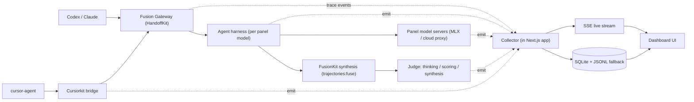

# Fusion Observability Spine + Companion App

## Goal
A locally-run Next.js dashboard that observes the entire fusion stack end-to-end: **sessions**, **environments** (panel/stack config), **each panel model's trajectory** (reasoning / tool calls / observations / diffs), and the **judge's thinking, scoring, synthesis reasoning, and final output** — all live and correlated by a single trace id.

## Why instrumentation is required (research findings)
- FusionKit's new `trajectories:fuse` endpoint (what agent fusion actually uses) **persists nothing**, and the judge's **raw reasoning is discarded** — only structured consensus/contradictions/scores survive ([judge.py](packages/fusionkit-core/src/fusionkit_core/judge.py), [prompts.py](packages/fusionkit-core/src/fusionkit_core/prompts.py)).
- HandoffKit's fusion path has **no event stream/DB/logger**; it only writes a post-run `unified-e2e-report.json` and returns `x-fusion-*` headers ([fusion-gateway.ts](packages/model-gateway/src/fusion-gateway.ts), [unified.ts](packages/ensemble/src/unified.ts)).
- Cursorkit emits structured JSON logs but no transcript store.
- There is **no frontend anywhere** — greenfield app.

File snapshots alone can't show judge thinking, can't capture `trajectories:fuse`, and can't correlate one gateway request across the panel servers + synthesis. Hence a push spine.

## Architecture

**Trace propagation:** the gateway front door mints (or honors incoming `x-fusion-trace-id` from the Cursorkit bridge) one `trace_id` per request, threads it through `runUnifiedHarnessE2E` -> descriptor -> agent harness, which attaches `x-fusion-trace-id` / `x-fusion-candidate-id` / `x-fusion-span-id` headers on panel-model calls and on the `trajectories:fuse` call. Every component emits to the collector with that id. Emit is **fire-and-forget** (never blocks fusion) and also appends to a local JSONL dir as a durable fallback the app can replay.

## Workstreams

### 1. Trace-event contract (shared, lightweight)
- Add a **standalone** `fusion-trace-event.v1` JSON Schema in a new `spec/fusion-trace/` dir (kept OUT of the frozen `model-fusion-contract` bundle to avoid the ~70-file bundle-hash re-stamp and the `@velum-labs/model-fusion-protocol` pin churn).
- Envelope: `trace_id`, `span_id`, `parent_span_id?`, `seq`, `ts`, `component` (`gateway|ensemble|agent|panel-model|judge|synthesis|cursor-bridge`), `event_type`, `session_id?`, `candidate_id?`, `model_id?`, `payload` (object). Use an exhaustive `event_type` enum.
- Event taxonomy: `session.started` (env snapshot), `session.finished`, `harness.candidate.started/finished`, `trajectory.step` (reasoning/tool_call/observation/output), `model.call.started/finished` (usage/latency/finish_reason/preview), `judge.thinking` (raw analyze), `judge.scored` (FusionAnalysis + per-candidate ranks/contributions), `judge.synthesis` (raw synthesize), `judge.final`, `tool.execution`, `cursor.route`.

### 2. Companion app + collector ("scopekit", new repo)
- New repo `/Users/alen/Documents/Development/scopekit` (name flexible). Next.js App Router + TypeScript + Tailwind + shadcn/ui + recharts; `better-sqlite3` for the store; SSE for live.
- Collector = Next.js route handlers: `POST /api/ingest` (batch, validates against the trace schema, writes SQLite + publishes to in-process bus), `GET /api/sessions`, `GET /api/sessions/:traceId` (events + derived spans), `GET /api/stream` (SSE live), `POST /api/replay` (backfill from JSONL dir).
- Store tables: `sessions` (trace_id, started_at, status, environment json, totals) and `events` (ordered by seq). Spans derived from `span_id`/`parent_span_id`.
- UI pages:
  - **Sessions** — live list: status, panel, repo, cost, latency, evidence.
  - **Session detail** — span waterfall/timeline; **Environment** panel (panel specs, providers, endpoints, harness kind, repo + git sha, gateway/synthesis urls); **Per-candidate trajectory** viewer (stepped reasoning/tool_call/observation/output, diff, verification); **Judge** view (thinking -> scoring table -> synthesis reasoning -> final); final output.
  - **Panel/Models** — per-model latency/cost/usage rollups.
  - **Environments** — distinct stack configs observed.

### 3. FusionKit instrumentation (Python)
- New `fusionkit_core/trace.py`: env-driven emitter (`FUSION_TRACE_URL`, `FUSION_TRACE_DIR`, `FUSION_TRACE_ID`), background-thread queue, JSONL fallback, no-op when unset.
- [judge.py](packages/fusionkit-core/src/fusionkit_core/judge.py): in `analyze` / `_synthesize_answer` / `synthesize_trajectories`, **retain the raw analyze + synthesize responses** (currently discarded) and emit `judge.thinking` / `judge.scored` / `judge.synthesis` / `judge.final`.
- [app.py](packages/fusionkit-server/src/fusionkit_server/app.py): in `POST /v1/fusion/trajectories:fuse`, read `x-fusion-trace-id`, emit a `session`/judge span set, and **persist its `judge_synthesis_record`** (today it writes nothing).
- Panel model servers [simple_openai_server.py](scripts/simple_openai_server.py) + [simple_mlx_openai_server.py](scripts/simple_mlx_openai_server.py): read trace headers, emit `model.call.started/finished` with usage/latency/finish_reason.

### 4. HandoffKit instrumentation + propagation (TS)
- New `packages/ensemble/src/trace.ts` emitter (mirrors the Python one; `FUSION_TRACE_URL`/`FUSION_TRACE_DIR`).
- [fusion-gateway.ts](packages/model-gateway/src/fusion-gateway.ts): mint/honor `x-fusion-trace-id` per front-door request; emit `session.started` (with environment) and `session.finished`; pass `traceId` into the runner.
- [gateway.ts](packages/cli/src/gateway.ts) + [unified.ts](packages/ensemble/src/unified.ts): thread `traceId` into `runUnifiedHarnessE2E` -> descriptor.
- [agent.ts](packages/ensemble/src/agent.ts) + [worktree-agent.ts](packages/adapter-ai-sdk/src/worktree-agent.ts): emit `harness.candidate.*` and stream each `trajectory.step` live; attach `x-fusion-trace-id`/`x-fusion-candidate-id` headers on panel-model + synthesis calls. (`TrajectoryStep` already captured in [harness.ts](packages/ensemble/src/harness.ts).)
- Emit `tool.execution` from the existing tool records.

### 5. Cursorkit instrumentation (TS)
- New `src/trace.ts` emitter; in [server.ts](src/server.ts) mint/forward `x-fusion-trace-id` to the gateway and emit `cursor.route` + agent-run events tagged with the same id, so the Cursor edge shows up on the same session timeline.

### 6. Single-command integration (`--observe`)
- [fusion-quickstart.ts](packages/cli/src/fusion-quickstart.ts): add `--observe` flag. When set, boot the collector/dashboard (build once + `next start` on a fixed port), set `FUSION_TRACE_URL`/`FUSION_TRACE_DIR` in every spawned process env (panel servers, synthesis server, gateway, Cursorkit bridge), and print/open the dashboard URL. Standalone `npm run dev` remains the default path.

### 7. Verification
- Unit: schema validation + collector ingest/query/SSE round-trip.
- Deterministic e2e: fake panel + synthesis emitting trace events -> assert a full session (env, candidate trajectories, judge thinking->final) renders.
- Live: `warrant fusion --observe` with the MLX trio (and one billed cloud run) -> confirm live trajectory steps and judge thinking appear correlated under one trace id.

## Key decisions (chosen defaults)
- Trace event lives **outside** the frozen model-fusion contract bundle (separate `spec/fusion-trace/`) to avoid bundle-hash/pinned-package churn.
- Collector is **embedded in the Next.js app** (route handlers + SQLite) for one-command simplicity; durable JSONL fallback per component means nothing is lost if the app is down, and `/api/replay` backfills.
- Emit is always fire-and-forget and a no-op unless `FUSION_TRACE_URL`/`FUSION_TRACE_DIR` is set, so production/normal runs are unaffected.