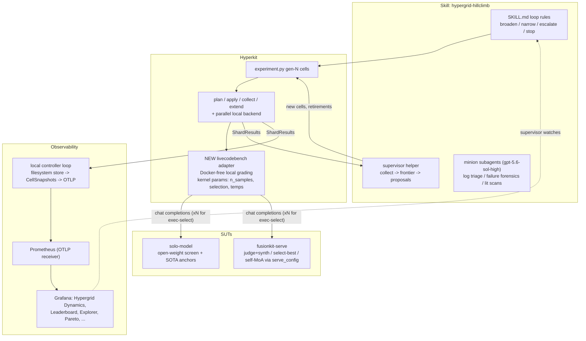

# Hypergrid Fusion Hill-Climb via Hyperkit — Plan

Status: **approved; first attempt (run 20260712-0843) abandoned mid gen-0 for
an environment restart** (see `20260712-0843/RETROSPECTIVE.md`; $5.10 of $250
spent). The restart operates under the shared lab process below. No billed
shards may run before the preflight gate is committed and the relevant lab
proposal PR is merged.

## Lab process (adopted 2026-07-13, from PR #98)

Experiment lifecycle and record-keeping follow `lab/AGENTS.md` (canonical) and
the `lab-experiment` / `lab-report` skills. This plan remains the scientific
roadmap; the lab holds the per-experiment claims, budgets, and conclusions.
Adaptation decisions:

- **Phase-level experiments.** The climb registers as separate lab experiments,
  each with its own claim, budget, decision rule, and out-of-scope:
  - `e001-hypergrid-bringup` — retroactive `abandoned` record of run
    20260712-0843 (substrate bring-up + partial screen, $5.10).
  - `e002` — SOTA anchors + open-weight solo screen (this plan's generation 0;
    budget $65; decision rules: >25pp floor gap -> re-scope slice, <2pp ->
    saturated slice).
  - `e003` — kernel probes on the top-2 complementary solos (judge-synth,
    judge-select, self-MoA, exec-select, exec-select+repair, exec-tie-judge).
  - `e004` — compound search over the promising region (generations via
    `hyperkit extend` within the experiment; supervisor-driven).
  - `e005` — locked holdout final (incumbent + best solo open + anchors, once).
- **Cross-experiment shard reads.** `sweep_id == experiment id`, so results
  live in separate stores; later experiments must NOT re-bill baselines — the
  supervisor reads across experiment workdirs for gap computations, and each
  design states which prior stores it references.
- **Backend: AWS Batch (the requirement; deployed 2026-07-13).** Sweeps run
  on the `hypergrid-batch` Fargate Spot substrate
  (`infra/hypergrid-batch/deploy.py`, idempotent): ECR runner image, S3 lake
  (`runs/` results + `lcb-store/` problems fetched lazily via
  `HYPERKIT_LCB_S3_URI`), `OPENROUTER_API_KEY` injected from Secrets Manager,
  2 vCPU / 4 GB job shape, 3 retries, 1 h timeout. Backend env:
  `HYPERKIT_AWS_BUCKET=hypergrid-batch-052777341990-us-east-1`,
  `HYPERKIT_AWS_BATCH_JOB_QUEUE=hypergrid-batch-queue`,
  `HYPERKIT_AWS_BATCH_JOB_DEFINITION=hypergrid-batch-runner:<rev>`.
  Analysis flow: `hyperkit pull` mirrors S3 results into the local store for
  `collect`/`supervisor.py`; the S3-polling `hyperkit controller`
  (`HYPERKIT_S3_BUCKET`, no SQS needed) feeds the tailnet Grafana. Validated
  end-to-end with a 1-shard smoke (SUCCEEDED, $0.0013 metered, result
  round-tripped through S3). `--backend local` remains the dev/smoke
  fallback only. Rebuild + push the runner image (deploy script) whenever
  hyperkit/fusionkit code that runs inside shards changes.
- **Spend ceiling.** Always pass `--spend-ceiling-usd <budget_usd>` at plan
  time. Note: the engine records but does not yet enforce it at apply time —
  keep the supervisor's pre-apply cost estimate discipline until enforcement
  lands (candidate hyperkit patch).
- **Claim registration brakes the loop.** A proposal PR must merge before any
  spend on a new experiment; within a merged experiment, generation-level
  `extend`s proceed autonomously (procedure C). A new question = a new
  proposal, not an extend.
- **No result payloads in git.** Frontier JSONs, logs, and caches stay out of
  `lab/`; final numbers with CIs go in `experiment.md` Results (length caps),
  long-form analysis links out (S3/Grafana/analysis docs). The
  `analysis/hypergrid/<run-id>/` convention is retired for new work; this
  directory remains for the plan, manifests, shared tooling
  (`supervisor.py`, `gen0.py`, `build_lcb_store.py`), and the e001-era
  artifacts.

## Preflight gate — verify access to every hyperkit capability before any experiment

Before the first billed shard, run a written preflight (results committed as
`analysis/hypergrid/<run-id>/preflight.md`) covering every capability under
`infra/hyperkit` and the hyperkit toolchain. Each item gets PASS / DEGRADED /
FAIL plus evidence; a FAIL on a required item blocks experiments, a DEGRADED
item requires an explicit recorded decision to proceed without it.

- **Hyperkit CLI + engine (required):** `hyperkit plan/status/collect` round-trip on a zero-cost toy experiment with a stub adapter; plugin registry resolves `solo-model`, `fusionkit-serve`, and the backends.
- **FusionKit SUT (required):** `fusionkit serve` boots from an inline `serve_config` and answers `/v1/models` (no billed completion).
- **Provider keys (required):** 1-token billed smoke on OpenRouter (open-weight universe), OpenAI, and Anthropic (anchors); confirm the specific registry model ids resolve on OpenRouter — a delisted endpoint found now costs nothing, found mid-screen costs a generation.
- **Benchmark data (required):** HF download of `livecodebench/code_generation_lite`, decode public/private stdin tests locally, count the eligible pool at the candidate cutoffs.
- **AWS account reachability (informative):** `boto3` sts/S3/Batch/SQS probes with the injected `cursor-agent-infra` role — determines whether the Terraform stack from `infra/hyperkit` (Batch queue, S3 lake, controller queue, AMP) is deployed and reachable, or whether this is a local-backend run. Either answer is fine; it must be *known*, not assumed, before choosing the backend.
- **Docker + observability stack (required for the Grafana phase, degradable):** dockerd stable under the Firecracker workarounds; `docker compose -f infra/hyperkit/grafana/compose.yaml up` healthy; `scripts/validate_hyperkit_dashboards.py` green on seed data; OTLP path from a locally emitted test metric into Prometheus verified.
- **Telemetry (degradable):** `hyperkit.telemetry.configure()` exports to the local OTLP endpoint without error.

Only when this table is committed does Phase 2+ spend begin.

## Objective

**Find the hyperpoint, not just measure.** The search optimizes one number:
the gap between the best open-weight fused compound and the closed-frontier
SOTA anchor (GPT-5.5 / Opus 4.8 solo, same harness, same tasks). The
deliverable is a named, reproducible compound configuration — kernel, panel,
hyperparams, prompts — plus its measured distance to SOTA on a locked holdout.

- **Search universe (the compound):** open-weight models only, via OpenRouter — the registry shortlist in `python/hyperkit/registry/2026-q3.yaml` (deepseek-v3.2/v4-pro, terminus, r1, qwen3-235b-thinking, qwen3.7-max, glm-5.2, kimi-k2.6, nemotron-3-super) plus kimi-k2-thinking and qwen3-coder from the product config.
- **Yardstick (never searched, run once per split):** frozen SOTA anchor cells — solo gpt-5.5 and solo opus-4.8. Closed models may not appear inside any fused cell.
- **Success ladder:** (1) fused open-weight > best solo open-weight, McNemar-significant on the locked holdout; (2) parity band — the anchor's rate falls inside the fused cell's Wilson CI *and* McNemar fused-vs-anchor is non-significant (at holdout n=60–80, a raw "3pp" claim is below resolution; paired tests are the honest instrument); (3) fused open-weight >= SOTA anchor with McNemar significance. Each rung is a reportable result; the supervisor climbs toward the highest rung the budget allows. Cost-per-resolve is tracked so results also state the price of the gap closure (open panels are ~10–40x cheaper than the anchors).

## Context (what prior work established)

- **Machinery exists, headline claim unproven.** The strongest verified win is execution-guided best-of-N selection on LiveCodeBench (+11.6pp over best single, McNemar 10–0, `.cursor/skills/fusion-hillclimb/reference.md`). The shipped judge+synth path has *lost* to best-single everywhere it was measured (polyglot 72.8% vs 79.6%; SWE-bench k=1 50% vs 60%). Gate A of `docs/fusion/FUSION_VALUE_RUBRIC.md` is unmet.
- **Hyperkit is the right engine but has a substrate gap.** Its two adapters (`swebench_verified`, `terminal_bench`) both need Docker; the AWS Batch backend needs deployed infra (unverified). Its core loop — content-addressed shards, `plan`/`apply`/`collect`/`extend --from-results` — is exactly the growable-hypergrid mechanism this effort needs.
- **Literature to encode in the search space** (from `docs/fusion/MOA_DESIGN.md`, `docs/fusion/FUSION_ARCHITECTURE_V2.md` + current papers): Mixture-of-Agents aggregation, Self-MoA (single strong model, high-temp diversity), complementary-MoA panel selection (team effects beat individual accuracy), execution/verifier-guided best-of-N, majority-of-bests, judge-select vs LLM-rewrite synthesis, multi-agent verification.

## Architecture

## Phase 0 — Environment + substrate verification

- Install `uv`, fix PATH per AGENTS.md, `uv sync --all-packages`, `pnpm install + build` so the `fusionkit` bin links; run existing test suites green.
- Probe AWS (`boto3` sts/s3/batch) once deps exist: if the hyperkit Batch stack is live, note it as an optional scale-out path; otherwise commit to the `local` backend (decision recorded, no Terraform work in scope).
- Install Docker with the Firecracker workarounds documented in AGENTS.md (fuse-overlayfs storage driver, containerd-snapshotter off, iptables-legacy, manual `dockerd`) — required for the Grafana observability stack below.
- Smoke provider keys (OpenAI, Anthropic, OpenRouter) with 1-token calls.

## Phase 0b — Live Grafana observability (the full hyperkit dashboard stack, fed by real sweep data)

The shipped local compose stack (`infra/hyperkit/grafana/compose.yaml`:
Prometheus + the production Grafana image with all ten dashboards — Hypergrid
Dynamics, Leaderboard, Explorer, Pareto, Generation Coverage, Cell Drilldown,
Learning Curves, Sweep Live, Fleet, Fusion Internal) currently visualizes only
*synthetic seed rules*; the real `hyperkit_cell_*` gauges are produced by the
cloud controller (`hyperkit.cloud.controller`), which is hard-coupled to
S3+SQS. To make the dashboards live against this local climb:

- **Local controller loop** (new, small): reuse `build_cell_snapshots` (`python/hyperkit/src/hyperkit/core/snapshots.py`) and the existing OTLP gauge publisher, but read cells + ShardResults from the local filesystem store (`.hyperkit/<sweep>/`) on a poll interval — the filesystem twin of `S3SweepRepository`. Runs in a tmux session alongside the sweep.
- **Prometheus OTLP ingestion:** extend the local compose Prometheus config to enable the OTLP receiver (`--web.enable-otlp-receiver` + `otlp` promotion of resource attrs) so both the runner telemetry (`hyperkit.shards.*`, `hyperkit.cost.usd`) and the controller's `hyperkit_cell_*` snapshot gauges land in the same instance the dashboards query; keep the seed rules available behind a flag for dashboard-contract validation only.
- **Validation:** `python3 scripts/validate_hyperkit_dashboards.py` green against the live stack; screenshots of Hypergrid Dynamics / Leaderboard with real generation-0 data attached to the PR and per-generation reports.
- The supervisor loop uses the dashboards as its live monitoring surface (frontier movement, cost burn, error shards) between `collect` checkpoints; the ShardResult store remains the source of truth for decisions.

## Phase 1 — Substrate: Docker-free LiveCodeBench adapter + params seam + parallel local backend

The enabler for local hill-climbing. Grounded design decisions from the code:

- **Harness-params seam (small core change).** `Cell.params` is already hashed into cell identity (`Cell.coord` in `python/hyperkit/src/hyperkit/core/models.py`) but never reaches the adapter — `RunOrchestrator` calls `run_instance(instance_id, target, workdir)`. Extend the `BenchmarkAdapter` protocol to `run_instance(..., params: dict)` (existing adapters ignore it). This is content-addressing safe and lets *harness-side kernels* (N samples, selection policy, temps, max_tokens) be cell coordinates — which is exactly what the exec-select kernel needs, since selection requires the benchmark's public tests, which only the adapter has. (An "exec-select SUT plugin" cannot work: a `SystemUnderTest` is just an OpenAI endpoint and has no access to tests.)
- **One parametrized `hyperkit/adapters/livecodebench.py`** (`BenchmarkAdapter`, fusion-agnostic, import-boundary test stays green): loads `livecodebench/code_generation_lite` (reuse the loading/decoding patterns of `python/fusionkit-evals/src/fusionkit_evals/livecodebench_data.py`, stdin-only, no starter code), grades by local subprocess execution on private tests. `params` drive the kernel: `n_samples` (default 1), `temps`, `selection: first | public-exec` (public-exec = the proven exec-select kernel: pick the sample passing most public tests, grade on private — leakage-free), `max_tokens`. Because the generator behind the endpoint is the SUT axis, `selection: public-exec` composes with *any* SUT: solo model, or a fusionkit-serve compound (per-endpoint passthrough ids allow cross-model sample fanout through one serve endpoint).
- **Contamination-aware pool selection.** Before freezing manifests, enumerate eligible stdin medium/hard tasks at cutoffs {2025-06-01, 2025-10-01, 2026-01-01} (newest `version_tag` available) and pick the most recent cutoff yielding >=180 tasks (110 dev + 70 holdout, disjoint, seeded split). The registry's open models are 2025-h2/2026-h1 generation, so an old cutoff would overstate everyone. Frozen manifests committed under `analysis/hypergrid/manifests/`.
- **Parallel local backend.** `LocalComputeBackend` is strictly sequential (`python/hyperkit/src/hyperkit/backends/local.py`); a screen generation is ~1–2k shards of network-bound work. Add `max_workers` (thread pool over shards; ShardResult store writes are per-file and idempotent) with a conservative default, configurable per run. Two contention points: the orchestrator boots one `fusionkit serve` per in-flight fused shard (fine at modest worker counts; each binds a free port), and test-execution grading is CPU-bound (cap concurrent graders separately from network workers).
- **Fused policies via `serve_config`** (no new code): the `fusionkit-serve` SUT accepts inline configs (`python/fusionkit-cli/src/fusionkit_cli/hyperkit_plugin.py`) reaching every `FusionConfig` knob: `default_mode` (panel/self/single), `panel_models`, `sample_count`, `judge_model`, `synthesizer_model`, `synthesis_select_best`, `sampling.*`, prompt overrides. A builder in the experiment file generates payloads from axis values; endpoints come from the model registry (`python/hyperkit/registry/2026-q3.yaml`).
- Unit tests: adapter kernel logic on fixture instances (no network), params-seam pass-through, parallel-backend determinism; `uv run pytest`, `ruff`, `pyright` green.

## Phase 2 — Experiment design: generation-0 hypergrid + locked protocol

Committed as `analysis/hypergrid/experiment.py` (a hyperkit `Experiment` whose
`cells()` reads a checked-in generation spec, so `extend` stays deterministic):

- **Splits:** frozen dev manifest (110 tasks) for climbing; locked holdout manifest (70 tasks, disjoint, seeded split) evaluated once per final incumbent. Iron law: wins are claimed only on the locked split.
- **Shard-reuse protocol for successive halving:** all dev cells pin `dataset_hash` to the full dev-manifest hash and vary only the `instances` prefix (25 -> 60 -> 110). Because `cell.coord` excludes the instance list, promoting a cell to a larger subset re-runs only the new instances — halving is genuinely cheap. (Cells that instead re-hash their subset would silently re-bill everything.)
- **SOTA anchor cells (yardstick, generation 0 only):** solo gpt-5.5 and solo opus-4.8 on the dev split — run once, frozen, reused by every later generation's gap computation. Never re-tuned, never fused.
- **Generation 0 — screen the open-weight universe** (~15–18 cells):
  - Solo screening: every registry open-weight endpoint solo (ds32, dsv4pro, terminus, r1, qwen3t, qwen37max, glm52, kimi26, nemotron3s, kimi-k2-thinking, qwen3-coder) on the full dev split — establishes the open floor, per-model cost, and the complementarity matrix (per-instance pass vectors) that seeds panel construction. Estimated ~$20–30 total at registry prices (~110 tasks x ~10k output tokens x $0.34–3.75/M).
  - SOTA anchors: ~$20–35 (frontier pricing dominates the generation).
  - Kernel probes on the top-2 solos at the 60-instance rung: judge+synth (default), judge-select (`synthesis_select_best: true`), self-MoA (`mode: self`, `sample_count` 3–4, high temperature), exec-select (`selection: public-exec`, `n_samples: 3`).
- **Generation 1+ — compound search over the promising region** (supervisor-driven):
  - Panel axis: pairs/triples chosen by *team complementarity* from gen-0 per-instance vectors (complementary-MoA: maximize union coverage, respect lineage-diversity veto from the registry), not by individual rank alone.
  - Kernel axis: full cross of surviving kernels x surviving panels; judge/synthesizer model assignment as its own axis (strongest open model as judge vs cheapest adequate); exec-select over a serve panel (cross-model best-of-N via passthrough model ids).
  - Hyperparams: `sample_count`/N ladder (3, 5, 8), per-stage temperatures, max_tokens escalation (32k vs 64k endpoints already in the registry).
  - Prompt axis: judge/synth prompt variants produced by cheap frozen-bank replay (`fusionkit fusion-hillclimb` Tier-1, run with the open-weight panel/judge — closed models stay yardstick-only, including inside the tuning loop) and re-injected as cells.
  - Reserve axes (added when signals warrant): step-mode/driver topology, verifier-vote / multi-agent verification kernels, hybrid kernels (exec-select first, judge+synth only on public-test ties — attacks the known failure mode where rewrite damages already-passing code).
- **Metrics per cell:** pass rate + Wilson CI, **gap-to-SOTA-anchor** (primary), delta vs best solo open, oracle headroom/regret, cost per resolve (`hyperkit.aggregate`/`stats`, plus a small gap-to-anchor addition in the supervisor helper).
- **Budget:** $250 total ledger (adjustable), phased: <=$10 smoke, <=$65 gen 0 (anchors + screen + probes), <=$100 compound generations, >=$60 reserved for locked-holdout finals (incumbent + best solo + both anchors on 70 tasks); per-shard costs from `ShardResult.cost_usd`, ledger committed per generation under `analysis/hypergrid/<run-id>/`.

## Phase 3 — Supervisor skill: `.cursor/skills/hypergrid-hillclimb/`

The supervision behavior, codified:

- **`SKILL.md`** — the loop contract: iron laws (locked-split wins only, ledger every generation, commit + push per generation, budget cap, anchors never re-tuned), the per-generation checklist mapped to hyperkit commands (`hyperkit resume` -> await shards -> `hyperkit collect` -> run supervisor helper -> agent decides prune/broaden/promote -> edit generation spec -> `hyperkit extend` appends the new generation to the lock), and the self-prompt template the supervising agent re-reads at the top of every generation (current rung, remaining budget, gap attribution, open hypotheses).
- **`reference.md`** — decision rules, all keyed to the gap-to-SOTA objective:
  - *Narrow/prune:* retire a cell family when its Wilson upper bound < best-solo-open Wilson lower bound on the same instances, or when it is Pareto-dominated on (gap-to-SOTA, cost) by a sibling; successive-halving instance budgets (25 -> 60 -> full dev split) so weak cells die cheap.
  - *Broaden:* when a cell's CI overlaps the current frontier, propose neighbors (adjacent N, temperature, kernel variant, panel swap by complementarity); when a panel's oracle headroom crosses the SOTA anchor but fused lags (regret is the bottleneck), escalate to prompt-tier replay climbing and judge/synth model swaps rather than more panel search; when headroom < 2pp (lopsided), abandon that panel family (Phase-0 lesson).
  - *Direction test:* every generation, attribute the remaining gap — panel ceiling (oracle < anchor: need better/more members), selection regret (oracle >= anchor but fused < oracle: need better judge/kernel), or synthesis damage (select-best beats rewrite: flip the synthesis policy). The attribution picks which axis the next generation expands.
  - *Escalation ladder:* config axes -> prompt axes -> gated source changes (reuse fusion-hillclimb Tier-3 gates).
  - *Stopping:* highest ladder rung confirmed on locked holdout; or budget spent; or two consecutive generations with no frontier movement.
- **Supervisor helper** (`analysis/hypergrid/supervisor.py`): deterministic analysis the skill invokes — reads ShardResults, prints frontier table, flags prune/broaden candidates per the rules above, drafts the next-generation cell spec for the agent to review/edit. Keeps judgment with the agent, arithmetic in code.
- **Minion delegation (codified in `SKILL.md`)** — the supervising agent stays the scientist; token-heavy reading is farmed to `gpt-5.6-sol-high` subagents, in parallel and as many as needed. Standing delegation triggers:
  - *Failure forensics:* after every `collect`, any cell with error shards or a surprising rate gets a minion that reads the shard `raw` payloads + `fusionkit-serve.log`s and returns a categorized failure table (provider errors vs truncation vs extraction vs genuine wrong answers) — the supervisor never debits budget to re-run what a log read can explain.
  - *Trajectory autopsies:* when the direction test blames selection regret or synthesis damage, minions read the fused-vs-solo transcripts on discordant instances and return failure taxonomies that seed the next prompt/kernel variants.
  - *Literature scans:* before adding a reserve axis, a minion surveys the relevant method family and returns concrete parameterizations worth encoding as cells.
  - *Report drafting:* per-generation `report.md` first drafts, from ledger + frontier table + forensics summaries.
  - Contract for every minion: precise question in, structured verdict out (the skill includes prompt templates); minions never edit the experiment spec, spend budget, or make accept/reject decisions — those stay with the supervisor.

## Phase 4 — Run and supervise the climb

- Smoke: 5-instance manifest through one solo + one fused cell end-to-end on the local backend.
- Generation 0: SOTA anchors + open-weight solo screen + kernel probes on dev split; then iterate the skill loop (expected 3–6 generations within budget), committing artifacts + ledger + a `report.md` per generation to `analysis/hypergrid/<run-id>/`. Each generation's analyze step fans out the minion subagents before the supervisor decides the next generation.
- Final: evaluate the incumbent open-weight compound, the best solo open model, and the SOTA anchors once on the locked holdout; McNemar + Wilson + gap-to-SOTA; write the final report naming the winning hyperpoint (full config committed as a runnable YAML) and its distance to SOTA; honest outcome either way (a "closest achievable point is X, gap is Y, bottleneck is Z" result is acceptable and reportable).

## Deliverables

- New hyperkit `livecodebench` adapter (kernel params incl. exec-select), the `run_instance` params seam, parallel local backend, + tests.
- `analysis/hypergrid/`: experiment code, manifests, supervisor helper, per-generation artifacts, final report **naming the winning open-weight hyperpoint** with a committed runnable config.
- `.cursor/skills/hypergrid-hillclimb/SKILL.md` + `reference.md` (the reusable supervision behavior).
- Live Grafana stack: local controller loop, OTLP-enabled local Prometheus config, all ten hyperkit dashboards rendering the real climb; dashboard validator green + screenshots per generation.
- All work on branch `cursor/hypergrid-hillclimb-667a`, PR against `main`, pushed per generation.

## Risks

- The open-weight floor may already sit near the anchors on LCB medium/hard (saturation) or hopelessly far below — the gen-0 solo screen measures both before compound spend; if the anchor gap is <2pp or >25pp at the floor, the supervisor swaps the dev benchmark slice (harder cutoff window) before continuing.
- Open-weight panels are cheap but numerous; successive halving and the complementarity-seeded panel construction keep the combinatorial panel space from eating the budget.
- Provider spend is real; every generation is gated by the ledger and the $60 locked-final reserve is inviolable.
- HF dataset download (`livecodebench/code_generation_lite`) must work in this sandbox; verified before any billed calls.
- The Grafana stack depends on the Docker-in-Firecracker workarounds; if the daemon proves unstable, the climb continues on supervisor tables (source of truth is the ShardResult store either way) and observability is reported as degraded rather than blocking spend.
