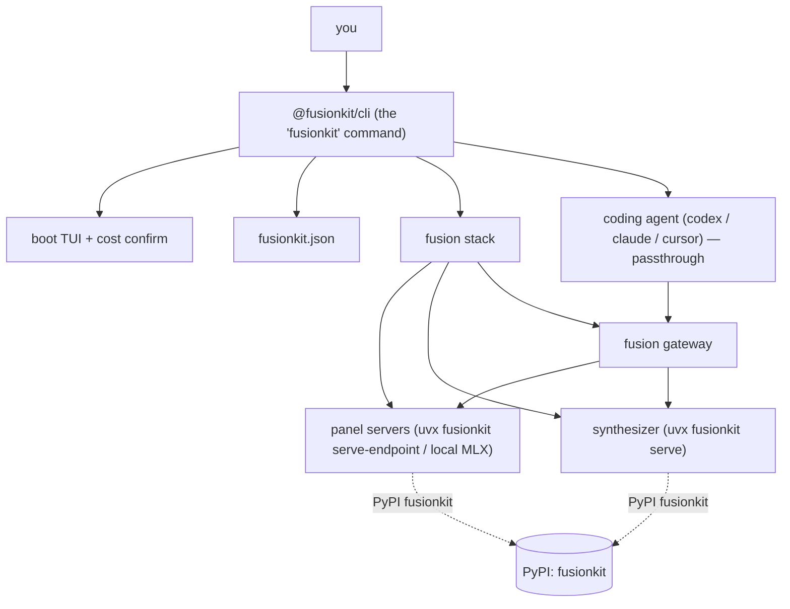

## The pieces

## Identity: two "fusionkit"s

- **`@fusionkit/cli`** (npm) — the `fusionkit` command you install and run.
- **`fusionkit`** (PyPI) — the synthesizer, fetched and run automatically via
  `uvx`. You never install it by hand.

`fusionkit --version` prints both so you can see the pinned pairing.

## Lifecycle

1. **Preflight** — verify binaries, keys, and that you're in a git repo.
2. **Boot** — start one server per panel model (cloud servers in parallel), the
   synthesizer, and the gateway, shown as a live checklist.
3. **Passthrough** — the CLI settles the TUI, restores the terminal, silences
   per-turn status chatter, and hands the terminal to your coding agent. The
   agent is never wrapped — only launched, pointed at the gateway.
4. **Teardown** — one `Ctrl+C` (or normal exit) tears down the whole stack.
   Signal handlers are installed before the first spawn, so interrupting during
   boot never orphans processes.

## Boundaries

- The CLI orchestrates and observes; it does not reimplement the agents.
- The synthesizer owns provider calls and judge synthesis.
- The gateway runs the panel and streams the judge's chosen trajectory to the
  agent over the wire dialect each agent speaks.
