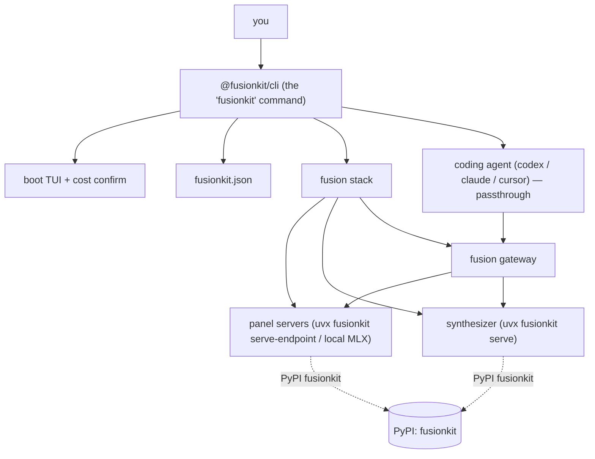
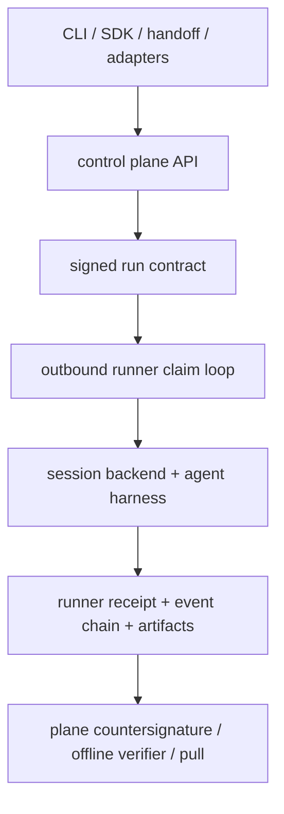

There are two layered architectures to understand: the **fusion stack** the CLI
boots for a coding session, and the **governed execution platform** underneath
the SDKs.

## The fusion stack (what the CLI runs)

### Lifecycle

1. **Preflight** — verify binaries, keys, and that you're in a git repo.
2. **Boot** — start one server per panel model (cloud servers in parallel), the
   synthesizer, and the gateway, shown as a live checklist.
3. **Passthrough** — the CLI settles the TUI, restores the terminal, silences
   per-turn status chatter, and hands the terminal to your coding agent. The
   agent is never wrapped — only launched, pointed at the gateway.
4. **Teardown** — one `Ctrl+C` (or normal exit) tears down the whole stack.
   Signal handlers are installed before the first spawn, so interrupting during
   boot never orphans processes.

### Identity: two "fusionkit"s

- **`@fusionkit/cli`** (npm) — the `fusionkit` command you install and run.
- **`fusionkit`** (PyPI) — the synthesizer, fetched and run automatically via
  `uvx`. You never install it by hand.

## The governed execution platform

The platform has a protocol kernel, an online control plane, outbound runners,
and developer-facing adapters layered above them.

### Governed run lifecycle

1. A client submits a run request with a task, identity, target pool, workspace
   inputs, agent kind, egress needs, and secret needs.
2. The plane validates the request, evaluates policy, creates a signed run
   contract, and records the initial event chain.
3. A runner polls the plane over an outbound-only channel and atomically claims a
   compatible contract.
4. The runner materializes the workspace, requests approved secrets only when
   needed, and executes the agent harness in the configured session backend.
5. Execution events, filesystem outputs, network decisions, secret disclosures,
   and harness evidence are recorded into a runner receipt.
6. The plane countersigns the receipt bundle, updates run status, serves UI/API
   views, and makes the bundle available for offline verification and pull.

### Layering

- **Protocol layer** (`@fusionkit/protocol`) is dependency-light and auditable. It
  owns canonical JSON, signing, hashing, schemas, event chains, receipts,
  checkpoints, handoff envelopes, and model-fusion records.
- **Workspace layer** (`@fusionkit/workspace`) captures Git state, denies known
  secret patterns, materializes workspaces for runners, collects outputs, and
  protects local pull from divergence.
- **Plane layer** (`@fusionkit/plane`) owns online authority: policy, approvals,
  principals, contract issuance, receipt countersignature, secret brokerage,
  retention, metrics, and the control panel UI.
- **Runner layer** (`@fusionkit/runner`) owns execution: the claim loop, capability
  matching, session lifecycle, harness invocation, and runner-side receipts.
- **Session layer** (`@fusionkit/session-*`) provides isolation backends with a
  common runner-facing shape.
- **Developer surface layer** (`@fusionkit/sdk`, `@fusionkit/handoff`, the adapters,
  and `@fusionkit/cli`) turns product workflows into plane API calls.

## Trust boundaries

- The plane is online authority, but receipts are designed for offline
  verification after the fact.
- Runners do not need inbound network exposure; they poll and claim work.
- Secrets are brokered by the plane and disclosed to a runner only when policy,
  approval, and contract scope allow it.
- Session backends enforce different isolation levels; receipts record the chosen
  backend and attestation tier rather than hiding the runtime boundary.
- Workspace pull is explicit and divergence-safe; completed remote work does not
  silently overwrite local changes.

## Extension seams

- Add a session backend by implementing the runner backend interface.
- Add a client workflow by using `@fusionkit/sdk` or composing the handoff SDK.
- Add new policy checks in the plane and keep receipts able to explain the
  decision.
- Add protocol records in `@fusionkit/protocol` first, then consume them from
  packages rather than duplicating shapes.
