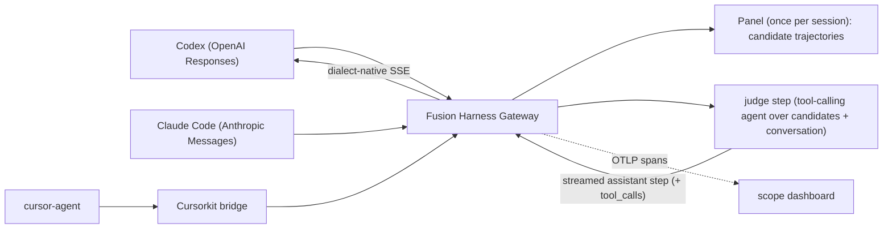

The Fusion Harness Gateway is the front door that lets unmodified coding agents
(Codex, Claude Code, Cursor) use model fusion as their backend. Each incoming
request is translated into a unified harness run: multiple panel models, each in
its own git worktree, executing a real coding harness, and the synthesized
answer is returned in the tool's native wire protocol.

The tool never learns that fusion happened. It speaks its normal dialect and gets
back a single synthesized answer.

## Trajectory-level fusion

Fusion operates on **trajectories**, not one-shot patches. Each panel model runs
the same uniform agent over the repo and produces a `harness-trajectory.v1`
(reasoning + tool calls + observations + final output + verification). A
trajectory-aware, intent-agnostic synthesizer then produces the final response in
the request's natural shape and first person:

- a question (`"what's in this repo?"`) gets a direct answer,
- a planning request gets a plan,
- a code change gets the concrete edit (with tests run as verification).

So every way you use the tool works, not just patch-shaped requests.

## Judge-streamed fusion

The judge is the front-door agent. A panel of models each solves the task once to
produce candidate trajectories, then the judge runs as a streaming, tool-calling
agent whose trajectory the user's own harness executes. The judge reacts to what
the harness observes and iterates until the task is done. There is no separate
apply/verify/repair step in the gateway, because iteration is the harness's job.

- **CandidateTrajectory**: one panel model's full reasoning / tool-call /
  observation / result for the task (the reference solutions).
- **Consolidated trajectory**: the live conversation the harness resends each
  turn (the judge's prior steps plus the tool results the harness fed back).
- **FusionSession**: per front-door conversation: the candidate trajectories
  (produced once) plus the running consolidated trajectory.

When the judge emits a step with no tool calls, that is the final answer and the
harness loop ends.

## Data flow

The gateway is dialect-aware on the edge and dialect-agnostic on the inside:
every front door normalizes to one runner input, runs the same unified harness,
and the single final output is reshaped per dialect.

## Front-door dialects

| Front door | Path | Used by |
| --- | --- | --- |
| OpenAI Responses | `POST /v1/responses` | Codex |
| Anthropic Messages | `POST /v1/messages` | Claude Code |
| OpenAI Chat | `POST /v1/chat/completions` | Cursorkit bridge, opencode, generic clients |
| Generic ACP | JSON-RPC stdio (`initialize` / `session/new` / `session/prompt`) | ACP editors |

`GET /v1/models` answers in either OpenAI or Anthropic shape (selected by the
`anthropic-version` header). `GET /health` is unauthenticated.

## Streaming is mandatory for some tools

Agentic CLIs stream, and some will not accept a non-streaming body. Codex sends
`stream: true` to `/v1/responses` and aborts the turn if it does not receive the
Responses SSE event sequence terminating in `response.completed`.

The gateway handles this without a streaming model backend: the unified run
produces one complete final output, and the gateway synthesizes a minimal SSE
stream from that text, then runs it through dialect translators to emit each
dialect's native streamed events.

- Responses streaming emits `response.created` → `response.output_text.delta` →
  `response.completed`.
- Anthropic streaming emits `message_start` → `content_block_delta` →
  `message_stop`.
- OpenAI Chat streaming emits `chat.completion.chunk` frames then `[DONE]`.

Because the panel solves the task once before the judge's first token (which can
take tens of seconds), the gateway returns the streaming response immediately and
emits SSE keepalives while the panel runs. Without this, real CLIs time out and
reconnect before the first byte.

## Boundaries

- The gateway owns dialect translation, streaming, and orchestration; the
  synthesizer owns the actual fusion/judge synthesis; the harness owns governed
  execution.
- The runner is injected into the gateway (dependency injection) so the
  `@fusionkit/model-gateway` package does not depend on `@fusionkit/ensemble` or
  the CLI.
- Fusion quality is only as good as the panel and judge model behind it. A tiny
  local model proves the plumbing, not the answer quality.

## Runtime kernel

The long-term composition model is the FusionKit runtime kernel: typed artifacts,
operators, explicit operator graphs, interchangeable schedulers, budgets, traces,
evidence, and outcome/replay records.

The production gateway uses the kernel for panel capture today. The live
`trajectories:fuse` step still runs through the gateway/Python synthesizer path.
Use the runtime kernel directly when composing custom workflows such as direct
calls, panel -> judge -> synth, rank -> select -> fuse, and evidence-guided
selection/repair.

See [Runtime Kernel](./runtime-kernel).
