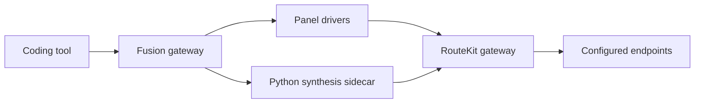

# Fusion Harness Gateway

The FusionKit gateway lets Codex, Claude Code, Cursor, and OpenCode use named
model-fusion ensembles through their native protocols.

## Composition boundary



- `@routekit/config` discovers, loads, validates, and atomically writes
  RouterConfig.
- `@routekit/router` composes an embedded gateway. RouteKit owns provider
  dialects, credentials, account relays, and single-model routing.
- `@fusionkit/config` v4 owns ensembles and Fusion policy. It contains only
  opaque RouteKit endpoint IDs.
- `@fusionkit/gateway` owns fused front-door protocols and durable sessions.
- The Python sidecar receives endpoint IDs and the RouteKit URL; it receives no
  provider credentials.

RouteKit never receives ensemble definitions.

## Launch

```sh
fusionkit init
# edit .routekit/router.yaml and .fusionkit/fusion.json
fusionkit doctor
fusionkit codex       # or claude | cursor | opencode | serve
```

The launcher creates one neutral `ToolLaunchSpec` and one generic
`AgentProfile` per ensemble. Tool-specific serialization and process launch are
owned by `@routekit/tool-codex`, `tool-claude`, `tool-cursor`, and
`tool-opencode`.

The default ensemble is exposed as `fusion-panel`; other names are
`fusion-<name>`.

## Runtime flow

1. FusionKit loads v4 config and validates every referenced endpoint against
   embedded RouterConfig or external RouteKit `/v1/models`.
2. Embedded mode starts an owned RouteKit SDK router. External mode only stores
   the URL and optional token resolved from `router.authEnv`.
3. Panel drivers call opaque endpoint IDs through RouteKit.
4. The Python sidecar performs judge/synthesizer calls through the same RouteKit
   gateway.
5. The Fusion gateway translates the synthesized result back to the caller's
   native Responses, Messages, Chat Completions, or Cursor dialect.

## Lifecycle

One launcher process owns the Fusion gateway, sidecar, dashboard, tool bridge,
portless registrations, and any embedded RouteKit router. Cleanup closes those
resources in process order.

External RouteKit daemons are never registered as Fusion-owned and are never
stopped by stack cleanup or `fusionkit stop`.

## Sessions and observability

Durable session state remains in `@fusionkit/gateway` under
`~/.fusionkit/sessions` by default. Use `--resume` or `--continue`.

`--observe` starts the Fusion-owned scope dashboard before the stack so gateway
and child spans use its OTLP endpoint. Dashboard failure is best-effort and does
not block fusion.

## Removed surfaces

FusionKit no longer contains proxy/account/CLIProxy management,
`install|uninstall codex`, provider/model/key launch flags, or `--direct`.
Install the independent `@routekit/cli` for those RouteKit responsibilities.
