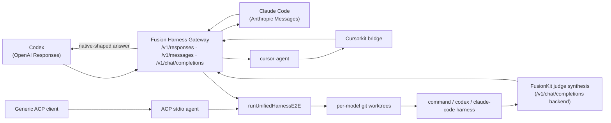

# Fusion Harness Gateway

The `fusionkit` CLI is a front door that lets unmodified coding agents
(Codex, Claude Code, Cursor) use model fusion as their backend. Each incoming
request is translated into a unified harness run — multiple panel models, each
in its own git worktree, executing a real coding harness — and the
FusionKit-synthesized answer is returned in the tool's native wire protocol.

The tool never learns that fusion happened. It speaks its normal dialect and
gets back a single synthesized answer.

## Quickstart: one command

Install the CLI globally and launch your agent backed by fusion:

```bash
pnpm add -g @fusionkit/cli           # public npm; installs the `fusionkit` command
export OPENAI_API_KEY=...  ANTHROPIC_API_KEY=...
cd your-git-repo
fusionkit codex                      # or: claude | cursor | serve
```

`fusionkit codex` spawns everything and launches the agent for you — no manual
gateway, no separate model servers, no juggling terminals. Omit the tool on a
TTY to pick interactively. In one command it:

1. starts the model panel — a **cloud** trio by default (one OpenAI + one
   Anthropic model), or the local MLX trio with `--local` on Apple Silicon,
   all fronted by a **single `fusionkit serve` router** (one process routes every
   panel model by id and also performs synthesis),
2. starts the Fusion Harness Gateway running the **agent harness** (each panel
   model drives a real tool loop — read/list/grep/write/run — in its own git
   worktree, producing a full **trajectory**),
3. fuses the trajectories through that router (`/v1/fusion/trajectories:fuse`)
   into one answer,
4. launches the chosen agent pre-wired to the gateway.

One Ctrl+C tears the whole stack (router + gateway + any Cursorkit bridge) down.
With [portless](https://github.com/vercel-labs/portless) the gateway, router,
and dashboard come up at stable HTTPS names and are reused across runs; the
router persists between runs (reap it with `fusionkit fusion stop`).

### Prerequisites

`fusionkit codex` runs a quick preflight and fails with guidance if anything is
missing:

- **`uv`/`uvx`** on PATH (runs the FusionKit router + synthesizer):
  <https://docs.astral.sh/uv/>
- the **coding agent** you launch (`codex`, `claude`, or `cursor-agent`),
- **API keys** for the default cloud panel (`OPENAI_API_KEY`,
  `ANTHROPIC_API_KEY`) — not needed with `--local`,
- a **git repository** (run inside it, or pass `--repo`),
- optionally **[portless](https://github.com/vercel-labs/portless)** `>=0.14`
  (Node `>=24`) for stable named URLs. With it installed, the gateway requires
  the proxy to be running (`portless service install` + `portless trust`);
  preflight fails fast otherwise. Use `--no-portless`/`PORTLESS=0` to use raw
  ports.

### Trajectory-level fusion

Fusion operates on **trajectories**, not one-shot patches. Each panel model runs
the same uniform agent over the repo and produces a `harness-trajectory.v1`
(reasoning + tool calls + observations + final output + verification). FusionKit's
trajectory-aware, intent-agnostic synthesizer then produces the final response in
the request's natural shape and **first person**:

- a question (`"what's in this repo?"`) gets a direct answer,
- a planning request gets a plan,
- a code change gets the concrete edit (with tests run as verification),

so every way you use the tool works — not just patch-shaped requests. The
synthesis backend (`fusionkit serve`) is fetched from PyPI via `uvx` — no
checkout needed. Pass `--fusionkit-dir` to run a local FusionKit checkout
instead (a dev override), or `--synthesis-url` to reuse an already-running
`fusionkit serve`.

It fuses over the current directory's git repo; point it at another with
`--repo`. Useful flags:

```bash
fusionkit claude --repo /path/to/your/repo
fusionkit cursor --cursor-kit-dir /path/to/cursorkit        # or FUSIONKIT_CURSORKIT_DIR
fusionkit codex --local                                     # local MLX panel (Apple Silicon)
fusionkit codex --model gpt=openai:gpt-5.5 --model opus=anthropic:claude-opus-4-8   # custom panel
fusionkit serve                                             # just run the gateway + print setup
```

### Cloud / SOTA panel

The panel is not limited to local models. A `--model` spec can name a cloud
provider as `ID=PROVIDER:MODEL`, and FusionKit fronts it as an OpenAI-compatible
endpoint (so OpenAI, Anthropic, and Google all work through the same
per-candidate coding harness):

```bash
export OPENAI_API_KEY=sk-...
export ANTHROPIC_API_KEY=sk-ant-...
fusionkit codex \
  --model gpt=openai:gpt-5.5 \
  --model opus=anthropic:claude-opus-4-8 \
  --judge-model gpt-5.5
```

- Cloud models require `--fusionkit-dir` (or `WARRANT_FUSIONKIT_DIR`): each cloud
  candidate is served by FusionKit's `scripts/simple_openai_server.py`, which
  uses FusionKit's provider clients. Keys come from `OPENAI_API_KEY` /
  `ANTHROPIC_API_KEY` (override per model with `--key-env ID=ENV`).
- Keys load seamlessly: the FusionKit checkout's `.env` is read automatically and
  injected into the cloud server processes (already-exported env vars win), so a
  `.env` with `OPENAI_API_KEY` / `ANTHROPIC_API_KEY` in the FusionKit dir means
  you never pass keys on the command line. Secrets stay in FusionKit's `.env`;
  nothing is copied into this repo.
- You can mix local and cloud (e.g. `--model local=mlx:...:` alongside cloud).
- For an already-running OpenAI-compatible server, skip provisioning entirely
  with `--model-endpoint ID=URL` (repeatable) and `--judge-endpoint URL`.

With SOTA models the coding-harness output becomes genuinely good, and you get
real cross-vendor diversity (a frontier OpenAI model and a frontier Anthropic
model, judged).

Notes:

- First run loads three real models (the trio); later runs reuse them. Swap in a
  lighter real set with `--model`.
- Cursor needs a built `cursorkit` checkout and a logged-in `cursor-agent`;
  without `--cursor-kit-dir`/`WARRANT_CURSORKIT_DIR` the command prints manual
  setup instead of launching.
- Small local models produce imperfect patches; fusion quality scales with the
  panel. The default is a fully real, local, zero-credential path.

For full control over the gateway itself (custom backends, ACP, acceptance
suite), use `fusionkit ensemble gateway` directly as described below.

## Data flow



The gateway is dialect-aware on the edge and dialect-agnostic on the inside:
every front door normalizes to one `FrontDoorRunnerInput`, runs the same
`runUnifiedHarnessE2E`, and the single `finalOutput` is reshaped per dialect.

## Front-door dialects

| Front door | Path | Used by |
| --- | --- | --- |
| OpenAI Responses | `POST /v1/responses` | Codex |
| Anthropic Messages | `POST /v1/messages` (+ `/v1/messages/count_tokens`) | Claude Code |
| OpenAI Chat | `POST /v1/chat/completions` | Cursorkit bridge, opencode, generic clients |
| Generic ACP | JSON-RPC stdio (`initialize`/`session/new`/`session/prompt`) | ACP editors |

`GET /v1/models` answers in either OpenAI or Anthropic shape (selected by the
`anthropic-version` header). `GET /health` is unauthenticated.

## Streaming is mandatory for some tools

The most important implementation lesson: **agentic CLIs stream, and some will
not accept a non-streaming body.** Codex sends `stream: true` to `/v1/responses`
and aborts the turn with `stream disconnected before completion: stream closed
before response.completed` if it does not receive the Responses SSE event
sequence terminating in `response.completed`.

The gateway handles this without a streaming model backend: the unified run
produces one complete `finalOutput`, and the gateway synthesizes a minimal
OpenAI Chat SSE stream from that text, then runs it through the existing
`openAiSseToResponses` / `openAiSseToAnthropic` translators to emit each
dialect's native streamed events. OpenAI Chat streaming emits
`chat.completion.chunk` frames directly. Non-streaming requests still return a
single JSON body.

Practical consequences:

- Responses streaming emits `response.created` → `response.output_text.delta` →
  `response.completed`.
- Anthropic streaming emits `message_start` → `content_block_delta` →
  `message_stop`.
- OpenAI Chat streaming emits `chat.completion.chunk` frames then `[DONE]`.

## Codex provider wiring

Codex reaches the gateway as a custom Responses provider. The provider
`base_url` ends in `/v1` because Codex appends `/responses`:

```toml
model = "fusion-panel"
model_provider = "fusion-gateway"
approval_policy = "never"

[model_providers.fusion-gateway]
name = "Fusion Harness Gateway"
base_url = "http://127.0.0.1:<port>/v1"
wire_api = "responses"
requires_openai_auth = false
```

`requires_openai_auth = false` lets Codex talk to the gateway with no API key.
`fusionkit ensemble gateway codex-config` prints this snippet.

## Claude Code provider wiring

Claude Code appends `/v1/messages`, so its base URL is the gateway root **without**
a `/v1` suffix:

```bash
ANTHROPIC_BASE_URL=http://127.0.0.1:<port> \
ANTHROPIC_AUTH_TOKEN=local-gateway \
claude -p "..." --output-format text
```

## Cursor wiring (via the Cursorkit bridge)

`cursor-agent` does not speak an OpenAI-compatible dialect directly. The
Cursorkit bridge (`cursor-rpc serve`) intercepts Cursor's backend protocol and
routes local-model inference to an OpenAI-compatible endpoint — point that
endpoint at the gateway:

```bash
MODEL_BASE_URL=http://127.0.0.1:<gateway-port>/v1 \
MODEL_NAME=local-fusion \
MODEL_PROVIDER_MODEL=fusion-panel \
MODEL_API_KEY=local \
node dist/src/cli.js serve   # in the cursorkit checkout

cursor-agent --endpoint http://127.0.0.1:<bridge-port> --model local-fusion --mode ask acp
```

Key points discovered:

- The bridge only intercepts when the selected `--model` equals the registered
  local model id (`MODEL_NAME`). Other models pass upstream.
- Omitting `BRIDGE_HARDCODED_RESPONSE` makes the bridge proxy real completions
  to `MODEL_BASE_URL`. The canned cursorkit ACP harness suite sets a hardcoded
  response, so it proves connectivity, not fusion content. A real fusion proof
  must omit it.
- The bridge calls `<MODEL_BASE_URL>/chat/completions` with
  `model = MODEL_PROVIDER_MODEL`; the gateway's chat front door ignores the
  model name and runs the panel.
- `cursor-agent acp` needs a logged-in Cursor session (`authenticate` with
  `methodId: "cursor_login"`); without it the flow is blocked, not failed.

## CLI

```
fusionkit ensemble gateway [serve] [opts]   front door: tools drive the fusion ensemble
  --fusion-backend URL    FusionKit/OpenAI-compatible backend URL (judge synthesis)
  --harness TARGET        mock | command | codex | claude-code | cursor-acp | cursor-desktop (repeatable)
  --model ID=MODEL        panel model mapping (repeatable)
  --command CMD           command harness script
  --repo DIR              workspace repository (default: .)
  --out DIR               output directory (default: ./.warrant/gateway)
  --host H / --port N     bind address
  --auth-token TOKEN      require a bearer token on the gateway

fusionkit ensemble gateway acp [opts]            run the generic ACP stdio front door
fusionkit ensemble gateway acp-registry install  install registry-backed ACP adapters
fusionkit ensemble gateway codex-config          print a Codex Responses provider snippet
fusionkit ensemble gateway test [opts]           run the unified front-door acceptance suite
```

## Acceptance suite

`runFrontDoorAcceptance` probes every reachable front door against a running
gateway with a sentinel value, and reports explicit per-door outcomes
(`passed` / `failed` / `skipped_with_reason` / `blocked`). External-dependency
doors (Codex ACP, Claude ACP, Cursor ACP via registry adapters) are reported as
`blocked` with a reason rather than silently passed.

## Verified end to end

All flows were verified with the **real** tools driving the gateway into a real
unified run (per-model worktrees + a command harness that patches a buggy
`add()` and runs the failing test) and FusionKit-backed judge synthesis:

| Front door | Real tool | Evidence |
| --- | --- | --- |
| OpenAI Responses | `codex exec --json` (ambient auth) | exit 0, agent message carried the synthesized sentinel |
| Anthropic Messages | `claude -p` | exit 0, stdout carried the synthesized sentinel |
| Cursor ACP | `cursor-agent acp` → Cursorkit bridge | session created, `session/update` carried the sentinel |
| Real model backend | `simple_mlx_openai_server` (Qwen3-1.7B-4bit) | judge synthesis `succeeded`; genuine model-written synthesis grounded in two real candidate patches; live Codex received a real MLX answer through it |

The real-MLX run proves the backend is not a stub: the synthesized answer is
model-generated text that references the candidate patches, returned through the
full tool → gateway → worktree harness → MLX judge chain.

## Tests

Deterministic coverage (no live tools, runs in the normal suite):

```bash
node --test packages/cli/dist/test/gateway-e2e.test.js
```

This covers all dialect front doors, streaming SSE for each dialect, the generic
ACP session lifecycle, and the acceptance suite.

Env-gated live tests (opt-in; need credentials/tools, skipped by default):

```bash
# Codex (ambient auth) + cursor-agent (logged in, needs a built cursorkit checkout)
WARRANT_GATEWAY_LIVE_CODEX=1 \
WARRANT_GATEWAY_LIVE_CURSOR=1 \
WARRANT_CURSORKIT_DIR=/path/to/cursorkit \
node --test packages/cli/dist/test/gateway-e2e.test.js

# Claude (needs Anthropic credits)
WARRANT_GATEWAY_LIVE_CLAUDE=1 node --test packages/cli/dist/test/gateway-e2e.test.js
```

Live tests stay gated so deterministic CI never depends on credentials, a
logged-in CLI, or a sibling checkout.

## Boundaries

- The gateway owns dialect translation, streaming, and orchestration; FusionKit
  owns the actual fusion/judge synthesis; the harness owns governed execution.
- The runner is injected into the gateway (dependency injection) so the
  `model-gateway` package does not depend on `ensemble`/`cli`.
- Fusion quality is only as good as the panel and judge model behind
  `--fusion-backend`. A tiny local model proves the plumbing, not the answer
  quality.
- Do not write secrets, API keys, or raw customer data into records,
  transcripts, reports, or docs.
