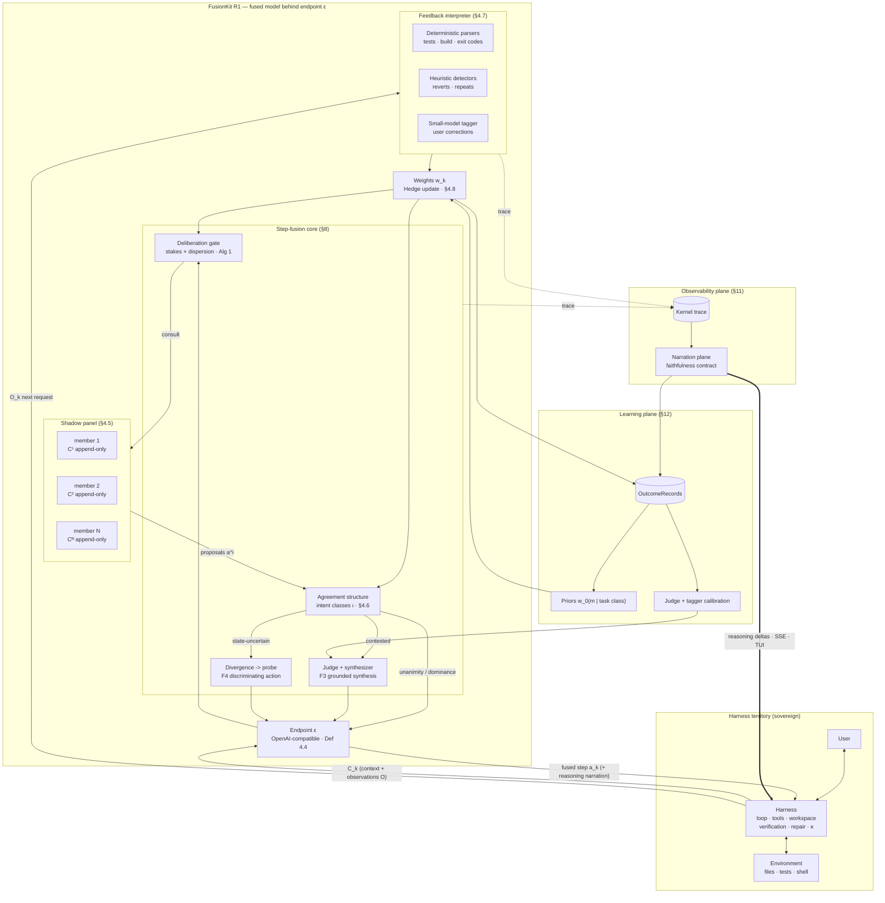
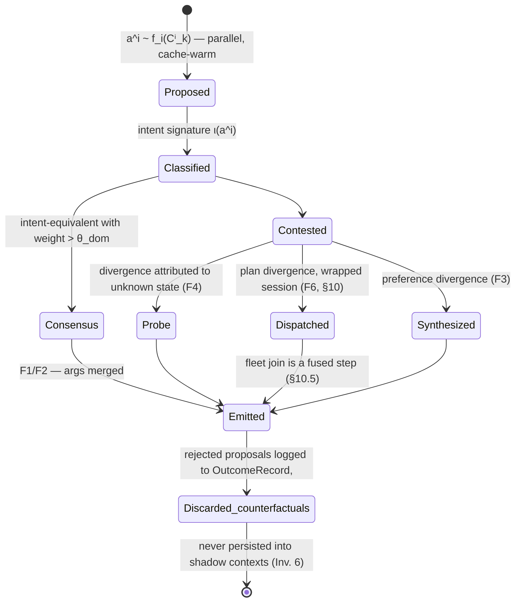
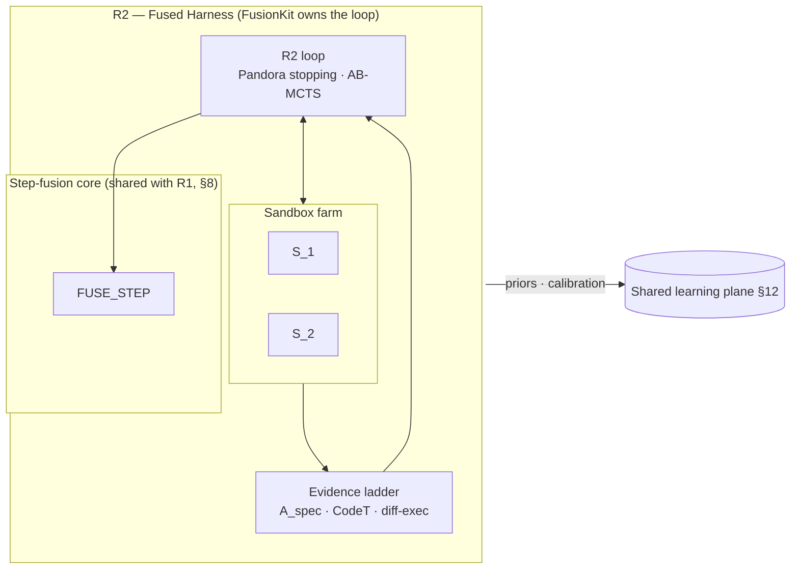
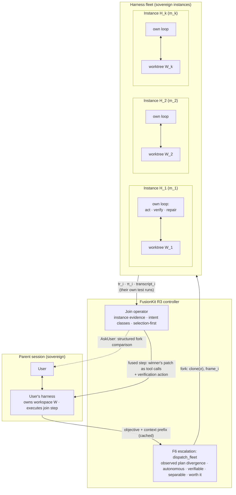

# FusionKit Architecture v2 — Step-Level Trajectory Fusion Behind the Harness Boundary

> **Internal - not product documentation:** Design archive for maintainers; do not treat this as current user-facing product guidance.


Status: design proposal. Supersedes the always-on panel/judge/synth pipeline as
the default architecture. The design rests on two ideas: the **harness sovereignty
principle** (§3) — FusionKit never duplicates the harness's loop — and **R3, the fused
harness fleet** (§10): scoped fork-join replication of the user's harness, reconciling
trajectory-level width with sovereignty. Companion to `MOA_DESIGN.md` (kernel taxonomy) and
`FUSION_VALUE_RUBRIC.md` (measurement rules).

Objective: **SOTA coding performance from cheap open-weight models**, delivered as an
open-source dev tool. Performance is the primary objective; cost is a budget; latency is a
user-chosen tolerance (§5). Deliberation is made legible by a faithful **narration plane**
(§11). The product identity is **fusion**: every step the harness executes is jointly
authored by a panel — selection is a degenerate case, never the objective (§3.3).

---


## 1. Diagnosis of the current design

The shipped system (panel -> LLM judge -> LLM synthesizer, applied per turn) has five
structural defects:

1. **Undirected spend.** Every turn pays N panel calls + judge + synth, including trivial
  turns, and the in-process tool loop regenerates the whole panel every tool round.
2. **Weakest-evidence decisions.** Selection is made by an LLM judge over candidate work
  truncated to prose (1,200 chars/output, 300 chars/tool-arg), ignoring the deterministic
   feedback already present in the conversation.
3. **Rewrite-by-default at the wrong granularity.** Whole-answer rewrite regresses code
  (polyglot fused 0.728 < best single 0.796) while execution-grounded comparison wins
   (LiveCodeBench fused 0.593 vs 0.477, McNemar 10-0).
4. **Context-cost blowup.** N full agents each re-read the growing session context every
  round: O(N * T) per round with T growing — quadratic in session length, times N.
5. **Role confusion.** The harness-path panel runs N *complete agents* in worktrees — a
  second, competing harness bolted onto the user's chosen one. It duplicates the loop the
   harness already owns (act, observe, verify, repair), transmits the duplicated work back
   as truncated prose, and forces a synthesizer to re-derive what the harness would have
   simply executed. Defects 1-4 are symptoms; defect 5 is the cause.

v2 fixes defect 5 first, with a boundary principle, and the rest follow.

## 2. Lessons from reference systems


| System                                | Axis solved               | Lesson adopted                                                                                                                                                                                                                                                                                                                  |
| ------------------------------------- | ------------------------- | ------------------------------------------------------------------------------------------------------------------------------------------------------------------------------------------------------------------------------------------------------------------------------------------------------------------------------- |
| Sakana Fugu (TRINITY / Conductor)     | Product shape             | A fused *model*: one OpenAI-compatible slug a harness drops in; orchestration internal and invisible; beats frontier models with publicly accessible pool members. This is the role-1 identity (§3.2). Pricing lesson: fees must not stack. UX lesson: users accept latency traded for quality.                                 |
| OpenRouter Fusion                     | Aggregation evidence      | Panel -> structured agreement analysis -> grounded final write. Their self-panel ablation (+6.7 pts, Opus with itself) shows lift lives in the aggregation step — Self-MoA is a serious baseline.                                                                                                                               |
| Devin Fusion                          | What *not* to claim       | Main+sidekick routing and compaction-boundary model switching are *harness-side* techniques: available only to whoever owns the loop. FusionKit behind an endpoint must not attempt them in-session; they apply only in role 2 (§9). Cache economics lesson retained: switching models on a warm context is strictly dominated. |
| Sakana AB-MCTS / TreeQuest            | Search at large budgets   | Adaptive wider/deeper tree search under Thompson sampling, driven by execution feedback. Legitimate only where FusionKit owns the loop (role 2, §9).                                                                                                                                                                            |
| Prediction with expert advice (Hedge) | The aggregation formalism | Panel members are experts; environment feedback defines losses; multiplicative weights aggregate with a regret bound vs the best expert in hindsight. This is the formal backbone of step fusion (§4.8, §8.3).                                                                                                                  |


## 3. The boundary principle


### 3.1 Who owns what

A coding session is an interaction loop between three parties:

```text
User  <->  Harness  <->  Model endpoint
              |
        Environment (workspace, tools, tests, shell)
```

The **harness** (Codex CLI, Claude Code, Cursor, ...) owns: the loop (act -> observe ->
iterate), tool execution, the workspace, verification-by-execution, repair, context
management (compaction), and the user relationship. The **model** owns exactly one thing:
given a context, produce the next assistant message.

**Harness sovereignty principle (HSP).** In a session where an external harness runs the
loop, FusionKit implements the model interface and nothing else:

```text
FUSED_STEP : Context -> Δ(AssistantMessage)
```

with `effects(FUSED_STEP) ⊆ { internal model API calls }`. FusionKit never executes tools,
never touches the workspace, never runs verification against the world, never iterates
across steps on its own authority. Depth (iteration, repair, verification execution) is the
harness's; **width (parallel perspectives within one step) is fusion's**. Anything else is
a second harness fighting the first.

**Corollary — replication, not reimplementation.** FusionKit may *instantiate* the user's
harness multiple times (R3, §10) — each instance sovereign over its own loop, doing its own
verification and repair with the harness's own logic — but FusionKit never reimplements
loop logic itself in the presence of a harness. Width in trajectory space is bought by
replicating the sovereign, never by competing with it.

Three otherwise-tempting design decisions are excluded by HSP, and replaced:


| Excluded design                                                             | Why it oversteps                                                                                            | What this design does instead                                                                                                                                                                      |
| --------------------------------------------------------------------------- | ----------------------------------------------------------------------------------------------------------- | -------------------------------------------------------------------------------------------------------------------------------------------------------------------------------------------------- |
| Repair loop / CONT boxes inside fusion                                      | Iteration is the harness loop's job; the harness will send the failure back and we fuse again               | Depth via the harness: fused steps react to feedback in the next context (§8)                                                                                                                      |
| Fusion-side verification execution (sandboxed tests, CodeT runs) in-session | Executing the user's code is environment interaction — the harness's monopoly                               | (a) Feedback interpretation: read the evidence the harness deposits in context (§4.7); (b) divergence -> probe: *propose* the discriminating check as the fused action; the harness runs it (§8.2) |
| Best-of-N trajectory selection as the product's core operation              | Picking one finished trajectory abandons fusion as the identity and needs manufactured evidence to be sound | Step-level fusion: every executed step aggregates all members; selection is the one-hot extreme of the weights, a degenerate case (§3.3)                                                           |


Trajectory-level width is not banned — it is *re-founded*: R3 (§10) recovers divergent full
rollouts without violating HSP, because the rollouts are sovereign harness instances doing
their own verification, and their comparison evidence is what *they* executed, not what
FusionKit manufactured. What stays excluded is the unconditional form with prose-truncated
candidates and a synthesizer re-deriving edits (defect 5).

### 3.2 Three modes under one principle

HSP induces three legitimate modes:

- **R1 — Fused Model** (the resident default): an external harness owns the loop; FusionKit
is the endpoint. Every interactive dialogue step is R1. Everything in §4-§8 is R1.
- **R2 — Fused Harness** (batch / deep mode): no external harness exists; FusionKit *is*
the loop owner (benchmark runs, overnight jobs, `fusionkit run <task>`). Here sandboxes,
acceptance predicates, generated-test cross-validation, and AB-MCTS are legitimate,
because verification and iteration are FusionKit's own job (§9).
- **R3 — Fused Harness Fleet** (fork-join, dispatched): within a wrapped session
(`fusionkit codex` launches the harness), a deliberate step that surfaces plan-level
divergence may escalate (F6, §8.2) an *autonomous,
verifiable, separable* objective to N sovereign instances of the user's own harness —
each with inherited context, its own worktree, its own loop — joined into a single fused
step in the parent session before the next user interaction (§10). Width in trajectory
space, by replication.

Mode discipline: R2 exists only standalone. R3 exists only as a dispatch from a wrapped R1
session and must join (or abort) before the user speaks again. The modes share the model
pool, the narration plane, the learning loop, and the aggregation operator.

### 3.3 Fusion, not selection

The fused-step operator (Def. 4.9) aggregates N member proposals under weights `w`. Its
extreme point — all weight on one member — reproduces selection. The objective is the
general operator:

- **Unanimity**: when members agree on the step, the fused step is that step (with
arguments merged). Agreement is the cheap, common case.
- **Weighted synthesis**: when members diverge, the fused step is written from the
*structured agreement analysis* of the proposals, under the current weights.
- **Divergence -> probe**: when members diverge *because the workspace state is uncertain*,
the fused step is an information-gathering action that discriminates between them —
executed by the harness, resolving the disagreement with real evidence next step.

Because every executed step is fused, the session's realized trajectory is **jointly
authored** — no single pool member produced it. That is trajectory fusion in the strongest
sense, achieved without ever assembling and comparing N complete divergent trajectories.

## 4. Formal foundations

Definitions match shapes already in the codebase (kernel `Artifact`/`TraceEvent`, Python
`Trajectory`, gateway drivers) so the formalism specifies the system rather than inventing a
parallel one.

### 4.1 Notation


| Symbol                     | Meaning                                                                     |
| -------------------------- | --------------------------------------------------------------------------- |
| `Δ(X)`                     | probability distributions over X                                            |
| `⟨x_1..x_n⟩`, `++`         | finite sequence; concatenation                                              |
| `C_k`                      | session context at step k; `T = |C_k|` tokens                               |
| `M`, `m_i`, `N`            | model pool; member i; pool size                                             |
| `a_k`, `O_k`               | executed assistant message at step k; the harness's observations for it     |
| `a^i_k`                    | member i's proposed step                                                    |
| `C^i_k`                    | member i's shadow context (Def. 4.5)                                        |
| `w_k = (w_{1,k}..w_{N,k})` | member weights at step k (simplex)                                          |
| `ι(a)`                     | intent signature of a step (Def. 4.6)                                       |
| `FB`, `r_k`, `ℓ_{i,k}`     | feedback extractor; step reward; member loss (Defs. 4.7, 4.8)               |
| `stakes(a)`, `disp(·)`     | effect-ladder stakes of a proposal; weighted dispersion of proposals (§8.1) |
| `W`, `σ`, `π`, `S`         | workspace; snapshot; patch; sandbox (R2 only, §9)                           |
| `p`, `rho`, `eta`          | pass probability; failure correlation; selector efficiency (§13)            |


### 4.2 Messages, contexts, models, tools

```text
Message := { role: system|user|assistant|tool, content, tool_calls?, tool_call_id? }
Context C := ⟨msg_1..msg_n⟩                       # append-only within a turn; κ = compaction

Model m := (f_m, meta_m)
  f_m: Context × SamplingParams -> Δ(AssistantMessage)
  meta_m: { W_m, tools, price (p_in, p_out, p_cached), latency (p50, p95), caching }
  cost(m, C_cached ++ C_new, y) = |C_cached|·p_cached + |C_new|·p_in + |y|·p_out

Tool τ := { name, sig, effect: pure|read_ws|exec|write_ws, network: bool }
ToolCall / Observation as invocation record / result record
```

The cost formula's prefix-sensitivity drives the central cache invariant (§4.5, Inv. 5).
In R1, tools are *declared by the harness* in the request; FusionKit's members may propose
`ToolCall`s but no environment ever executes them inside FusionKit (HSP).

### 4.3 The session step relation (R1)

An R1 session is an alternating sequence governed by the harness:

```text
C_{k+1} = κ?( C_k ++ ⟨a_k⟩ ++ O_k )
  a_k ~ FUSED_STEP(C_k)          # FusionKit's entire influence on the world
  O_k  = harness-executed observations for a_k's tool calls (possibly empty)
  κ?   = harness-side compaction, applied at the harness's discretion
```

FusionKit sees only the delivered `C_k` stream. All environment truth — test results,
compiler output, file contents — arrives inside `O_·` segments *authored by the harness*.
This is the formal sense in which evidence is interpreted, not manufactured (§4.7).

### 4.4 The endpoint contract

```text
ε : Context × SamplingParams -> Stream(Delta)
```

OpenAI chat-completions semantics (deltas: `content`, `reasoning_content`, `tool_calls`;
terminal `finish_reason`, `usage`). Obligations:

- **HSP compliance**: `ε` is a pure function of delivered contexts plus internal state that
is itself a function of delivered contexts (Def. 4.10). No world effects.
- **Degree-1 observational equivalence**: under `fast` posture with no escalation, `ε` is
distributionally indistinguishable from the leader member's endpoint, modulo metadata.
- **Sanctioned side channels only**: fusion internals surface exclusively via
`reasoning_content` narration deltas and the `fusion` extension on the terminal chunk.
- **Tool-call integrity**: emitted `tool_calls` are schema-valid against the harness's
declared tools; member-internal deliberation never leaks as spurious calls.


### 4.5 Shadow contexts (the multi-turn panel, cache-correct)

Each pool member holds a **shadow context** — its own append-only rendering of the true
session history:

```text
C^i_k := frame_i ++ C_k                            # frame_i: member-specific system framing
```

Properties, each load-bearing:

- **Truth-conditioned**: members are conditioned on the *executed* steps `a_·` and *real*
observations `O_·` — the genuine history — not on their own counterfactual proposals.
Rejected proposals do not enter any persistent context.
- **Append-only ⇒ cache-warm**: because `C^i` only grows (modulo harness compaction, which
hits everyone equally), each member's provider prompt cache stays warm. Per-step marginal
cost per member ≈ `|new segment|·p_in + |C^i|·p_cached + |proposal|·p_out`. This replaces
the current system's "re-fan the panel per round at full price" with N× *cached-rate*
context — the economics that make a persistent panel viable at all.
- **Identity-coherent**: `frame_i` instructs the member that prior assistant turns are its
own (the standard multi-model-session convention); the existing identity/disclosure
prompt block already solves this.


### 4.6 Step proposals and intent signatures

At step k, active members propose:

```text
a^i_k ~ f_{m_i}(C^i_k; θ_i)                        # θ_i: per-member framing/temperature
Proposal := { member: i, msg: AssistantMessage, rationale?: reasoning summary }
```

The **intent signature** classifies a proposal for agreement analysis:

```text
ι(a) := ( kind:      respond | tool_call | mixed,
          tools:     multiset of tool names invoked,
          targets:   normalized objects acted on (file paths, commands, symbols),
          gist:      semantic hash of content / patch shape )
```

Two proposals are **intent-equivalent** iff their signatures agree on `kind`, `tools`, and
`targets` (gist may differ — same action, different wording). The partition of proposals by
intent-equivalence is the **agreement structure** of the step; the weight of a class is the
sum of its members' weights.

### 4.7 The feedback extractor (evidence, generalized)

Evidence in R1 is whatever the harness deposits into the context. The extractor is a pure
function over the newly delivered segment:

```text
FB : (a_{k-1}, O_{k-1}, user msgs) -> [Signal]
Signal := { channel:  test_result | build_result | lint_result | runtime_error
                    | exit_code | user_correction | user_approval | revert_detected,
            valence:  [-1, +1],
            strength: calibration class (deterministic_parse | heuristic | llm_tagged),
            refs:     spans in O_{k-1} }
```

Implementation is layered exactly like the old evidence tiers, but as *parsers* not
*executors*: deterministic parsers for test-framework summaries, compiler error counts, and
exit codes; heuristic detectors for reverts and repeated errors; a small-model tagger for
user corrections in natural language. The **step reward** folds signals:

```text
r_k := clip( Σ valence·weight(strength) , -1, +1 )   # reward attributed to executed step a_k
```

This is the generalization requested of "the checks": one uniform mechanism — *environment
feedback interpretation* — that covers tests, builds, linters, runtime errors, and the user
themselves, works for any harness and any domain, and requires FusionKit to execute
nothing. Execution evidence still grounds the system; it simply flows through the loop that
was already running it.

### 4.8 Member weights: prediction with expert advice

The panel is an experts problem: members propose, the environment (via `FB`) scores the
executed step, and weights update multiplicatively.

```text
ℓ_{i,k} := agreement(a^i_k, a_k) · (1 - r_k)/2  +  (1 - agreement(a^i_k, a_k)) · (1 + r_k)/2
           # agree with a step that went badly, or disagree with one that went well -> loss
           # agreement(·,·) ∈ [0,1]: 1 if intent-equivalent, partial credit via ι overlap

w_{i,k+1} ∝ w_{i,k} · exp(-η_hedge · ℓ_{i,k})        # Hedge / multiplicative weights
w_{i,0}   ∝ prior(m_i | task-class features)          # from the learning loop (§12)
```

**Guarantee (and its honest scope).** Under the standard experts analysis, cumulative loss
of the weighted fusion is within `O(√(K ln N))` of the best member's *in hindsight*, per
session — the fused policy tracks whichever pool member is actually best for this repo,
this task, this week, without knowing in advance. The bound is with respect to `ℓ`, a proxy
whose fidelity is exactly the credit-assignment problem (§16); the bound is a design
compass, not a marketing theorem.

### 4.9 The fused-step operator

```text
FUSE_STEP : (proposals {a^i_k}, weights w_k, context C_k) -> AssistantMessage
```

Required properties:

- **(F1) Unanimity.** All proposals intent-equivalent ⇒ output in the same intent class,
arguments merged (e.g. identical tool, union of trivially-compatible args).
- **(F2) Weighted dominance.** A class with weight > θ_dom ⇒ output from that class;
within-class disagreement on `gist` resolved by synthesis among class members only.
- **(F3) Grounded synthesis.** Otherwise: judge produces a structured agreement analysis
over the *full structured proposals* (complete tool calls, complete diffs — never
truncated prose; Inv. 8), and a synthesizer writes the step, weighted by `w_k`,
constrained to schema-valid actions.
- **(F4) Divergence -> probe.** If the analysis attributes the disagreement to unknown
environment state (members assume different file contents, API shapes, test status), the
fused step is the cheapest discriminating *read-class* action (read the file, run the
test, grep the symbol) instead of a guess. The harness executes it; next step all members
are conditioned on the answer. **This is how verification enters R1**: the check is
proposed through the loop, never executed beside it.
- **(F5) Selection as extreme point.** `w` one-hot ⇒ FUSE_STEP = that member's proposal
verbatim. Degenerate case, not objective.
- **(F6) Plan divergence -> fleet (wrapped sessions only).** If the analysis attributes the
disagreement to *plan-level* divergence — members pursue genuinely different approaches, not
different beliefs about state — and the §10.4 admission conditions hold, the fused step is a
fleet dispatch: the competing approaches are rolled out by sovereign harness instances and
joined (§10). Escalation, not a separate gate outcome: F6 exists only downstream of an
observed disagreement, never as a forecast.


### 4.10 FusionKit's internal state (R1)

```text
Ψ_k := { shadow contexts C^i_k, weights w_k, narration log, trace }
```

Ψ is a deterministic function of the delivered context stream and FusionKit's own sampling
randomness — never of any world interaction. This is HSP stated as a state invariant: R1
FusionKit is a (stateful, stochastic) *function*, not an agent.

## 5. Optimization objective and postures: performance first

```text
maximize   E[quality]
subject to cost    <= C_budget(posture)
           latency <= L_tolerance(posture)      # a tolerance, not an objective term
```

Latency does not appear in the objective (users trade waiting for quality — the Fugu Ultra
pattern); its acceptability is measured by abort rates (§11.5), not assumed. The per-step
spend decision is the **deliberation gate** (§8.1): width scales with the stakes and
dispersion of the step, so trivial steps cost ~1 model and contested write-actions get the
full panel plus synthesis.


| Posture              | Panel policy per step                                     | Escalation             | Narration       |
| -------------------- | --------------------------------------------------------- | ---------------------- | --------------- |
| `fast`               | leader-only; panel consulted on gate triggers only        | gate (§8.1)            | quiet (level 1) |
| `balanced` (default) | active panel on medium+ stakes; leader-only on low stakes | gate, lower thresholds | standard (1-2)  |
| `max`                | full panel every step; synthesis always grounded (F3)     | always deliberate      | verbose (1-3)   |


Postures map to slugs `fusionkit/fast`, `fusionkit/fusion`, `fusionkit/ultra`; user- or
model-escalatable mid-session.

## 6. Invariants

1. **Harness sovereignty (HSP).** In R1, `effects(FUSED_STEP) ⊆ {internal model calls}`:
  no tool execution, no workspace access, no verification against the world, no
   cross-step iteration on FusionKit's own authority. Depth is the harness's; width is
   fusion's.
2. **Mode discipline.** R2 (fused harness, §9) exists only standalone — never beside an
  external harness. R3 (fleet, §10) exists only as an F6 escalation from a deliberate step
   in a wrapped session,
   scoped to a workspace snapshot, and each fleet instance is sovereign over its own loop
   (replication corollary, §3.1).
3. **Degree-1 capability.** A degree-1 path exists (`fast`, no escalation) that is
  observationally equivalent to the leader member's endpoint (Def. 4.4).
4. **Fusion identity.** Every emitted step satisfies F1-F6 (Def. 4.9). Selection occurs
  only as the one-hot extreme of the weights.
5. **Append-only shadow contexts.** `C^i` grows monotonically between harness compactions;
  member reassignment (pool membership change for a warm shadow context) happens only at
   compaction events — the cache-boundary rule, now applied to FusionKit's own panel.
6. **Truth conditioning.** Persistent member contexts contain only executed steps and real
  observations; counterfactual proposals are never persisted into any member's context.
7. **Evidence is interpreted, not manufactured (R1).** All evidence enters via `FB` over
  harness-delivered segments, or via probes (F4) executed by the harness. Signal strength
   classes order trust: deterministic_parse > heuristic > llm_tagged; stronger classes
   dominate weight updates.
8. **Structured artifacts.** Judge and synthesizer consume full structured proposals
  (complete tool calls, complete diffs/messages) — never truncated prose summaries.
9. **Narration faithfulness.** Every narration event projects >= 1 kernel trace event;
  never ahead of the trace, never speculative, failures narrated like successes (§11).
10. **Provenance.** Every emitted step carries lineage: proposals, agreement structure,
  weights, gate decision, spend vs single-leader counterfactual.
11. **Verification isolation (R2 only).** Where FusionKit owns the loop, all candidate work
  and verification run under the sandbox judgment with isolation axioms I1-I4 (§9.1).
12. **Join before the user.** An R3 fleet joins (or aborts, narrated) before the next user
  interaction; the join's output enters the parent session as a fused step whose actions
    (patch application, verification) are executed by the parent harness — never by
    FusionKit (§10.5).


## 7. System architecture


### 7.1 R1 static structure




### 7.2 One fused step, end to end

```mermaid
sequenceDiagram
    participant H as Harness
    participant E as Endpoint ε
    participant F as Feedback interpreter
    participant W as Weights w
    participant G as Gate
    participant P as Shadow panel
    participant A as Agreement + judge/synth
    participant N as Narration

    H->>E: C_k (includes O_{k-1}: test output, tool results)
    E->>F: new segment of C_k
    F->>W: signals -> r_{k-1}; Hedge update ℓ_{i,k-1}
    W->>N: weight-shift event (trace-grounded)
    E->>G: stakes(pending step) × dispersion estimate
    alt gate: leader only (low stakes, low dispersion)
        G->>P: leader proposes
        P-->>E: a_k := leader proposal (F5 extreme point)
    else gate: full deliberation
        G->>P: all active members propose (parallel, cached prefixes)
        P-->>A: structured proposals {a^i_k}
        A->>N: agreement-structure event
        alt unanimity / weighted dominance (F1, F2)
            A-->>E: consensus step, args merged
        else contested, state-uncertain (F4)
            A-->>E: probe action (read/test) — harness will execute
        else contested, preference (F3)
            A-->>E: synthesized step, weighted, schema-valid
        end
    end
    E->>H: a_k + reasoning narration + provenance
    H->>H: executes tool calls; runs its own loop (verify, repair, iterate)
    H->>E: C_{k+1} — and the cycle continues
```


### 7.3 Proposal lifecycle within a step




## 8. The step-fusion core (R1 algorithms)


### 8.1 Algorithm 1 — Deliberation gate

Width per step is bought where it pays: stakes (what could the step break) times dispersion
(do informed members actually disagree).

```text
function GATE(C_k, w_k, posture P) -> leader_only | deliberate:
    # fleet dispatch is NOT a gate outcome: it is an escalation *from* deliberation,
    # decided inside FUSE_STEP on observed plan-level divergence (§8.2, §10.4)
    stakes <- effect ladder of the likely action:
              respond/read: low · exec (tests, build): medium · write_ws (edits): high
              # estimated from leader's draft or from the harness's pending tool schema
    dispersion_prior <- disp(recent steps) and task-class prior      # cheap, no extra calls
    if P == max: return deliberate
    if stakes == high or TRIP(C_k): return deliberate
    if stakes == medium and dispersion_prior > θ_d(P): return deliberate
    return leader_only                                # leader = argmax_i w_{i,k}

TRIP(C_k) :=      # deterministic, from FB signals already extracted
    negative r over last j steps                      # the harness loop is struggling
 or repeated_error_signature(O_{k-1}, O_{k-2})
 or revert_detected
 or user requested deliberation ("think hard")
 or harness requested via fusion tool-call
```

Degree-1 equivalence (Inv. 3): `leader_only` under `fast` posture emits the leader's stream
untouched.

### 8.2 Algorithm 2 — FUSE_STEP

```text
function FUSE_STEP(C_k, Ψ_k, posture P) -> AssistantMessage:
    if GATE(...) == leader_only:
        a_k <- stream leader's proposal                              # F5 extreme point
        NARRATE(step, leader, gate_decision); return a_k

    proposals <- parallel { a^i_k ~ f_i(C^i_k; θ_i) : active i }     # cached prefixes (Inv. 5)
    classes   <- partition proposals by intent-equivalence (ι)       # §4.6
    NARRATE(agreement, classes, w_k)                # "3 of 4 members want to edit parser.py"

    if top_class.weight == 1:                        return MERGE_ARGS(top_class)       # F1
    if top_class.weight > θ_dom:                     return SYNTH_WITHIN(top_class)     # F2

    analysis <- JUDGE(structured proposals, classes, w_k)            # full diffs/calls (Inv. 8)
    if analysis.divergence_cause == unknown_state:                                     # F4
        probe <- cheapest read-class action discriminating the classes
                 # e.g. run the disputed test · read the disputed file · grep the symbol
        NARRATE(probe, probe, classes)
        return probe                                 # harness executes; members see O_k next step

    if analysis.divergence_cause == plan_divergence                                    # F6
       and ADMIT_FLEET(C_k, classes, P):             # §10.4: wrapped session + autonomous,
                                                     # verifiable, separable, budget covers k
        NARRATE(dispatch, classes)
        return DISPATCH_FLEET(...)                   # §10.3; join is itself a fused step (§10.5)

    a_k <- SYNTHESIZE(analysis, proposals, w_k)      # F3: weighted, schema-valid,
                                                     # grounded in agreement structure
    NARRATE(synthesis, a_k, analysis); return a_k
```

Cost shape: `leader_only` steps cost one model call. Deliberate steps cost N cached-prefix
calls + at most one judge + one synth — and F1/F2/F4 skip the synthesizer entirely. The
probe rule additionally *converts* deliberation into harness-executed evidence, so a probe
step is simultaneously the cheapest and the most informative resolution. F6 is the only
rung that costs more than a deliberate step, and it is only reachable *through* one: the
panel's observed plan divergence is both the trigger and the justification for paying k
rollouts (§10.4), so the ladder leader -> panel -> fleet never buys width on a forecast.

### 8.3 Algorithm 3 — Feedback fold and weight update

```text
function ON_NEW_CONTEXT(C_k, Ψ_{k-1}):
    seg      <- C_k minus C_{k-1}                    # ⟨a_{k-1}⟩ ++ O_{k-1} ++ user msgs
    signals  <- FB(seg)                              # §4.7: parse, detect, tag
    r_{k-1}  <- fold(signals)                        # step reward, strength-weighted
    for each member i active at step k-1:
        ℓ_{i,k-1} <- loss(agreement(a^i_{k-1}, a_{k-1}), r_{k-1})    # §4.8
        w_{i,k}   <- w_{i,k-1} · exp(-η_hedge · ℓ_{i,k-1}); renormalize
    append seg to every shadow context C^i            # truth conditioning (Inv. 6)
    NARRATE(feedback, signals, weight_shift)          # "tests: 9/9 passed — kimi-k2 ↑"
    emit OutcomeRecord fragment (proposals, classes, gate, r, w)
```

Credit assignment is the known weak joint (§16): `agreement(·)` gives partial credit via
intent-signature overlap, probes get neutral loss (they generate evidence rather than bet),
and `η_hedge` is kept small so single misattributed steps cannot capsize a member.

### 8.4 What deliberately does not exist in R1

Stated to keep the boundary audit-able:

- No retry/repair of a step after emission — the harness's feedback arrives as the next
context and the next step responds to it.
- No sandbox, no workspace, no test execution, no generated tests.
- No trajectory-level candidate assembly; no post-hoc trajectory selection.
- No main/sidekick role play, no delegation — those require owning the loop (Devin owns
its harness; FusionKit behind `ε` does not).
- No hidden context edits: FusionKit never rewrites, reorders, or augments the harness's
context beyond the member framing prefix.


## 9. R2 — Fused Harness (batch / deep mode)

When no external harness exists — `fusionkit run <task>`, benchmark execution, overnight
jobs — FusionKit legitimately owns the loop, and the machinery excluded from R1 (§3.1)
applies here in full, because here it *is* the harness's job and FusionKit is the harness:

### 9.1 Sandboxes

`S = (W_S, E, R, Φ)` — scratch worktree from a snapshot, allowlisted env, resource limits,
permitted effect set (`network ∉ Φ` by default) — with execution judgment
`S ⊢ run(cmd) ⇓ (exit, out, Δ, violations)` and isolation axioms: (I1) egress only via
artifacts; (I2) ingress only via provisioning; (I3) consumption bounded by R; (I4) teardown
leaves no residue. All R2 candidate work and verification runs under `S ⊢ ·` (Inv. 11).

### 9.2 Objectives, acceptance, evidence tiers

R2 tasks carry an `ObjectiveSpec` with executable acceptance `A_spec: (π, S) -> accept | partial | reject`, and the full evidence ladder applies — including the two tiers R1 cannot
have: **generated-test cross-validation** (CodeT-style agreement matrix with own-model
exclusion, holdout split, greedy dual-agreement scoring) and **differential execution**.
Banded scalarization bridges tiers to the scalar `v` used by search.

### 9.3 Budgeting and search

Candidate generation under **Pandora-box optimal stopping** (reservation indices
`z_m` from hierarchical priors; escalation gate and stopping rule are the same
computation), with failure re-pricing per the error taxonomy; **AB-MCTS** (TreeQuest,
Apache-2.0, inside the existing `TreeSearchScheduler` scaffold) for budgets B >= ~16 where
refinement chains beat flat sampling. Exhaustion policy: BestEffort with flagged unmet
checks, or surface the fork to the user — never silent best-guess.

### 9.4 The bridge between roles

R2's loop *contains* R1's fusion core: each step of an R2 rollout is itself a fused step
(§8). The roles differ only in who executes actions and who may verify. Everything
measured in R2 (member pass rates, failure correlations, judge accuracy) feeds the shared
priors — R2 is also the calibration bench for R1's weights.




## 10. R3 — Fused Harness Fleet (fork-join replication)


### 10.1 Why step fusion alone is not enough

Step fusion (§8) has a structural blind spot: it collapses trajectory-space width to 1. The
panel only ever votes on the next move of *one shared trajectory*; a member whose globally
better approach locally disagrees with the weighted majority gets steamrolled (herding).
Conversely, divergent full rollouts have the opposite failure mode: N times the cost, and a
join problem at the end. The two width axes are complementary:


|                | Step fusion (R1)                                        | Fleet fork-join (R3)                                         |
| -------------- | ------------------------------------------------------- | ------------------------------------------------------------ |
| Width in       | action space, per step                                  | trajectory space, per objective                              |
| Candidates are | proposals (unverified)                                  | finished work products, verified by each instance's own loop |
| Failure mode   | herding: majority steamrolls a better minority approach | join risk: divergent states to reconcile; N× rollout cost    |
| Evidence       | harness feedback, one step delayed                      | each instance's own execution results, available at join     |
| Fits           | interactive dialogue, low/medium stakes steps           | autonomous, verifiable, separable objectives                 |


Deliberation itself chooses the axis: plan-level divergence observed in the panel is what
escalates to R3 (F6, §10.4). Headroom argument for R3: selection over N rollouts
accesses `E[max_i quality(tr_i)] >= max_i E[quality(tr_i)]` — the oracle-over-trajectories
bound — and the §13 selection arithmetic applies directly, with `eta` powered by evidence
the instances themselves produced. Step fusion's regret bound only ever tracks the best
*member on the shared path*; R3 is the mechanism that beats it when paths matter.

### 10.2 Mode definition and sovereignty

R3 is available when FusionKit *wraps* the harness (the CLI already launches it:
`fusionkit codex`). On dispatch, each active member `i` receives its own **instance** of
the user's harness:

```text
Instance H_i := ( vendor harness binary, headless,
                  model = m_i,
                  context = user-session prefix (verbatim; shared cache) ++ frame_i,
                  workspace = clone(σ_dispatch),          # own worktree
                  tools = harness-native toolset,
                  loop = the harness's own logic )         # sovereign: repairs, verifies,
                                                           # stops by its own rules
```

Sovereignty holds *per instance*: FusionKit never reaches inside an instance's loop, never
injects steps, never repairs on its behalf. FusionKit's authority over the fleet is
exactly: dispatch, observe transcripts, enforce budget/wall-clock caps, join, teardown.
This is the replication corollary of HSP (§3.1) made operational.

### 10.3 Fork semantics

```text
function DISPATCH_FLEET(Σ_user, objective, fleet_size k <= N_max):
    σ <- snapshot(Σ_user.W)                          # the parent workspace state
    prefix <- Σ_user.C truncated at the dispatch point   # shared across instances -> cached
    for each selected member i (top-k by w, diversity-adjusted):
        H_i <- spawn(harness, m_i, prefix ++ frame_i, clone(σ), budget_i)
    NARRATE(dispatch, objective, fleet composition)
    instances run concurrently to their own completion or budget cap
    parked_i <- any instance that stalls awaiting user input      # §10.5
    return { (tr_i, π_i, transcript_i) : completed i } ∪ { parked reports }
```

Fork cost honesty: each instance pays the shared prefix at *cached* rate (same provider
prefix), then its own divergent suffix at full rate. The dominant new cost is the divergent
rollout itself — which is the point: that spend buys verified exploration, and the gate
only authorizes it where verification exists (§10.4).

### 10.4 Dispatch trigger (escalation from deliberation)

Fleet dispatch is not a gate outcome. The gate (§8.1) only ever decides `leader_only` vs
`deliberate`; dispatch is an escalation *inside* a deliberate step (F6 branch of FUSE_STEP,
§8.2), taken when the panel's own agreement structure reveals plan-level divergence. This
removes a redundancy the three-outcome design had: the gate would have needed to *predict*
panel disagreement a priori to choose dispatch, duplicating exactly the estimate that
running the panel produces as evidence. The escalation ladder is therefore observed, not
forecast: leader -> panel -> fleet, each rung paid for by evidence from the rung below.

```text
ADMIT_FLEET(C_k, classes, P) iff ALL of:
    dispersed:    plan-level divergence observed in this step's intent classes
                  (the F6 trigger — not a prior; the panel already disagreed)
    autonomous:   no user input expected during the rollout (plan says so; user absent/idle,
                  or user explicitly dispatched: "try a few approaches")
    verifiable:   the objective's outcome is checkable by the instances' own loops
                  (tests exist or are runnable; build/repro command known)
    separable:    the objective is self-contained enough to brief via the context prefix
    worth it:     stakes justify k rollouts and the posture budget covers them
```

Interactive small steps never reach the F6 branch (they resolve at F1/F2 or synthesis).
`max` posture lowers the thresholds; `fast` never dispatches without an explicit user
request.

### 10.5 Join semantics

Join must complete (or abort) **before the next user interaction** (Inv. 12). The join is
itself a fused decision, and its output is — critically — **a fused step in the parent
session**:

```text
function JOIN(results {(tr_i, π_i, transcript_i)}, Σ_user):
    evidence_i <- FB(transcript_i)                   # instance-run tests, builds, errors:
                                                     # parsed from what THEY executed (§4.7);
                                                     # FusionKit executed nothing
    classes <- intent classes over patches π_i       # structure-first, full diffs (Inv. 8)
    NARRATE(join, classes, evidence summary)

    if unanimity or evidence-dominant class:                       # the common good case
        winner <- top class / top instance by (evidence, w)
        return fused step in parent session:
               winner's π as ordinary edit tool-calls              # the PARENT harness
               ++ a verification action (run the suite)            # executes both (HSP)
    if instances' evidence conflicts (each passes its own, differing, checks):
        return fused step: apply leading candidate + run the UNION of their checks
               # the parent harness's next feedback resolves the conflict
    if no evidence distinguishes and approaches diverge:
        return AskUser(structured comparison of the k approaches)  # the fork is the answer
    parked instances: their pending questions are surfaced in the join summary
                      (an instance needing user input is itself a plan-divergence signal)
```

Note what never happens at join: no synthesizer rewriting one patch "informed by" the
others; no prose summaries of diffs; no FusionKit-side execution. Selection-first, with
composition excluded for the same partial-monoid reasons as ever, and even *integration*
flows through the sovereign parent harness as tool calls it executes itself.

### 10.6 Why this is not defect 5

The current worktree panel superficially resembles R3. The differences are exactly the
things that made defect 5 a defect:


| Defect-5 form (current)                                                                              | R3                                                                                                                    |
| ---------------------------------------------------------------------------------------------------- | --------------------------------------------------------------------------------------------------------------------- |
| Unconditional: every user turn fans out full agents                                                  | Escalated (F6) from observed plan divergence, under explicit admission preconditions                                  |
| Candidates reach the synthesizer as 1,200-char prose                                                 | Join consumes full structured patches + transcripts (Inv. 8)                                                          |
| Synthesizer re-derives edits; needs "your candidates edited imaginary workspaces" prompt scaffolding | Winner's patch flows into the parent session as ordinary tool calls; no re-derivation, no imaginary-workspace framing |
| Judge-over-prose is the selection evidence                                                           | Instances' own execution results are the selection evidence                                                           |
| Fresh fanout every round; no cache story                                                             | Fork shares the cached session prefix; one fork per dispatched objective                                              |
| Panel competes with the user's session state                                                         | Fleet is scoped to a snapshot; parent session continues from exactly one state, chosen at join                        |


### 10.7 Practicalities

- **Fleet bound**: `k <= N_max` (default 4) concurrent instances; per-instance budget and
wall-clock caps; eager teardown of worktrees.
- **Auth**: instances reuse the existing subscription/auth machinery (the Codex-harness
auth-symlink and allowlisted-env code paths apply per instance). Watch vendor rate
limits: k instances on one subscription is a real constraint — narrated when it binds.
- **Harness pinning**: the existing vendor-drift machinery (config generation, version
pinning) applies unchanged, once per instance.
- **Weights**: fleet composition is chosen by current weights `w` with a diversity
adjustment (don't send four near-clones); join outcomes feed the same Hedge/prior
updates — an R3 win is strong evidence about a member.


### 10.8 R3 structure




## 11. Narration plane

Deliberation is the product; narration makes it legible. One contract serves all three
modes; only the phase vocabulary differs.

### 11.1 Event model

```text
NarrationEvent := {
  id, ts,
  phase:       step | agreement | synthesis | probe | feedback | weight_shift
             | escalate | violation | abort | (R2: distill | evidence | search_step
             | stop_decision | select | integrate),
  trace_refs:  [TraceEventId],       # >= 1 (Inv. 9)
  progress:    { gate_decision, classes_summary, budget_spent, leader },
  fields:      structured payload (members, intent classes, weights, signal channels),
  text:        rendered from fields by per-phase templates,
  level:       1 (headline) | 2 (standard) | 3 (verbose/debug)
}
```


### 11.2 Faithfulness contract

Grounded (non-empty `trace_refs`; every textual claim maps to a field); deterministic
rendering (templates; optional LLM rephrasing may not add claims — enforced by diffing
entity mentions against the template rendering); non-speculative (events follow trace
events, never precede); honest failure (weight drops, failed proposals, probe dead-ends
narrated at the same level as successes).

### 11.3 Surfaces


| Surface        | Channel                                                      | Rendering                                                                                                            |
| -------------- | ------------------------------------------------------------ | -------------------------------------------------------------------------------------------------------------------- |
| Endpoint `ε`   | `reasoning_content` deltas + `fusion.narration` SSE payloads | Harnesses render as thinking; fusion-aware clients render rich progress                                              |
| CLI / TUI      | live status: gate decision, agreement summary, weight bars   | `[fusion] deliberate · 3/4 agree: edit parser.py · qwen3 ↑`                                                          |
| Terminal chunk | provenance block (Inv. 10)                                   | "Fused from 4 proposals (3 intent-equivalent); synthesized under weights {...}; spend $0.011 vs $0.007 leader-only." |


### 11.4 Example (level 2, three consecutive steps)

```text
step 12  deliberate (stakes: write) · 4 proposals · 3/4 agree: edit parser.py handle_empty()
         synthesized from majority class · emitted
step 13  feedback: tests 6/9 -> 9/9 (deterministic) · reward +0.8 · weights: qwen3 ↑ kimi ↑ gpt-oss ↓
         leader-only (stakes: read) · emitted
step 14  deliberate (dispersion) · members disagree on retry API shape — cause: unknown state
         probe emitted: read src/retry.ts (discriminates 2v2 split)
```


### 11.5 Narration as a signal source

User aborts/redirects logged with narration state (revealed cost/patience tolerance);
verbosity per posture (`fast` 1, `balanced` 1-2, `max` 1-3).

## 12. Learning loop

```text
OutcomeRecord := {
  features,                       # task class, repo, harness, posture, step index
  step_log,                       # per step: proposals, ι classes, gate, executed a, r
  weights_trajectory,             # w_k over the session
  session_outcome,                # user acceptance / revert / R2 grade where available
  cost, latency,                  # + leader-only counterfactual per step
  narration_log, user_aborts,
}
```

Training targets, in deployment order:

1. **Feedback extractor calibration** — validate parser valences against R2 ground truth
  (where FusionKit can grade); tune the small-model tagger.
2. **Judge calibration** — the F3 judge's agreement analyses scored against subsequent
  feedback (did the synthesized resolution get positive r?); Bradley-Terry accuracy per
   task class; anonymization and self-preference controls as before.
3. **Weight priors** `w_0(m | task class, repo)` — hierarchical partial pooling; R2 runs
  and the §13 measurement provide the cold start; ordinary R1 use sharpens them.
4. **Gate tuning** — θ_dom, θ_d, stakes classifier, from step-level regret: how often did
  leader-only steps draw negative feedback that deliberation would plausibly have caught
   (estimable off-policy: proposals for deliberated steps are logged with counterfactuals).
5. **Learned coordination** (Conductor-style) — only after logged regret shows the Hedge +
  gate policy leaving material headroom.

Opt-in telemetry pool: anonymized aggregates (task-class features, member, ℓ, r — never
code or prompts) so the community shares priors the way it shares the tool.

## 13. The arithmetic and guarantees that decide the product

**R1 (fused model).** Two claims, each measurable:

- *Tracking*: by the experts bound (§4.8), session loss tracks the best pool member in
hindsight within `O(√(K ln N))` — the fused endpoint is never much worse than the pool's
best member for the workload at hand, without knowing which member that is. Validity
hinges on the loss proxy (§16.1).
- *Uplift*: unanimity confidence, weighted synthesis, and probes must add quality beyond
tracking. Measured as: harness + `fusionkit/fusion` vs harness + best single member,
same harness, same tasks, paired (the `fusion_compound.py` McNemar machinery applies
unchanged — the compound under test is now harness+endpoint).

**R3 (fleet).** The selection arithmetic below applies to R3 joins directly, with `eta`
powered by instance-run execution evidence — this is where the oracle-over-trajectories
headroom (`E[max_i] >= max_i E`) is actually harvested in production. Measured as an
ablation: wrapped sessions with dispatch enabled vs step-fusion-only, paired on autonomous
verifiable objectives, at equal token budget.

**R2 (fused harness)** keeps the selection arithmetic, since selection evidence exists
there:

```text
P(fused pass) = eta · (1 - (1 - p)^N_eff),   N_eff = 1 + (N - 1)(1 - rho)
```

Worked example unchanged (p=0.45, N=4, rho=0.3, eta=0.85 -> ~0.71 vs frontier ~0.55-0.60);
the margin lives in eta and rho. R2 also measures what R1 cannot directly: per-member p,
pairwise and self-sample rho, judge accuracy — feeding R1's priors (§9.4).

First empirical work, in order: (1) R2 measurement run for p / rho / eta (exists in spirit
in `fusion_compound.py`); (2) R1 session-level paired benchmark (harness + fused endpoint
vs harness + best member) — this is the product's falsifier; (3) probe-rule ablation (F4
on/off) — the cheapest test of the boundary thesis, since probes are the mechanism that
replaces manufactured verification.

## 14. Build order, each layer with a falsifier


| #   | Layer                                                                                                                                        | Falsifier (kill criterion)                                                                                                                                 |
| --- | -------------------------------------------------------------------------------------------------------------------------------------------- | ---------------------------------------------------------------------------------------------------------------------------------------------------------- |
| 1   | Shadow panel + FUSE_STEP with F1/F2/F5 only (unanimity, dominance, leader) — no judge, no synth                                              | Session-level paired benchmark: harness+fusion fails to match harness+best-member (tracking broken)                                                        |
| 2   | Narration plane over the trace (gate, agreement, feedback events)                                                                            | Abort rate unchanged vs un-narrated; or overhead material                                                                                                  |
| 3   | Feedback extractor + Hedge weights                                                                                                           | Weights fail to converge toward the member R2 measurement says is best per task class                                                                      |
| 4   | F4 probes                                                                                                                                    | Probe ablation shows no quality gain, or probes measurably annoy (abort/step-count blowup)                                                                 |
| 5   | F3 grounded synthesis (judge + synthesizer)                                                                                                  | Synthesis steps draw worse subsequent feedback than dominance-class steps on contested steps (the polyglot regression, re-measured at step level)          |
| 6   | Gate tuning from logged counterfactuals                                                                                                      | No cost reduction at equal quality vs always-deliberate                                                                                                    |
| 7   | R2 fused harness (sandboxes, acceptance, CodeT, Pandora, AB-MCTS)                                                                            | R2 fused pass@1 fails to beat best single member on held-out set (the LiveCodeBench 10-0 result already supports this layer)                               |
| 8   | R3 fleet fork-join (F6 escalation, instance orchestration, join operator) — reuses R2's structured-artifact and transcript-parsing machinery | Dispatch-enabled sessions fail to beat step-fusion-only on paired autonomous verifiable objectives at equal budget; or joins cause integration regressions |
| 9   | Learned coordination                                                                                                                         | Hedge+gate regret on OutcomeRecords is immaterial                                                                                                          |


Layer 5 is deliberately *after* probes: the system should first exhaust agreement,
dominance, and evidence-acquisition before trusting an LLM to write contested steps — the
repo's own data says rewrite is where regressions live.

Immediate prerequisites from the current codebase:

- retire the N-full-agent worktree panel as the default R1 path (it violates HSP; its
machinery moves to R2);
- implement append-only shadow contexts in the gateway (per-member conversation state
keyed to the harness session; the per-turn candidate cache in `fusion-backend.ts` is the
seed of this);
- build `FB` parsers for the top ecosystems (pytest/jest/cargo/go test summaries, tsc/ruff
error counts, exit codes) — pure functions over context segments, trivially testable;
- ground the existing judge-as-`reasoning_content` stream in trace events (first narration
surface);
- publish the LiveCodeBench execution-selection result as the R2 validation it actually is
(0.593 vs 0.477, McNemar 10-0).


## 15. Mapping to the existing codebase


| v2 component                         | Existing asset                                                                                                                            | Delta                                                                                                                                                     |
| ------------------------------------ | ----------------------------------------------------------------------------------------------------------------------------------------- | --------------------------------------------------------------------------------------------------------------------------------------------------------- |
| Endpoint ε (Def. 4.4)                | Python `/v1/chat/completions` + SSE; TS gateway dialect adapters                                                                          | Add degree-1 equivalence test; `fusion.narration` SSE events                                                                                              |
| Shadow panel (§4.5)                  | Per-turn candidate cache in `fusion-backend.ts`; panel fanout in `FusionEngine`                                                           | Persist per-member append-only contexts across the session; drop per-round re-fanout                                                                      |
| Intent signatures / agreement (§4.6) | Judge JSON (consensus/contradictions)                                                                                                     | Structure-first classification before any LLM call; judge only for contested steps                                                                        |
| FUSE_STEP (Alg 2)                    | `JudgeSynthesizer.fuse`                                                                                                                   | Reorder: unanimity/dominance/probe before synthesis; full structured proposals (Inv. 8)                                                                   |
| Feedback extractor (§4.7)            | — (new)                                                                                                                                   | Pure parsers over context segments; small-model tagger                                                                                                    |
| Hedge weights (§4.8)                 | — (new)                                                                                                                                   | Small, self-contained; priors from R2 + §13 measurement                                                                                                   |
| Probes (F4)                          | — (new)                                                                                                                                   | Emitted as ordinary tool calls; no new infrastructure                                                                                                     |
| Narration (§11)                      | Judge-as-`reasoning_content`; kernel `TraceEvent`                                                                                         | Trace-grounded events; TUI status                                                                                                                         |
| R2 loop (§9)                         | `ExecutionSelectRepairScheduler` + `TreeSearchScheduler` scaffolds, `fusion_bench` / `fusion_compound`                                    | Scope to R2; add sandbox Φ/rlimits; CodeT; Pandora indices                                                                                                |
| R3 fleet (§10)                       | Worktree panel runners in the TS gateway; per-member headless harness spawning, auth symlinks, allowlisted env in `tool-codex/harness.ts` | Re-scope from unconditional to F6-escalated; join on structured patches + instance transcripts; integrate via parent-harness tool calls, not synthesis |
| Prose synthesis                      | Panel/judge/synth pipeline                                                                                                                | Retained inside F3 and for R2 plan-type outputs                                                                                                           |
| Postures (§5)                        | Router modes (`single`/`self`/`panel`/`router`)                                                                                           | Replace keyword `HeuristicRouter` with gate (stakes × dispersion)                                                                                         |


## 16. Open problems

1. **Credit assignment (the load-bearing one).** `ℓ` attributes step feedback to members
  via proposal agreement; delayed and confounded feedback (a bad edit surfaces three
   steps later) will misattribute. Mitigations: small η_hedge, eligibility traces over
   recent steps, R2-calibrated loss models. Needs data.
2. **Step-level synthesis regression.** The polyglot lesson may recur at step granularity;
  layer 5's falsifier exists for exactly this, and F1/F2/F4 are ordered to minimize how
   often synthesis is even attempted.
3. **Intent-signature robustness.** `ι` normalization (paths, commands, patch shape) will
  miss semantically equivalent but syntactically divergent proposals; misclassification
   degrades dominance decisions.
4. **Identity coherence of shadow members.** Members conditioned on fused steps they did
  not write may drift or contradict themselves; frame_i mitigates, drift needs measuring.
5. **Probe economy.** Probes add harness round-trips; a probe-happy fused policy could
  inflate step counts. The gate and probe-cost accounting bound it; abort telemetry
   watches it.
6. **Harness diversity of feedback formats.** `FB` parsers must survive many test
  frameworks and harness formatting quirks; parser coverage is an ongoing maintenance
   surface (mitigated by its pure-function testability).
7. **Compaction races.** Harness-side κ rewrites history under the members' feet;
  shadow contexts must re-derive from the delivered compacted context (cache reset —
   priced, rare, and identical for every member).
8. **Loss-proxy validity.** The regret guarantee is w.r.t. ℓ, not true quality; the gap is
  measurable in R2 where ground truth exists.
9. **Join under conflicting instance evidence (R3).** Instances that each pass their own,
  different, checks force the union-verification path (§10.5) — an extra parent-harness
   round; frequent conflicts would erode R3's economics. Measure the conflict rate.
10. **Parked instances (R3).** An instance stalling on a question mid-rollout wastes its
  budget; the dispatch precondition (autonomous) should keep this rare, and parked
    questions are surfaced at join — but the detection ("is this instance waiting on the
    user?") is harness-transcript parsing that must survive vendor formatting drift.
11. **Fleet economics under subscription limits (R3).** k instances against one vendor
  subscription can hit rate limits mid-rollout; degradation policy (shrink k, stagger
    starts) needs design once measured.


## 17. One-sentence summary

FusionKit is a fused *model*, not a second harness: behind the endpoint, a cache-warm panel
of open-weight members jointly authors every step — agreeing cheaply when they agree,
probing the world through the harness when they disagree about facts, synthesizing under
evidence-weighted trust when they disagree about approach; when an autonomous, verifiable
objective deserves divergent exploration, fusion buys width in trajectory space by
*replicating* the user's sovereign harness into a fleet whose verified work products join
back as a single fused step — and only where no harness exists at all does FusionKit become
the loop itself, with sandboxes, acceptance tests, and search.

## 18. References

- Sakana Fugu / TRINITY / Conductor: sakana.ai/fugu; arXiv:2512.04695; arXiv:2512.04388
- Sakana AB-MCTS / TreeQuest: arXiv:2503.04412; github.com/SakanaAI/treequest (Apache-2.0)
- Devin Fusion: cognition.ai/blog/devin-fusion
- OpenRouter Fusion: openrouter.ai/blog/announcements/fusion-beats-frontier
- CodeT (test-generation cross-validation, R2): arXiv:2207.10397
- Self-MoA: arXiv:2502.00674
- Weitzman, "Optimal Search for the Best Alternative" (Pandora's box, R2), Econometrica 1979
- Freund & Schapire, "A decision-theoretic generalization of on-line learning" (Hedge), JCSS 1997
- Cesa-Bianchi & Lugosi, *Prediction, Learning, and Games* (experts framework), 2006
- Internal: `docs/fusion/MOA_DESIGN.md` §4 (polyglot/LiveCodeBench results),
`FUSION_VALUE_RUBRIC.md`, `incomplete-work-inventory.md`

