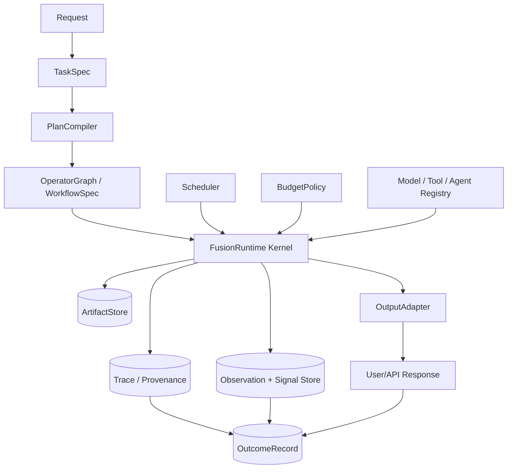

# FusionKit Model-Fusion Architecture, v1.0 Draft

Status: design replacement for the earlier MoA controller-loop draft.

This document defines FusionKit as a **model-fusion runtime kernel** for executing typed operator
graphs under interchangeable schedulers. It is meant to describe and implement classic MoA,
Self-MoA, OpenRouter-style Fusion, LLM-Blender, execution-guided selection/repair, Devin-style
agentic routing, Sakana TreeQuest/AB-MCTS-style search, Sakana Fugu-like learned orchestration,
Archon-style architecture search, and offline model merging without forcing them into one runtime
control loop.

## 1. Executive Summary

The old framing, "all systems are a common controller loop," was too broad. A loop can simulate
anything, but it is not explanatory. Static inference DAGs, fixed layered MoA, rank/fuse systems,
adaptive controllers, tree search, learned workflow compilers, agentic routing harnesses, offline
architecture search, and offline model merging have different control semantics.

The cleaner abstraction is:

```text
TaskSpec
  -> Artifact contracts
  -> Operators
  -> OperatorGraph / WorkflowSpec
  -> Scheduler family
  -> RuntimeState (only when needed)
  -> Evidence / Signals
  -> Budget / Trace / OutcomeRecord
```

FusionKit should not be "a MoA controller." It should be a **model-fusion runtime kernel** that can
execute operator graphs under multiple schedulers. The runtime should be boring and reliable; the
power should live in schedulers, evidence sources, and learned policies.

## 2. Non-Goals

- Do not claim to reverse-engineer proprietary systems such as Sakana Fugu or Devin Fusion.
- Do not force every system into an adaptive loop.
- Do not treat benchmark-specific verifier tricks as the production ontology.
- Do not treat runtime inference, agentic orchestration, offline architecture search, and offline
  model merging as the same lifecycle layer.
- Do not require learned coordination before we have clean outcome logs and replay infrastructure.

## 3. Grounded Taxonomy

Use multiple axes:

- **Lifecycle:** runtime inference, runtime agentic execution, offline architecture search, offline
  model construction, evaluation/training.
- **Control structure:** static DAG, fixed layered loop, sample/rank/fuse, adaptive controller, tree
  search, learned workflow compiler, offline optimizer.
- **Composition primitive:** select, synthesize, repair, route, delegate, search, merge, train.
- **Evidence strength:** none, self/judge, learned ranker, consistency, schema/compiler, execution
  tests, external scorer, private grade.
- **Product surface:** model endpoint, server tool/plugin, coding agent, library, benchmark optimizer,
  merged model.

| Family | Control structure | Primary operation | Runtime/offline | Representative systems |
| --- | --- | --- | --- | --- |
| Static inference DAG | Fixed graph | Generate -> judge/rank -> synthesize | Runtime | OpenRouter Fusion, LLM-Blender |
| Fixed layered MoA | Fixed repeated layers | Propose -> aggregate across layers | Runtime | Classic MoA |
| Self-sampling / Self-MoA | Fixed sampling/fusion loop | Sample same model -> aggregate | Runtime | Self-MoA, Self-MoA-Seq |
| Sample/rank/fuse | Fixed or semi-fixed DAG | Generate candidates -> rank -> fuse | Runtime | LLM-Blender, best-of-N systems |
| Verifier-guided selection/repair | DAG or adaptive scheduler | Generate -> evidence -> select/repair | Runtime/eval | FusionKit execution-guided path, Archon modules |
| Adaptive routing controller | State-dependent model choice | Route to model/agent/tool | Runtime | Devin Fusion, base Fugu |
| Tree-search scheduler | Search tree | Expand/refine/select under scorer | Runtime | AB-MCTS, TreeQuest |
| Agentic delegation harness | Workspace-aware multi-agent execution | Delegate/review/single-writer integration | Runtime agentic | Devin, Fugu-Ultra-like workflows |
| Learned coordinator | Learned policy/workflow compiler | Assign roles/models/topology | Runtime, trained offline | TRINITY, Conductor, Fugu |
| Offline architecture search | Search over graph/module configs | Optimize architecture against eval/budget | Offline/meta | Archon |
| Offline model merge | Search over weights/data-flow merge recipes | Create a new model | Offline model construction | Sakana Evolutionary Model Merge |

Verifier-guided systems are a **cross-cutting capability**, not a standalone architecture. Evidence can
appear inside static DAGs, adaptive schedulers, tree search, agentic harnesses, and offline architecture
search.

## 4. Literature and System Grounding

| System / paper | Publicly confirmed idea | Design implication |
| --- | --- | --- |
| Mixture-of-Agents (Wang et al., ICLR 2025) | Layered proposer/aggregator architecture; prompt-only; single-proposer special case | Fixed layered graph is one scheduler family, not the root ontology |
| Self-MoA / Self-MoA-Seq | Multiple samples from the best model can beat mixing weaker models | Quality-diversity matters more than model count |
| LLM-Blender | PairRanker ranks candidates, GenFuser fuses top candidates | Rank before fuse; sample/rank/fuse is a static graph family |
| Archon | Offline search over inference-time modules such as rank, fusion, verification, unit tests | Architecture search is a meta-layer over graphs/schedulers |
| Sakana AB-MCTS / TreeQuest | Wider/deeper tree search with custom generators and scorers | Tree search is a scheduler family with checkpointed state |
| Sakana Fugu / TRINITY / Conductor | Learned/evolved/RL coordination, roles, tiers, one API | Learned workflow/scheduler target; exact internals proprietary |
| Sakana Evolutionary Merge | Offline search over model weight/data-flow merge recipes | Offline model construction, not runtime MoA |
| Devin Fusion | Main + sidekick agents, capability routing, cached contexts, single-writer discipline | Agentic routing harness; not N-way candidate fusion |
| OpenRouter Fusion | Panel -> structured judge analysis -> final synth; model/tool/plugin surfaces; DRACO eval | Validates current panel/judge/synth base graph |
| Law of Multi-Model Collaboration | Oracle ensemble upper bound; diversity matters | Measure oracle/headroom and failure correlation |

FusionKit's own results fit this taxonomy:

- Blind judge-fusion can regress: polyglot fused 0.728 < best single 0.796.
- Execution-guided selection wins: LiveCodeBench fused 0.593 vs each individual 0.477,
  McNemar 10-0, leakage-free private grading.

Interpretation: execution evidence is extremely valuable for code, but the general architecture is not
"verification first." It is operator graphs under schedulers, with evidence as one class of artifacts.

## 5. Core Abstractions

### 5.1 TaskSpec

Represents the user workload and constraints.

Includes:

- messages / prompt / files / repository state / uploaded data;
- task class: chat, code, research, structured, tool-use, back-office;
- provider allowlist/denylist, privacy policy, side-effect policy;
- latency tier and cost tier;
- available tools and workspace capabilities.

Does not include runtime observations, model scores, candidate outputs, or benchmark grades.

### 5.2 SuccessSpec

Defines how success is measured for evaluation or production learning.

Examples:

- code: private pass@1, paired McNemar vs best single, no leakage;
- research: rubric score, citation correctness, negative criteria;
- back-office: schema validity plus business-rule correctness;
- agentic coding: resolved issue, side-effect safety, patch quality;
- chat: preference, helpfulness, latency, style stability.

SuccessSpec is not the same as inference-time evidence. Public tests can guide; private tests grade.

### 5.3 Artifact

Typed immutable value passed between operators.

Examples:

- messages;
- trajectory;
- candidate answer;
- patch;
- tool output;
- judge JSON;
- rank matrix;
- test log;
- workflow spec;
- architecture config;
- merge recipe;
- final answer;
- private benchmark grade.

Artifact metadata should include provenance, visibility, content type, and leakage class:

```ts
interface Artifact<T = unknown> {
  id: string;
  type: string;
  value: T;
  provenance: Provenance;
  visibility: 'runtime' | 'developer' | 'user' | 'private_eval';
  leakage: 'none' | 'public' | 'private' | 'contaminated';
}
```

### 5.4 Operator

Typed transformation from input artifacts to output artifacts.

Examples:

- model generation;
- panel generation;
- pairwise ranking;
- judge comparison;
- synthesis;
- schema validation;
- test execution;
- repair;
- agent delegation;
- code review;
- architecture evaluation;
- model merge.

Operators do not choose global control flow.

```ts
interface OperatorSpec {
  id: string;
  kind: string;
  inputTypes: string[];
  outputTypes: string[];
  sideEffects: 'none' | 'read_workspace' | 'write_workspace' | 'external_tool';
  expectedCost?: CostEstimate;
  expectedLatencyMs?: number;
}

interface Operator<I extends Artifact[], O extends Artifact[]> {
  spec: OperatorSpec;
  run(inputs: I, ctx: ExecutionContext): Promise<O>;
}
```

### 5.5 OperatorGraph / WorkflowSpec

Graph of operators and artifact dependencies.

Examples:

- direct model call;
- panel -> judge -> synth;
- generate -> PairRanker -> GenFuser;
- sample -> public tests -> select -> optional repair;
- layered MoA;
- learned natural-language workflow compiled into executable steps.

The graph describes structure. It does not decide scheduling policy by itself.

### 5.6 Scheduler

Execution policy for a graph.

Schedulers decide which ready operator(s) to run, with what parameters, under budget.

Scheduler families:

- `DirectFastPathScheduler`
- `StaticDAGScheduler`
- `FixedLayerScheduler`
- `BestOfNScheduler`
- `RankFuseScheduler`
- `ExecutionSelectRepairScheduler`
- `AdaptiveRouterScheduler`
- `TreeSearchScheduler`
- `AgenticDelegationScheduler`
- `LearnedWorkflowScheduler`
- `OfflineArchitectureSearchScheduler`

### 5.7 RuntimeState

Mutable state required by adaptive schedulers.

Static DAGs should not need a large mutable controller state.

Examples:

- search tree;
- open candidate set;
- agent contexts;
- workspace locks;
- budget counters;
- cache state;
- retry queues.

### 5.8 EvidenceSource, Observation, Signal

EvidenceSource produces raw observations. Calibrators turn observations into signals.

Examples of EvidenceSources:

- unit tests;
- compiler/typechecker;
- schema validator;
- static analyzer;
- citation checker;
- pairwise ranker;
- LLM rubric judge;
- consistency/clustering;
- human feedback;
- production telemetry.

```ts
interface Signal {
  targetArtifactId: string;
  dimension: 'correctness' | 'coverage' | 'safety' | 'format' | 'latency' | 'cost';
  score: number;
  confidence: number;
  calibration: 'ground_truth' | 'empirical' | 'heuristic' | 'llm_judge' | 'unknown';
  leakageRisk: 'none' | 'public' | 'private' | 'contaminated';
  observationIds: string[];
}
```

Private grading signals must never become runtime scheduler inputs.

### 5.9 Budget / ResourceModel

Hard and soft execution constraints:

- max cost;
- max latency;
- max candidates;
- max depth;
- max repair rounds;
- max tool calls;
- side-effect policy;
- provider allow/deny list;
- streaming posture.

Degree-1 invariant:

> A degree-1 path must behave like a direct model call: no hidden fanout, no judge, no synth pass, no
> non-required evidence source, and first token streams as soon as the underlying model streams.

### 5.10 Trace / Provenance

Auditable record of execution:

- operator invocations;
- artifact lineage;
- model IDs;
- tool calls;
- evidence sources;
- selected/fused lineage;
- cost and latency.

User-facing provenance should be concise and safe:

- "Selected from 6 candidates using public tests."
- "Synthesized from 3 model perspectives."
- "Reviewed by a read-only sidekick."
- "No deterministic evidence source available."

### 5.11 OutcomeRecord

Training/evaluation row for future learned schedulers:

- task features;
- graph/scheduler config;
- model/operator calls;
- artifacts produced;
- signals available at decision time;
- final output;
- success outcome;
- cost and latency;
- regressions/incidents;
- counterfactual candidates when available.

OutcomeRecords distinguish:

- features known at decision time;
- inference-time signals;
- private labels known only after grading;
- production feedback known after deployment.

## 6. Kernel vs Scheduler

FusionKit should separate boring runtime mechanics from powerful scheduling policies.

### Runtime kernel responsibilities

- execute typed operators;
- manage artifact store;
- enforce budgets and side-effect policies;
- handle concurrency;
- normalize provider/tool failures;
- record traces/provenance;
- emit OutcomeRecords.

The kernel should not contain SOTA heuristics.

### Scheduler responsibilities

- choose which operator(s) to run;
- choose models, roles, samples, and repair depth;
- decide when to select, aggregate, route, repair, or stop.

Schedulers are where MoA variants live.

## 7. Reference Architecture



## 8. Scheduler Families

### 8.1 DirectFastPathScheduler

Runs one model operator and streams immediately.

Use for ordinary chat and low-value/latency-sensitive requests.

### 8.2 StaticDAGScheduler

Executes a fixed operator graph.

Use for OpenRouter-style panel/judge/synth, LLM-Blender-style rank/fuse, schema-validation pipelines,
and simple tool pipelines.

### 8.3 FixedLayerMoAScheduler

Executes repeated proposer/aggregator layers.

Use for classic MoA and Self-MoA variants.

### 8.4 ExecutionSelectRepairScheduler

Generates candidates, runs allowed evidence sources, selects the strongest candidate, and optionally
repairs candidates using actionable feedback.

Use for code and structured tasks.

### 8.5 TreeSearchScheduler

Maintains a search tree and chooses wider versus deeper expansion under a scoring function.

Use for hard verifiable tasks where feedback is cheap enough.

### 8.6 AgenticDelegationScheduler

Coordinates main, sidekick, reviewer, and worker agents under role permissions and workspace
side-effect rules.

Use for coding agents and back-office automation.

### 8.7 LearnedWorkflowScheduler

Uses a learned coordinator or workflow compiler to generate graph fragments, role assignments, worker
choices, and communication topology.

Use only after OutcomeRecords and offline evaluation are mature.

### 8.8 OfflineArchitectureSearchScheduler

Searches over FusionKit graphs and scheduler configs under benchmark/budget objectives.

Use for Archon-style meta-optimization.

## 9. Mapping Known Systems

| System | Artifacts | Operators | Scheduler | Evidence | Runtime/offline |
| --- | --- | --- | --- | --- | --- |
| Classic MoA | layer outputs, final answer | proposer calls, aggregator calls | fixed layered | implicit aggregation | runtime |
| Self-MoA | samples, aggregate | same-model sampling, aggregator | fixed sample/fuse | implicit quality/diversity | runtime |
| LLM-Blender | candidates, rank matrix, fused output | generator, PairRanker, GenFuser | static DAG | learned ranker | runtime |
| OpenRouter Fusion | panel responses, judge JSON, final | panel, judge, writer | static / conditionally invoked DAG | judge analysis, DRACO in eval | runtime |
| Devin Fusion | workspace, main/sidekick contexts, reviews | main agent, sidekick, router, reviewer | agentic routing | tests, review, cost/cache signals | runtime |
| TreeQuest / AB-MCTS | search tree nodes, rewards | generators, refiners, scorer | tree search | custom reward/scorer | runtime |
| Fugu / TRINITY / Conductor | worker outputs, workflows, role assignments | coordinator, workers, verifier role | learned workflow scheduler | task feedback, verifier role | runtime, trained offline |
| Archon | architecture configs, benchmark results | module configs, evaluator | offline architecture search | benchmark metrics | offline/meta |
| Evolutionary Merge | weights, merge recipes, merged model | merge operators, evaluator | offline optimizer | fitness metrics | offline model construction |
| FusionKit SOTA | candidates, public-test scores, private grades | sampler, public-test selector | execution select | public tests | runtime/eval |

## 10. SOTA Strategy

Do not optimize the aggregator first. Optimize in this order:

1. Define SuccessSpec.
2. Create high-quality candidate diversity.
3. Collect the strongest available observations.
4. Calibrate observations into signals.
5. Choose graph/scheduler actions by expected utility under budget.
6. Repair or sample more when expected value is positive.
7. Aggregate only when the task value is union/synthesis of candidates.
8. Log OutcomeRecords so schedulers can improve.

This preserves the code-benchmark lesson (execution evidence is powerful) without making
"verification" the center of the whole system.

## 11. Product Surfaces

FusionKit should expose:

1. **Model endpoint**: OpenAI-compatible model slug that returns final answers.
2. **Tool mode**: callable by another model/agent; may return candidates, evidence, synthesis, patch,
   or uncertainty summary.
3. **Agent harness**: workspace-aware execution with side-effect permissions.
4. **Offline search**: architecture/config search for benchmarks and deployment profiles.

## 12. Evaluation Rules

- Public signals may guide runtime selection.
- Private signals grade only.
- Every evidence artifact carries leakage metadata.
- Report quality, cost, latency, and variance.
- Compare against the best individual model, not just average model.
- Use paired tests when candidates are evaluated on the same tasks.
- Track regressions where fusion underperforms best single model.

## 13. Implementation Roadmap

| Phase | Scope | Tests | Evaluation gate |
| --- | --- | --- | --- |
| 0. Vocabulary | Finalize this doc, glossary, taxonomy | Known-system mapping tests in prose | Architecture review approval |
| 1. Kernel abstractions | Artifact, Operator, OperatorGraph, Scheduler, Budget, Trace, OutcomeRecord | serialization, budget, provenance | direct path identical to baseline |
| 2. Concrete schedulers | direct, static DAG, layered MoA, best-of-N | mock-model golden tests | reproduce existing panel/judge/synth |
| 3. Evidence-guided selection/repair | EvidenceSource, Signal, select, repair | leakage tests, sandbox tests | match/exceed current LiveCodeBench result |
| 4. Adaptive search | search tree, wider/deeper scheduler, checkpointing | toy scorer, resume tests | beat repeated sampling at equal budget |
| 5. Agentic routing | role permissions, sidekick/reviewer, single-writer | workspace mutation tests | cost reduction without quality regression |
| 6. Learned scheduling | outcome store, feature extraction, offline replay | off-policy replay, temporal split | learned policy beats heuristic on heldout tasks |

### Current implementation status

The TypeScript kernel in `@fusionkit/ensemble` implements the runtime substrate,
direct/static execution, workflow recipes, replay records, evidence/signal
records, and scaffold scheduler families. The advanced family classes
(`TreeSearchScheduler`, `AdaptiveRouterScheduler`, `AgenticDelegationScheduler`,
`LearnedWorkflowScheduler`, and `OfflineArchitectureSearchScheduler`) are
explicit extension points over typed graphs. They do **not** claim full
TreeQuest/AB-MCTS, Devin Fusion, Fugu/TRINITY/Conductor, or Archon semantics
until those schedulers own the corresponding adaptive state, policy learning, or
offline optimization loops. See `docs/fusion/MOA_IMPLEMENTATION_STATUS.md` for
the current checklist.

## 14. Invariants

- Degree-1 path is observationally equivalent to a direct model call plus safe trace metadata.
- Static graphs do not require adaptive controller state.
- Operators declare side effects.
- Roles enforce permissions, not just prompt labels.
- Selection, synthesis, repair, routing, search, and merge are distinct operations.
- Private grading data never enters runtime scheduler state.
- Every final answer has artifact lineage.
- Every production/eval run can emit an OutcomeRecord.

## 15. Open Problems

- Calibrating LLM judges against deterministic evidence.
- Knowing when synthesis beats selection.
- Verifier-less confidence gating for chat/research.
- Capability-routing reliability under model drift.
- Counterfactual evaluation for learned schedulers.
- Production UX for provenance without exposing confusing internals.
- Cost/latency accounting for multi-model calls.
- Side-effect safety in agentic workflows.

## 16. References

- Mixture-of-Agents: [arXiv:2406.04692](https://arxiv.org/abs/2406.04692)
- Self-MoA / Rethinking MoA: [arXiv:2502.00674](https://arxiv.org/abs/2502.00674)
- Archon: [Stanford Scaling Lab](https://scalingintelligence.stanford.edu/pubs/archon/)
- AB-MCTS / TreeQuest: [arXiv:2503.04412](https://arxiv.org/abs/2503.04412), [Sakana](https://sakana.ai/ab-mcts/), [GitHub](https://github.com/SakanaAI/treequest)
- Evolutionary Model Merge: [arXiv:2403.13187](https://arxiv.org/abs/2403.13187)
- Sakana Fugu: [sakana.ai/fugu](https://sakana.ai/fugu/)
- Devin Fusion: [cognition.ai/blog/devin-fusion](https://cognition.ai/blog/devin-fusion), [multi-agents-working](https://cognition.ai/blog/multi-agents-working)
- OpenRouter Fusion: [OpenRouter blog](https://openrouter.ai/blog/announcements/fusion-beats-frontier/), [Fusion Router docs](https://openrouter.ai/docs/guides/routing/routers/fusion-router)
- LLM-Blender: [arXiv:2306.02561](https://arxiv.org/abs/2306.02561)
- LLM Ensemble survey: [arXiv:2502.18036](https://arxiv.org/abs/2502.18036)
- Verifier / test-time-scaling survey: [arXiv:2508.16665](https://arxiv.org/abs/2508.16665)
- Law of Multi-Model Collaboration: [arXiv:2512.23340](https://arxiv.org/abs/2512.23340)
