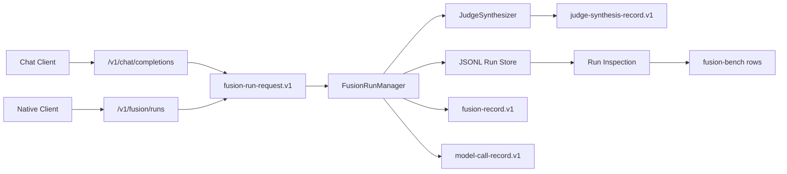

# Model Fusion Learnings

This document captures the durable implementation knowledge from the first FusionKit
model-fusion roadmap slice. It is intended to help future work continue from the
current architecture without rediscovering contract, run, tool, benchmark, and
provider decisions.

## Roadmap Progress

The following tickets are landed on `main`:

- `MF-00`: language-neutral model-fusion contract seed and fixtures.
- `MF-01`: Python Pydantic bindings for FusionKit contract records.
- `MF-10`: core `FusionRun` state machine, JSONL run store, artifact refs, idempotency, and inspection.
- `MF-11`: native `/v1/fusion/runs` API, inspect endpoint, and event replay.
- `MF-12`: external tool pause/resume protocol with candidate-scoped `requires_action`.
- `MF-13`: `JudgeSynthesizer` and `judge-synthesis-record.v1` in product fusion.
- `MF-14`: `/v1/chat/completions` compatibility shim over native runs.
- `MF-15`: tiny synthetic Phase 1 benchmark gate.
- `MF-16`: provider pool metadata, cost estimates, and budgets.
- `MF-51`: fusion-bench runner skeleton and record join layer.

## Architecture Decisions

### Contract First

The contract source of truth lives under `spec/model-fusion-contract`. JSON Schema
stays language-neutral; Python bindings in `fusionkit_core.contracts` are a local
consumer of that contract, not a replacement for it.

Fixtures under `spec/model-fusion-contract/fixture` are compatibility tests, not
examples. Keep that fixture matrix small and stable. Product benchmark fixtures live
under `packages/fusionkit-evals/fixtures`, not in the contract fixture tree.

### Native Runs Are The Product Boundary

`FusionRunManager` and `FileSystemRunStore` are now the core native run path. Native
runs persist append-only JSONL events and expose current state, inspection, and event
pages. The OpenAI-compatible chat endpoint is now a wrapper over this path.

`/v1/chat/completions` should remain an OpenAI-compatible projection. It may include
curated public metadata such as `run_id`, `trace_id`, state, status, event cursor, and
concise candidate metrics, but it should not expose native inspection payloads,
artifacts, raw events, or debug internals by default.

### Judge Synthesis Owns Final Fusion

For multi-candidate flows, final output should come from `JudgeSynthesizer`, which
emits `judge-synthesis-record.v1`. The deterministic ranker remains useful for prompt
packing, diagnostics, and baseline comparison, but not as the product final selector.

### Tool Execution Is Externalized

FusionKit records and coordinates tool use; it does not execute arbitrary tools in
the server process. External tool support is represented by candidate-scoped
`requires_action`, `tool-call-plan.v1`, and `tool-execution-record.v1` events. Tool
results must match the candidate id, tool call id, and tool name that requested them.

Read-only tool calls can expose a policy cache key for dedupe. Mutating, network, or
external side effects must be denied unless explicit policy and environment fields are
present.

### Benchmark Rows Come From Records

`fusionkit_evals.fusion_bench` joins records from run events into one normalized
attempt row per task. It should not compute from raw transcripts. The tiny Phase 1
benchmark gate is a synthetic internal smoke suite, not public benchmark performance.

Harness/coding tasks are explicit skips until the external ensemble adapter exists.
Skipping unavailable providers or harnesses is a valid result; silent success is not.

### Provider Metadata Is Configuration, Not Routing

Provider/model metadata is typed in core config and surfaced through model-call
metadata and run inspection. FusionKit did not add LiteLLM/Bifrost as a core router.
If those appear later, treat them as ordinary OpenAI-compatible endpoints.

Secrets should be represented by `api_key_env` references. Resolved API keys are used
by clients but must not be written into records, metrics, fixtures, or benchmark rows.

## Current Data Flow



## Important Files

- `spec/model-fusion-contract/README.md`: schema lifecycle and fixture policy.
- `packages/fusionkit-core/src/fusionkit_core/contracts.py`: Python contract bindings.
- `packages/fusionkit-core/src/fusionkit_core/run.py`: native run manager, state, idempotency, tools, budgets.
- `packages/fusionkit-core/src/fusionkit_core/run_store.py`: filesystem JSONL event store and inspection reconstruction.
- `packages/fusionkit-core/src/fusionkit_core/judge.py`: judge synthesis flow.
- `packages/fusionkit-core/src/fusionkit_core/providers.py`: provider metadata and cost helpers.
- `packages/fusionkit-server/src/fusionkit_server/app.py`: native and compatibility HTTP endpoints.
- `packages/fusionkit-evals/src/fusionkit_evals/tiny.py`: tiny Phase 1 smoke benchmark runner.
- `packages/fusionkit-evals/src/fusionkit_evals/fusion_bench.py`: record join layer and fusion-bench rows.
- `packages/fusionkit-evals/fixtures/tiny-phase1`: 25 synthetic benchmark task records.

## Verification Commands

Run these after changes that touch contracts, run state, API behavior, tools, provider
metadata, or benchmark output:

```bash
uv run python scripts/validate_contract_fixtures.py
uv run pytest -W error::DeprecationWarning
uv run ruff check .
uv run pyright
```

The deprecation warning check is intentional. Earlier work removed Starlette's
deprecated `httpx` test-client path by adding `httpx2`.

## Design Invariants

- Preserve existing config compatibility unless a ticket explicitly migrates it.
- Keep contract schema changes additive within `.v1`; breaking changes require `.v2`.
- Keep raw secrets and customer data out of fixtures, records, benchmark tasks, and docs.
- Keep `/v1/chat/completions` compatible for simple OpenAI-style clients.
- Keep native inspect/event endpoints as the richer debugging surface.
- Do not compute benchmark metrics from raw transcripts.
- Do not run arbitrary tools in the FusionKit server process.
- Do not make compatibility aliases the product boundary.

## Known Follow-Ups

- Public benchmark smoke adapters can build on the `fusion_bench` manifest/row shape.
- Metrics/report work can aggregate `FusionBenchAttemptRow` fields without changing the
  row schema.
- HandoffKit can call FusionKit's `tool-results` endpoint as an external executor
  adapter without linking into core internals.
- Provider adapters can add richer raw usage normalization behind `ChatClient` without
  replacing the provider metadata model.
