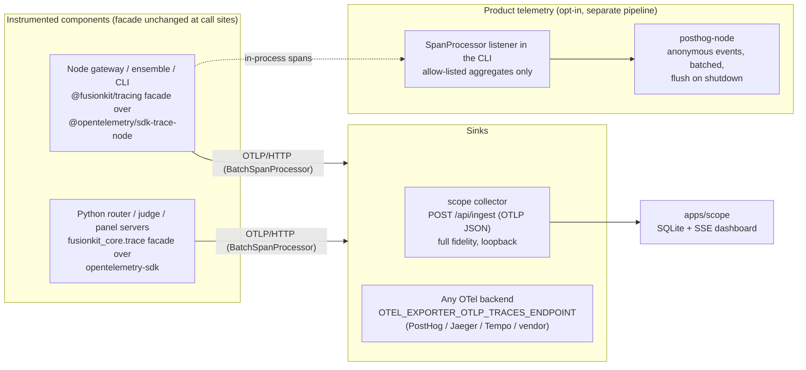

# Tracing and telemetry plan

A comprehensive plan to evolve the fusion trace spine into a proper tracing
system that serves two consumers with very different trust models:

1. **Scope tracing** — the local `apps/scope` dashboard, which is allowed to see
   everything (prompts, code, judge thinking) because it never leaves the
   machine.
2. **Product telemetry** — opt-in, anonymous, allow-listed usage signals sent to
   Velum Labs, which must never carry prompts, code, repo paths, or model
   outputs.

Two principles drive the design:

- **One instrumentation spine, many sinks, redaction at the sink boundary.**
  Components emit rich domain events exactly once; what a sink is allowed to
  see is a property of the sink, not the emit site.
- **Buy, don't build.** We adopt the OpenTelemetry SDKs as the tracing engine
  (ids, context propagation, batching, flush, sampling, export) and
  `posthog-node` as the product-telemetry engine (queueing, batching,
  anonymous events, shutdown flush). What stays ours is the thin domain layer:
  the fusion event taxonomy, the emit-site facade, the scope UI, and the
  consent/allow-list policy.

## Goals

- OpenTelemetry-based tracing in both languages with W3C `traceparent`
  propagation, standard `OTEL_*` configuration, and OTLP export to any
  backend (Jaeger, Tempo, vendors) for free.
- A single, versioned, machine-checked registry of fusion event names and
  attributes (semantic conventions) that all emitters and consumers provably
  conform to — replacing today's four hand-maintained contract copies.
- Scope keeps working unchanged from the user's perspective (`--observe`),
  but ingests standard OTLP and stops silently dropping fields.
- Product telemetry via PostHog that is **off by default**, consent-gated,
  allow-listed, and documented — honoring the existing promise in
  `docs/privacy.md`.
- Minimal churn at emit sites: the `emitTrace(...)` / payload-builder facade
  and the in-process listener API (which the reasoning narrator depends on)
  keep their shape; only the engine underneath changes.

## Non-goals

- Hand-rolling any transport machinery: no custom batching queues, retry
  loops, flush lifecycles, OTLP serializers, or analytics uploaders. If the
  SDK provides it, we configure it.
- A hosted control plane or server-side telemetry pipeline (PostHog cloud or
  a self-hosted PostHog instance covers the backend; standing one up is out
  of scope for this repo).
- Telemetry of any prompt, code, diff, file path, repo name, or model output —
  ever, under any setting.
- Changes to the legacy `warrant` stack or the kernel's internal in-memory
  `TraceEvent` runtime log (`packages/kernel/src/types.ts`), which is a
  deterministic replay record, not distributed tracing.

## Where we are today

The spine exists and works end-to-end (`fusionkit codex --observe` streams live
events into scope), but it is entirely hand-rolled and has drifted:

| # | Drift / gap | Evidence |
| --- | --- | --- |
| 1 | Hand-rolled emitters in both languages reimplement what OTel provides: id minting, queueing, HTTP posting, JSONL fallback, sampling hooks — with gaps (TS fire-and-forgets posts with no flush-on-exit; one event per HTTP request; Python's `close()` is never called on exit). | `packages/protocol/src/trace.ts`, `python/fusionkit-core/src/fusionkit_core/trace.py` |
| 2 | Schema enum is stale: `judge.request`, `judge.scored`, `judge.synthesis` are emitted by both languages but missing from `spec/fusion-trace/schema/fusion-trace-event.v1.schema.json`, which sets `additionalProperties: false`. Real events fail strict validation. | Schema enum vs `FUSION_TRACE_EVENT_TYPES` in `packages/protocol/src/trace.ts` |
| 3 | `candidate_id` (TS) vs `trajectory_id` (Python): the schema allows `trajectory_id` only; scope stores `candidate_id` only, so Python-emitted correlation ids are silently dropped at ingest. | `apps/scope/lib/db.ts`, both emitters |
| 4 | Four hand-maintained contract copies (`spec/fusion-trace/ts`, `packages/protocol/src/trace.ts`, `fusionkit_core/trace.py`, `apps/scope/lib/types.ts`), no conformance tests, and the spec binding is stale. | File diffs across the copies |
| 5 | Ids are not W3C-compatible (12-hex span ids, prefixed trace ids) and there is no `traceparent` interop; custom `x-fusion-*` headers only. | `newSpanId()` in both emitters |
| 6 | Ordering is per-process: `seq` restarts at 0 in every process, so cross-process ordering falls back to wall-clock `ts` with collector-ingest tiebreak. | Emitter seq counters; `apps/scope/lib/db.ts` ordering |
| 7 | No product telemetry exists at all, and `docs/privacy.md` promises none. Any telemetry work must be opt-in and re-document that promise honestly. | `docs/privacy.md` "Telemetry" section |

## Target architecture

Key decisions:

- **OTel is the engine; the fusion taxonomy is the payload.** Fusion domain
  events (`judge.thinking`, `trajectory.step`, `harness.candidate.*`) map onto
  OTel primitives: sessions, candidates, judge turns, and model calls become
  **spans**; point-in-time domain events become **span events** carrying
  `fusion.*` attributes. `spec/fusion-trace/` stops being a wire format and
  becomes a **semantic-conventions registry** (span names, event names,
  attribute keys, and which attributes are sensitive), which is what we
  actually own.
- **The facade survives; the engine is swapped.** `emitTrace()`, the typed
  payload builders, and `addTraceListener` keep their signatures, implemented
  over the OTel tracer and a custom `SpanProcessor`. Emit sites across the
  gateway, ensemble, and Python core barely change; the narrator keeps
  working untouched.
- **Scope becomes an OTLP receiver.** Its collector route parses standard
  OTLP/HTTP JSON (types from `@opentelemetry/otlp-transformer`) and flattens
  span events back into its stored rows. Scope's UI and derivations stay;
  only ingestion changes. Anything that can speak OTLP can now feed scope,
  and scope's data can be teed to any vendor backend simultaneously via
  standard env vars.
- **Telemetry is a sink, not a second instrumentation system.** A CLI-side
  `SpanProcessor` folds finished session spans into allow-listed aggregates
  and hands them to `posthog-node`. Redaction is structural: the processor
  copies only enumerated attribute keys, never whole attribute bags.

## PostHog compatibility

PostHog compatibility is a hard requirement, and this architecture satisfies
it on all three of PostHog's integration surfaces (verified against PostHog
docs, July 2026):

1. **Product analytics** — the WS4 telemetry pipeline *is* PostHog: it uses
   the official `posthog-node` SDK, so `cli.command` and `fusion.session`
   land as ordinary PostHog events with the SDK's batching, queueing, and
   shutdown flush.
2. **Distributed tracing (PostHog alpha)** — PostHog now runs a generic OTLP
   receiver: standard OTel SDKs, no PostHog packages, project token in the
   `Authorization: Bearer` header. Because WS2 standardizes on the OTel SDK
   with OTLP/HTTP export, sending fusion traces to PostHog is pure
   configuration:
   `OTEL_EXPORTER_OTLP_TRACES_ENDPOINT=https://us.i.posthog.com/i/v1/traces`
   plus the auth header. Note the gotcha: PostHog needs the traces-specific
   env var with the full path, not the base `OTEL_EXPORTER_OTLP_ENDPOINT`
   (which appends its own `/v1/traces`).
3. **LLM analytics (AI Observability)** — PostHog has a dedicated OTLP
   endpoint (`/i/v0/ai/otel`) that ingests only generative-AI spans (names /
   attribute keys starting `gen_ai.`, `llm.`, `ai.`) and drops the rest
   server-side. WS1 therefore names model-call span attributes per the
   **OTel GenAI semantic conventions** (`gen_ai.provider.name`,
   `gen_ai.request.model`, `gen_ai.usage.input_tokens`,
   `gen_ai.usage.output_tokens`, …) instead of inventing `fusion.*`
   equivalents. That single choice makes fusion's panel/judge/synthesizer
   model calls show up natively in PostHog's LLM analytics (models, tokens,
   latency, cost dashboards) — and in any other GenAI-semconv-aware backend.
   Since the endpoint safely drops non-AI spans, the same mixed span stream
   can be sent without filtering. Only `exportable`-tagged attributes are
   sent (prompts/outputs are `local-only` and never leave the machine unless
   a user explicitly opts into PostHog's `$ai_input`-style capture later).

Practical constraints folded into the design: PostHog's OTLP ingestion is
HTTP-only (we chose OTLP/HTTP, not gRPC), request bodies are capped at 4 MB
(the `BatchSpanProcessor` export batch size stays comfortably under it), and
distributed tracing is alpha (endpoints may change — they live in env/config,
not code). Product-analytics events and traces land in the same PostHog
project, so telemetry sessions and traces can be correlated by trace id when
a user has both enabled.

## Dependencies to add

| Where | Packages | Purpose |
| --- | --- | --- |
| New `packages/tracing` (`@fusionkit/tracing`) | `@opentelemetry/api`, `@opentelemetry/sdk-trace-node`, `@opentelemetry/exporter-trace-otlp-http`, `@opentelemetry/resources`, `@opentelemetry/semantic-conventions` | Tracer provider setup, facade, listener SpanProcessor. Lives in a new package so `@fusionkit/protocol` stays a dependency-free leaf (it keeps only the generated types/constants). |
| `apps/scope` | `@opentelemetry/otlp-transformer` (types/parsing) | Parse OTLP JSON at `/api/ingest`. |
| `python/fusionkit-core` | `opentelemetry-api`, `opentelemetry-sdk`, `opentelemetry-exporter-otlp-proto-http` | Same swap for the Python router, judge, and panel servers (the panel-server scripts already import `fusionkit_core`). |
| `packages/cli` | `posthog-node` | Product telemetry capture, batching, shutdown flush. |

Version floors are compatible: OTel JS requires Node `^18.19.0 || >=20.6.0`
and `posthog-node` requires Node 20+; this repo already enforces Node >=22.

## Workstreams

### WS1 — Semantic conventions registry (replaces the wire-format contract)

- Rewrite `spec/fusion-trace/` as the fusion semantic conventions: a single
  machine-readable registry (YAML or JSON) of span names
  (`fusion.session`, `fusion.candidate`, `fusion.judge`, `fusion.model_call`),
  span-event names (today's `event_type` values, with the three missing judge
  types included), attribute keys (`fusion.candidate_id`,
  `fusion.trajectory_id` — both, with documented semantics), and a
  **sensitivity class per attribute** (`local-only` vs `exportable`).
- Where the OTel **GenAI semantic conventions** already define an attribute,
  use it instead of a `fusion.*` invention: model-call spans carry
  `gen_ai.provider.name`, `gen_ai.request.model`,
  `gen_ai.usage.input_tokens` / `gen_ai.usage.output_tokens`, and a
  `gen_ai.`-prefixed span name. This is what makes the trace stream natively
  consumable by PostHog LLM analytics (and any GenAI-aware backend) — see
  "PostHog compatibility". `fusion.*` attributes are reserved for concepts
  GenAI semconv has no word for (candidates, judge decisions, trajectories).
- Codegen TS and Python constant modules from the registry (extending the
  `pnpm check` regeneration pattern the repo already uses for protocol
  bindings); `apps/scope/lib/types.ts` is generated from the same source.
  Drift fails CI.
- Keep the repaired `fusion-trace-event.v1` JSON Schema only as the **legacy
  replay format** (old JSONL dirs must remain readable in scope), marked
  frozen.
- Conformance tests: each language emits one span/event of every kind through
  the real SDK and asserts the OTLP output against the registry (names,
  required attributes, sensitivity tags present).

### WS2 — Adopt the OTel SDK behind the facade (both languages)

- **TS:** new `@fusionkit/tracing` package configures a `NodeTracerProvider`
  with a `BatchSpanProcessor` + `OTLPTraceExporter` (scope's ingest URL when
  `--observe` is on; any `OTEL_EXPORTER_OTLP_ENDPOINT` otherwise/additionally)
  and re-exports the existing facade: `emitTrace`, payload builders,
  `addTraceListener` (implemented as a `SpanProcessor` that fans out span
  events synchronously, preserving narrator behavior), and the span-shaped
  helpers the gateway needs (`startSessionSpan`, `startCandidateSpan`, …).
  `packages/protocol` keeps only generated types/constants; emit sites move
  their import from `@fusionkit/protocol` to `@fusionkit/tracing` (mechanical,
  ~15 files across `model-gateway`, `ensemble`, `adapter-ai-sdk`, `cli`).
- **Python:** `fusionkit_core/trace.py` becomes a facade over
  `opentelemetry-sdk` with the same mapping; the FastAPI app and the panel
  servers keep their `trace_emit(...)` call sites. Batch processor + OTLP
  HTTP exporter replace the hand-rolled thread/queue/urllib code, which is
  deleted.
- **Propagation:** W3C `traceparent` via OTel propagators becomes the
  canonical context carrier between the gateway, panel servers, and the
  Python fuse endpoint. The `x-fusion-trace-id` header remains accepted
  inbound and emitted outbound during a deprecation window; the
  domain-correlation headers (`x-fusion-candidate-id`,
  `x-fusion-trajectory-id`) stay — they carry fusion semantics, not trace
  context.
- **Lifecycle and sampling for free:** flush-on-exit is
  `provider.shutdown()` in the CLI's existing disposer chain; sampling is the
  standard `OTEL_TRACES_SAMPLER` / `ParentBased(TraceIdRatioBased)`
  configuration; batching/retry/backoff are SDK config, not code.
- Delete: both hand-rolled emitters' queue/post/JSONL machinery. The JSONL
  fallback for replay is retired in favor of scope's SQLite persistence (the
  collector is always running when `--observe` is on); `POST /api/replay`
  keeps reading legacy dirs.

### WS3 — Scope ingests OTLP

- `/api/ingest` accepts OTLP/HTTP JSON (`ExportTraceServiceRequest`), flattens
  spans + span events into the existing `events` rows (span start/end become
  the `*.started` / `*.finished` rows the UI already understands), and keeps
  the legacy fusion-trace JSON path for replay of old JSONL dirs.
- Store `trajectory_id` alongside `candidate_id` (same `ALTER TABLE`
  migration pattern as `prompt_preview`), fixing the silent drop of Python
  correlation ids; include both in the ingest dedupe hash.
- Ordering comes from OTLP span/event timestamps plus span relationships
  (parent ids), which is strictly better than today's per-process `seq`;
  keep ingest id as the final tiebreak.
- The `--observe` boot path (`packages/cli/src/fusion/observability.ts`) sets
  the children's `OTEL_EXPORTER_OTLP_ENDPOINT` (and service-name resources)
  instead of `FUSION_TRACE_URL`/`FUSION_TRACE_DIR`; old env vars keep working
  for one release with a deprecation note.
- No UI redesign: sessions, judge flow, models, and environments views keep
  their derivations over the same stored rows.

### WS4 — Product telemetry via PostHog (opt-in, allow-listed)

- **Engine:** `posthog-node` in `packages/cli/src/telemetry/`. Anonymous
  events only: `$process_person_profile: false` and `$ip: null` on every
  capture; `distinctId` is a random install UUID persisted in
  `~/.fusionkit/telemetry.json`; `disableGeoip` stays on. Batching, queueing,
  and `shutdown()` flush (2 s cap in the CLI's disposer chain) are the SDK's.
- **Events (two kinds, versioned in a short `docs/telemetry.md` field
  table):**
  - `cli.command` — command name, CLI version, os/arch, node major, duration
    bucket, exit kind (`ok` / error kind), boolean flag presence (`observe`,
    `local`), `is_ci`.
  - `fusion.session` — panel size, provider names (`openai`, `openrouter`,
    `mlx`, …), harness kind, judge decision (`synthesize` /
    `select_trajectory`), turn count, latency buckets, token totals, error
    kinds. Built by a CLI-side `SpanProcessor` from finished session spans,
    copying **only attributes tagged `exportable` in the WS1 registry** —
    never whole attribute bags, never span-event payloads. No costs in v1
    (USD totals can fingerprint accounts).
- **Consent and kill switches**, precedence order:
  `DO_NOT_TRACK=1` (forced off) > `FUSIONKIT_TELEMETRY=0|1` >
  `~/.fusionkit/telemetry.json` > default **off**. CI environments default
  off unless the env var explicitly opts in.
- **Commands:** `fusionkit telemetry status` (effective state, which layer
  decided it, install id, full field list), `on` (confirm prompt showing the
  exact field list), `off` (also deletes the install id), and `inspect`
  (debug mode: print would-be payloads to stderr, send nothing). Plus an
  opt-in step in the `fusionkit init` wizard beside the existing `observe`
  step, defaulting to "no".
- **Docs:** rewrite the Telemetry section of `docs/privacy.md` — off by
  default, exact field list, all disable methods, where consent is stored —
  and add a CHANGELOG entry. The current "does not include product telemetry"
  promise becomes "includes no telemetry unless you explicitly turn it on,
  and here is the complete list of what it sends".
- **Tests:** consent gating (a fake PostHog endpoint asserts zero requests
  across a full simulated session when disabled); allow-list snapshot (exact
  key set of both event kinds, so any new field is a deliberate, reviewed
  diff); kill-switch precedence; no-install-id-until-opt-in.

### WS5 — Verification and rollout

- Unit/integration: `pnpm verify` (check + build + test), `apps/scope`
  `pnpm test` + `pnpm build`, `uv run pytest tests -q`, `uv run pyright`,
  `uv run ruff check .`.
- E2E: extend `scripts/fusion-step-e2e.mjs` (and the codex/claude variants)
  to run against the OTLP pipeline — assert every span/event kind lands in
  scope, `trajectory_id` round-trips, `traceparent` propagates gateway →
  panel server → fuse endpoint, and telemetry makes zero requests by
  default. One live `--observe` run to confirm the dashboard renders
  sessions end-to-end. Vendor interop check: point
  `OTEL_EXPORTER_OTLP_TRACES_ENDPOINT` at a PostHog project (and/or a local
  Jaeger) and confirm the session trace renders in PostHog distributed
  tracing and the model calls appear in PostHog LLM analytics via
  `/i/v0/ai/otel`.
- Versioning: `@fusionkit/tracing` ships new; `@fusionkit/protocol` gets a
  minor bump (types move, emitter code removed with re-export shims for one
  release); the legacy `fusion-trace-event.v1` schema is frozen; the
  semantic-conventions registry starts at `1.0.0`.
- Sequencing: WS1 → WS2 → WS3 land together as the engine swap (2–3 PRs:
  registry + TS swap, Python swap, scope ingest); WS4 is independent after
  WS1 (it needs the sensitivity tags) and can proceed in parallel with WS3.

## Risks and mitigations

| Risk | Mitigation |
| --- | --- |
| Telemetry erodes the privacy promise and user trust | Default off, `DO_NOT_TRACK` honored, anonymous-only PostHog events, structural allow-list from the registry's sensitivity tags with snapshot tests, complete field list published in `docs/privacy.md`, `fusionkit telemetry inspect` shows exact payloads |
| OTel JS SDK churn (exporters are 0.x) | Pin exact versions (repo already pins exact deps via the trusted-pin check); confine OTel imports to `@fusionkit/tracing` and the Python facade so an upgrade touches one module per language |
| Engine swap breaks scope mid-migration | Scope accepts both OTLP and legacy fusion-trace JSON for one release; legacy JSONL replay stays; old `FUSION_TRACE_*` env vars alias to the OTLP endpoint with a deprecation warning |
| The narrator regresses (it depends on synchronous in-process listeners) | The listener API is preserved as a custom `SpanProcessor` with synchronous fan-out; `packages/model-gateway/src/test/reasoning-narration.test.ts` guards it |
| Dependency footprint grows in the published CLI | OTel trace packages + posthog-node are small and tree-shakeable; `@fusionkit/protocol` stays dependency-free for contract-only consumers |
| PostHog outage or blocked egress slows the CLI | posthog-node is async/batched with a request timeout; `shutdown()` capped at 2 s; failures drop events, never block or fail a command |
