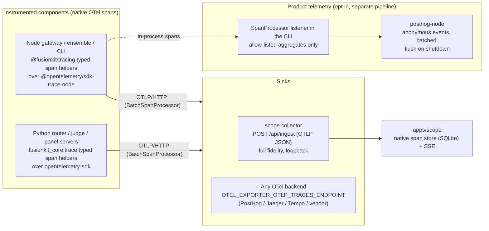

# Tracing and telemetry plan

A comprehensive plan to replace the fusion trace spine with a proper tracing
system that serves two consumers with very different trust models:

1. **Scope tracing** — the local `apps/scope` dashboard, which is allowed to see
   everything (prompts, code, judge thinking) because it never leaves the
   machine.
2. **Product telemetry** — opt-in, anonymous, allow-listed usage signals sent to
   Velum Labs, which must never carry prompts, code, repo paths, or model
   outputs.

Three principles drive the design:

- **One instrumentation spine, many sinks, redaction at the sink boundary.**
  Components emit rich domain signals exactly once; what a sink is allowed to
  see is a property of the sink, not the emit site.
- **Buy, don't build.** We adopt the OpenTelemetry SDKs as the tracing engine
  (ids, context propagation, batching, flush, sampling, export) and
  `posthog-node` as the product-telemetry engine (queueing, batching,
  anonymous events, shutdown flush). What stays ours is the thin domain
  layer: the fusion span/attribute taxonomy, typed instrumentation helpers,
  the scope UI, and the consent/allow-list policy.
- **Clean cutover over compatibility.** Trace data is ephemeral, disposable
  observability data — `--observe` already provisions a fresh per-run store.
  There will be no deprecation windows, dual wire formats, header aliases,
  env-var shims, or re-export stubs. The old spine is deleted in the same
  change set that lands the new one, and every emitter and consumer moves in
  one coordinated pass. The monorepo makes this atomic: the CLI, gateway,
  ensemble, Python core, and scope all ship together.

## Goals

- OpenTelemetry-native tracing in both languages: real spans with W3C
  `traceparent`/`baggage` propagation, standard `OTEL_*` configuration, and
  OTLP export to any backend (PostHog, Jaeger, Tempo) as pure configuration.
- A single, versioned, machine-checked registry of fusion span names,
  event names, and attributes (semantic conventions) that all emitters and
  consumers provably conform to — replacing today's four hand-maintained
  contract copies with one source of truth.
- Scope becomes a first-class span store: native span/span-event storage,
  real waterfalls, same one-command `--observe` experience.
- Product telemetry via PostHog that is **off by default**, consent-gated,
  allow-listed, and documented — honoring the existing promise in
  `docs/privacy.md`.
- Less code than today: both hand-rolled emitters, the custom wire format,
  the custom headers, and the JSONL fallback machinery are deleted, not
  wrapped.

## Non-goals

- Hand-rolling any transport machinery: no custom batching queues, retry
  loops, flush lifecycles, OTLP serializers, or analytics uploaders. If the
  SDK provides it, we configure it.
- Backward compatibility with the old spine: no support for old JSONL trace
  dirs, `x-fusion-*` trace-context headers, `FUSION_TRACE_*` env vars, or
  pre-cutover scope databases. Trace data is disposable; the store recreates
  itself on schema-version mismatch.
- A hosted control plane or server-side telemetry pipeline (PostHog cloud or
  a self-hosted PostHog instance covers the backend; standing one up is out
  of scope for this repo).
- Telemetry of any prompt, code, diff, file path, repo name, or model output —
  ever, under any setting.
- Changes to the legacy `warrant` stack or the kernel's internal in-memory
  `TraceEvent` runtime log (`packages/kernel/src/types.ts`), which is a
  deterministic replay record, not distributed tracing.

## Where we are today

The spine exists and works end-to-end (`fusionkit codex --observe` streams live
events into scope), but it is entirely hand-rolled and has drifted:

| # | Drift / gap | Evidence |
| --- | --- | --- |
| 1 | Hand-rolled emitters in both languages reimplement what OTel provides: id minting, queueing, HTTP posting, JSONL fallback, sampling hooks — with gaps (TS fire-and-forgets posts with no flush-on-exit; one event per HTTP request; Python's `close()` is never called on exit). | `packages/protocol/src/trace.ts`, `python/fusionkit-core/src/fusionkit_core/trace.py` |
| 2 | The events are flat records emulating spans: `*.started`/`*.finished` pairs with hand-threaded `span_id`/`parent_span_id`, per-process `seq` counters that restart at 0, and wall-clock ordering at the collector. A real span model gives structure, duration, and ordering for free. | Both emitters; `apps/scope/lib/db.ts` ordering |
| 3 | Schema enum is stale: `judge.request`, `judge.scored`, `judge.synthesis` are emitted by both languages but missing from `spec/fusion-trace/schema/fusion-trace-event.v1.schema.json`, which sets `additionalProperties: false`. Real events fail strict validation. | Schema enum vs `FUSION_TRACE_EVENT_TYPES` in `packages/protocol/src/trace.ts` |
| 4 | `candidate_id` (TS) vs `trajectory_id` (Python): the schema allows `trajectory_id` only; scope stores `candidate_id` only, so Python-emitted correlation ids are silently dropped at ingest. | `apps/scope/lib/db.ts`, both emitters |
| 5 | Four hand-maintained contract copies (`spec/fusion-trace/ts`, `packages/protocol/src/trace.ts`, `fusionkit_core/trace.py`, `apps/scope/lib/types.ts`), no conformance tests, and the spec binding is stale. | File diffs across the copies |
| 6 | Custom propagation headers (`x-fusion-trace-id`, `x-fusion-span-id`, `x-fusion-parent-span-id`, `x-fusion-candidate-id`/`x-fusion-trajectory-id` — the last two themselves diverged between languages) reinvent W3C `traceparent` and `baggage`. | `spec/fusion-trace/README.md`, both emitters |
| 7 | No product telemetry exists at all, and `docs/privacy.md` promises none. Any telemetry work must be opt-in and re-document that promise honestly. | `docs/privacy.md` "Telemetry" section |

## Target architecture

Key decisions:

- **Native spans, not an event facade.** The old spine's `*.started` /
  `*.finished` record pairs are replaced by real OTel spans with lifecycles:
  `fusion.session`, `fusion.candidate`, `fusion.judge`, and model-call spans.
  Point-in-time domain signals (`trajectory.step`, `judge.thinking`, cost
  metering) become **span events** on their owning span. Emit sites are
  refactored to the span model — this is the elegant shape, and refactoring
  them is in scope. A thin typed helper layer in each language
  (`startSessionSpan()`, `candidateSpan.step(...)`, `judgeSpan.thinking(...)`)
  keeps attributes registry-conformant and non-stringly-typed; it is a typed
  API over OTel, not an emulation of the old wire format.
- **Standard propagation only.** W3C `traceparent` carries trace context;
  W3C `baggage` carries the fusion correlation context (candidate id,
  trajectory id, turn) across process boundaries via OTel's stock
  propagators. Every `x-fusion-*` header is deleted.
- **The registry is the only contract.** `spec/fusion-trace/` becomes a
  semantic-conventions registry (span names, event names, attribute keys,
  sensitivity classes) from which the TS and Python constants and scope's
  types are generated. The `fusion-trace-event.v1` JSON Schema, its
  fixtures, and its stale TS binding are deleted.
- **Scope stores spans natively.** The collector parses OTLP/HTTP JSON into
  `spans` and `span_events` tables; sessions are root spans; waterfalls,
  durations, and ordering come from the span model instead of being
  reconstructed from flat rows. Derivations (`deriveSession`, rollups) are
  rewritten against the span store. The SQLite file carries a schema version
  and recreates itself on mismatch — no migrations for disposable data.
- **Telemetry is a sink, not a second instrumentation system.** A CLI-side
  `SpanProcessor` folds finished session spans into allow-listed aggregates
  and hands them to `posthog-node`. Redaction is structural: the processor
  copies only enumerated attribute keys, never whole attribute bags.

## PostHog compatibility

PostHog compatibility is a hard requirement, and this architecture satisfies
it on all three of PostHog's integration surfaces (verified against PostHog
docs, July 2026):

1. **Product analytics** — the WS4 telemetry pipeline *is* PostHog: it uses
   the official `posthog-node` SDK, so `cli.command` and `fusion.session`
   land as ordinary PostHog events with the SDK's batching, queueing, and
   shutdown flush.
2. **Distributed tracing (PostHog alpha)** — PostHog runs a generic OTLP
   receiver: standard OTel SDKs, no PostHog packages, project token in the
   `Authorization: Bearer` header. Because emitters standardize on the OTel
   SDK with OTLP/HTTP export, sending fusion traces to PostHog is pure
   configuration:
   `OTEL_EXPORTER_OTLP_TRACES_ENDPOINT=https://us.i.posthog.com/i/v1/traces`
   plus the auth header. Note the gotcha: PostHog needs the traces-specific
   env var with the full path, not the base `OTEL_EXPORTER_OTLP_ENDPOINT`
   (which appends its own `/v1/traces`).
3. **LLM analytics (AI Observability)** — PostHog has a dedicated OTLP
   endpoint (`/i/v0/ai/otel`) that ingests only generative-AI spans (names /
   attribute keys starting `gen_ai.`, `llm.`, `ai.`) and drops the rest
   server-side. The registry therefore names model-call span attributes per
   the **OTel GenAI semantic conventions** (`gen_ai.provider.name`,
   `gen_ai.request.model`, `gen_ai.usage.input_tokens`,
   `gen_ai.usage.output_tokens`, …) instead of inventing `fusion.*`
   equivalents. That single choice makes fusion's panel/judge/synthesizer
   model calls show up natively in PostHog's LLM analytics (models, tokens,
   latency dashboards) — and in any other GenAI-semconv-aware backend. Since
   the endpoint safely drops non-AI spans, the same mixed span stream can be
   sent without filtering. Only `exportable`-tagged attributes are sent
   (prompts/outputs are `local-only` and never leave the machine unless a
   user explicitly opts into PostHog's `$ai_input`-style capture later).

Practical constraints folded into the design: PostHog's OTLP ingestion is
HTTP-only (we chose OTLP/HTTP, not gRPC), request bodies are capped at 4 MB
(the `BatchSpanProcessor` export batch size stays comfortably under it), and
distributed tracing is alpha (endpoints may change — they live in env/config,
not code). Product-analytics events and traces land in the same PostHog
project, so telemetry sessions and traces can be correlated by trace id when
a user has both enabled.

## Dependencies to add

| Where | Packages | Purpose |
| --- | --- | --- |
| New `packages/tracing` (`@fusionkit/tracing`) | `@opentelemetry/api`, `@opentelemetry/sdk-trace-node`, `@opentelemetry/exporter-trace-otlp-http`, `@opentelemetry/resources`, `@opentelemetry/semantic-conventions` | Tracer provider setup, typed span helpers, listener SpanProcessor. Lives in a new package so `@fusionkit/protocol` stays a dependency-free contract leaf (generated registry constants only). |
| `apps/scope` | `@opentelemetry/otlp-transformer` (types/parsing) | Parse OTLP JSON at `/api/ingest`. |
| `python/fusionkit-core` | `opentelemetry-api`, `opentelemetry-sdk`, `opentelemetry-exporter-otlp-proto-http` | Same engine for the Python router, judge, and panel servers (the panel-server scripts already import `fusionkit_core`). |
| `packages/cli` | `posthog-node` | Product telemetry capture, batching, shutdown flush. |

Version floors are compatible: OTel JS requires Node `^18.19.0 || >=20.6.0`
and `posthog-node` requires Node 20+; this repo already enforces Node >=22.

## Workstreams

### WS1 — Semantic conventions registry (the only contract)

- Rewrite `spec/fusion-trace/` as the fusion semantic conventions: a single
  machine-readable registry (YAML or JSON) of span names (`fusion.session`,
  `fusion.candidate`, `fusion.judge`), span-event names (the full taxonomy,
  including the judge events the old schema forgot), attribute keys, and a
  **sensitivity class per attribute** (`local-only` vs `exportable`).
- Where the OTel **GenAI semantic conventions** already define an attribute,
  use it instead of a `fusion.*` invention: model-call spans carry
  `gen_ai.provider.name`, `gen_ai.request.model`,
  `gen_ai.usage.input_tokens` / `gen_ai.usage.output_tokens`, and a
  `gen_ai.`-prefixed span name — this is what makes the stream natively
  consumable by PostHog LLM analytics. `fusion.*` attributes are reserved
  for concepts GenAI semconv has no word for (candidates, judge decisions,
  trajectories).
- Resolve the `candidate_id`/`trajectory_id` split by defining both crisply
  in the registry (`fusion.candidate.id` = panel candidate,
  `fusion.trajectory.id` = wire trajectory) and renaming every emit site and
  consumer to the registry names in the same pass. No aliases.
- Codegen TS and Python constant modules and scope's types from the registry
  (extending the `pnpm check` regeneration pattern the repo already uses for
  protocol bindings). Drift fails CI.
- Delete the old contract wholesale: the JSON Schema, its fixtures, and the
  stale `spec/fusion-trace/ts` binding.
- Conformance tests: each language emits one span/event of every kind through
  the real SDK and asserts the OTLP output against the registry (names,
  required attributes, sensitivity tags present).

### WS2 — Native OTel instrumentation (both languages)

- **TS:** new `@fusionkit/tracing` package owns the `NodeTracerProvider`
  (BatchSpanProcessor + `OTLPTraceExporter`, W3C TraceContext + Baggage
  propagators, service-name resources) and exposes the typed span helpers.
  Emit sites are refactored to the span model: the gateway front door opens
  the `fusion.session` span, candidate harnesses run inside
  `fusion.candidate` spans, the judge turn is a `fusion.judge` span, and the
  vendor proxy / panel calls are GenAI spans. `trajectory.step`,
  `judge.thinking`, and cost-meter beats become span events on their owning
  span. The narrator's in-process feed becomes a `SpanProcessor` with
  synchronous fan-out (same guarantees it has today). The hand-rolled
  emitter in `packages/protocol/src/trace.ts` and the re-export in
  `packages/ensemble/src/trace.ts` are deleted; ~15 files across
  `model-gateway`, `ensemble`, `adapter-ai-sdk`, and `cli` move to the new
  helpers in the same change.
- **Python:** `fusionkit_core/trace.py` is rewritten as the same typed helper
  layer over `opentelemetry-sdk`; the FastAPI fuse endpoint, judge, and
  panel servers are refactored to spans + span events. The thread/queue/
  urllib machinery is deleted.
- **Propagation:** context crosses process boundaries exclusively via
  `traceparent` and `baggage` headers using the stock propagators. All
  `x-fusion-*` headers and their constants are deleted from both languages.
- **Configuration:** standard `OTEL_*` env vars only. The `--observe` boot
  path sets `OTEL_EXPORTER_OTLP_TRACES_ENDPOINT` to scope's ingest URL for
  every spawned child; users can point the same variable (or an additional
  exporter) at PostHog/Jaeger. `FUSION_TRACE_URL`, `FUSION_TRACE_DIR`, and
  `FUSION_TRACE_ID` are deleted, along with the JSONL fallback (scope's
  SQLite is the durable store when observing; without a sink, the SDK's
  no-op path applies).
- **Lifecycle and sampling for free:** flush-on-exit is
  `provider.shutdown()` in the CLI's existing disposer chain; sampling is
  standard `OTEL_TRACES_SAMPLER` configuration.

### WS3 — Scope as a native span store

- `/api/ingest` accepts OTLP/HTTP JSON (`ExportTraceServiceRequest`) and
  writes normalized `spans` and `span_events` tables (trace id, span id,
  parent id, name, timestamps, status, attributes JSON). The old flat
  `events` table, its content-hash dedupe, replay-from-JSONL
  (`/api/replay`, `lib/replay.ts`), and the seed fixtures shaped like the
  old wire format are deleted; seeds are regenerated as OTLP payloads.
- Sessions are root `fusion.session` spans; the sessions list, session
  detail, judge flow, models, and environments derivations are rewritten
  over the span model. This is a simplification: durations, waterfalls,
  parent/child nesting, and per-candidate grouping fall out of the store
  instead of being reconstructed per page.
- The SSE live stream publishes ingested spans/span-events as before.
- The SQLite file embeds a schema version; on mismatch the store is
  recreated empty. Trace data is disposable — no migrations, ever.

### WS4 — Product telemetry via PostHog (opt-in, allow-listed)

- **Engine:** `posthog-node` in `packages/cli/src/telemetry/`. Anonymous
  events only: `$process_person_profile: false` and `$ip: null` on every
  capture; `distinctId` is a random install UUID persisted in
  `~/.fusionkit/telemetry.json`; `disableGeoip` stays on. Batching, queueing,
  and `shutdown()` flush (2 s cap in the CLI's disposer chain) are the SDK's.
- **Events (two kinds, versioned in a short `docs/telemetry.md` field
  table):**
  - `cli.command` — command name, CLI version, os/arch, node major, duration
    bucket, exit kind (`ok` / error kind), boolean flag presence (`observe`,
    `local`), `is_ci`.
  - `fusion.session` — panel size, provider names (`openai`, `openrouter`,
    `mlx`, …), harness kind, judge decision (`synthesize` /
    `select_trajectory`), turn count, latency buckets, token totals, error
    kinds. Built by a CLI-side `SpanProcessor` from finished session spans,
    copying **only attributes tagged `exportable` in the WS1 registry** —
    never whole attribute bags, never span-event payloads. No costs in v1
    (USD totals can fingerprint accounts).
- **Consent and kill switches**, precedence order:
  `DO_NOT_TRACK=1` (forced off) > `FUSIONKIT_TELEMETRY=0|1` >
  `~/.fusionkit/telemetry.json` > default **off**. CI environments default
  off unless the env var explicitly opts in.
- **Commands:** `fusionkit telemetry status` (effective state, which layer
  decided it, install id, full field list), `on` (confirm prompt showing the
  exact field list), `off` (also deletes the install id), and `inspect`
  (debug mode: print would-be payloads to stderr, send nothing). Plus an
  opt-in step in the `fusionkit init` wizard beside the existing `observe`
  step, defaulting to "no".
- **Docs:** rewrite the Telemetry section of `docs/privacy.md` — off by
  default, exact field list, all disable methods, where consent is stored —
  and add a CHANGELOG entry. The current "does not include product telemetry"
  promise becomes "includes no telemetry unless you explicitly turn it on,
  and here is the complete list of what it sends".
- **Tests:** consent gating (a fake PostHog endpoint asserts zero requests
  across a full simulated session when disabled); allow-list snapshot (exact
  key set of both event kinds, so any new field is a deliberate, reviewed
  diff); kill-switch precedence; no-install-id-until-opt-in.

### WS5 — Verification and rollout

- Unit/integration: `pnpm verify` (check + build + test), `apps/scope`
  `pnpm test` + `pnpm build`, `uv run pytest tests -q`, `uv run pyright`,
  `uv run ruff check .`.
- E2E: rewrite `scripts/fusion-step-e2e.mjs` (and the codex/claude variants)
  against the OTLP pipeline — assert every span/event kind lands in scope,
  candidate/trajectory baggage round-trips, and `traceparent` propagates
  gateway → panel server → fuse endpoint; assert telemetry makes zero
  requests by default. One live `--observe` run to confirm the dashboard
  renders sessions end-to-end. Vendor interop check: point
  `OTEL_EXPORTER_OTLP_TRACES_ENDPOINT` at a PostHog project (and/or a local
  Jaeger) and confirm the session trace renders in PostHog distributed
  tracing and the model calls appear in PostHog LLM analytics via
  `/i/v0/ai/otel`.
- Versioning: `@fusionkit/tracing` ships new; `@fusionkit/protocol` drops its
  trace exports in a coordinated minor bump of the workspace (its consumers
  all live in this monorepo and move in the same change set); the registry
  starts at `1.0.0`.
- Sequencing: WS1 + WS2 + WS3 are **one cutover** — the old spine is deleted
  as the new one lands, split into reviewable stacked PRs (registry + TS
  instrumentation, Python instrumentation, scope store) that merge together;
  the e2e suite gates the final merge. WS4 is independent after WS1 (it
  needs the sensitivity tags).

## Risks and mitigations

| Risk | Mitigation |
| --- | --- |
| Telemetry erodes the privacy promise and user trust | Default off, `DO_NOT_TRACK` honored, anonymous-only PostHog events, structural allow-list from the registry's sensitivity tags with snapshot tests, complete field list published in `docs/privacy.md`, `fusionkit telemetry inspect` shows exact payloads |
| Big-bang cutover breaks the observe loop | The monorepo ships all sides atomically; the rewritten e2e scripts (step/codex/claude) plus a live `--observe` run gate the merge; scope's per-run store means no user data migration exists to get wrong |
| OTel JS SDK churn (exporters are 0.x) | Pin exact versions (repo already pins exact deps via the trusted-pin check); confine OTel imports to `@fusionkit/tracing` and the Python facade so an upgrade touches one module per language |
| The narrator regresses (it depends on synchronous in-process listeners) | Its feed becomes a `SpanProcessor` with synchronous fan-out; `packages/model-gateway/src/test/reasoning-narration.test.ts` guards it |
| Dependency footprint grows in the published CLI | OTel trace packages + posthog-node are small; `@fusionkit/protocol` stays dependency-free for contract-only consumers |
| PostHog outage or blocked egress slows the CLI | posthog-node is async/batched with a request timeout; `shutdown()` capped at 2 s; failures drop events, never block or fail a command |
