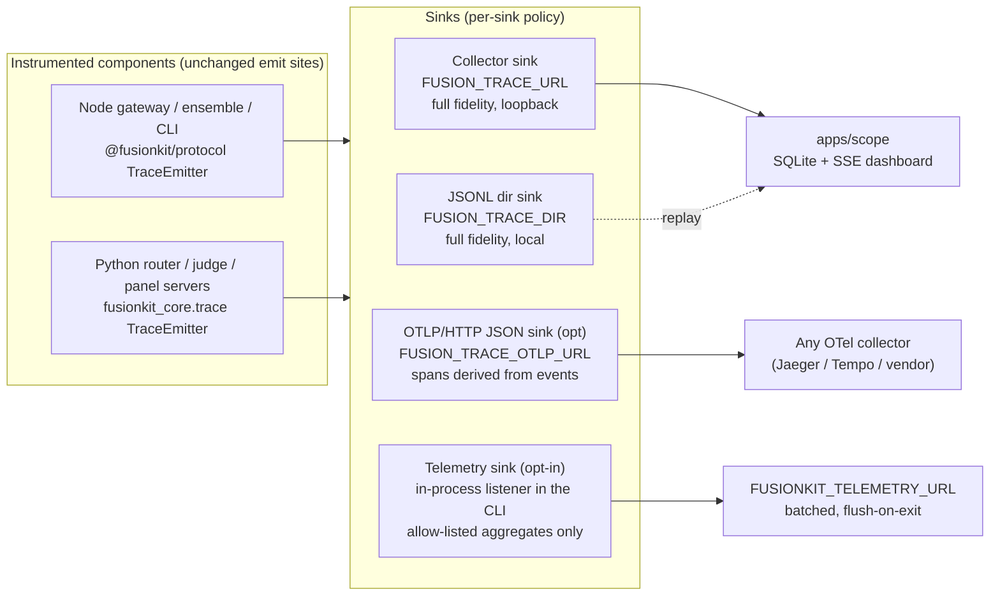

# Tracing and telemetry plan

A comprehensive plan to evolve the fusion trace spine into a proper tracing
system that serves two consumers with very different trust models:

1. **Scope tracing** — the local `apps/scope` dashboard, which is allowed to see
   everything (prompts, code, judge thinking) because it never leaves the
   machine.
2. **Product telemetry** — opt-in, anonymous, allow-listed usage signals sent to
   Velum Labs, which must never carry prompts, code, repo paths, or model
   outputs.

The design principle: **one instrumentation spine, many sinks, redaction at the
sink boundary**. Components emit rich `fusion-trace-event` records exactly once;
what a sink is allowed to see is a property of the sink, not the emit site.

## Goals

- A single, versioned, machine-checked trace contract that all emitters
  (TypeScript and Python) and all consumers (scope, telemetry, future OTLP)
  provably conform to.
- W3C-trace-context-compatible ids and propagation, so traces can interop with
  standard tooling without adopting heavyweight SDKs.
- Hardened emitters: batching, flush-on-exit, bounded queues, and a sampling
  hook, in both languages.
- Product telemetry that is **off by default**, consent-gated, allow-listed,
  and documented — honoring the existing promise in `docs/privacy.md`.
- Scope keeps working unchanged from the user's perspective (`--observe`),
  but stops silently dropping fields and mis-ordering events.

## Non-goals

- Adopting the OpenTelemetry SDKs. Both emitters are intentionally
  dependency-free (`packages/protocol` is a zero-dependency leaf;
  `fusionkit_core.trace` is stdlib-only) and must stay that way. We adopt OTel
  *compatibility* (id format, `traceparent`, optional OTLP/HTTP JSON export),
  not its runtime.
- A hosted control plane or server-side telemetry pipeline (endpoint contract
  only; the service itself is out of scope for this repo).
- Telemetry of any prompt, code, diff, file path, repo name, or model output —
  ever, under any setting.
- Changes to the legacy `warrant` stack or the kernel's internal in-memory
  `TraceEvent` runtime log (`packages/kernel/src/types.ts`), which is a
  deterministic replay record, not distributed tracing.

## Where we are today

The spine exists and works end-to-end (`fusionkit codex --observe` streams live
events into scope), but the contract has drifted from the implementations:

| # | Drift / gap | Evidence |
| --- | --- | --- |
| 1 | Schema enum is stale: `judge.request`, `judge.scored`, `judge.synthesis` are emitted by both languages but missing from `spec/fusion-trace/schema/fusion-trace-event.v1.schema.json`, which sets `additionalProperties: false`. Real events fail strict validation. | Schema enum vs `packages/protocol/src/trace.ts` (`FUSION_TRACE_EVENT_TYPES`) and `python/fusionkit-core/tests/test_judge.py` |
| 2 | `candidate_id` (TS) vs `trajectory_id` (Python): the schema allows `trajectory_id` only; TS emits `candidate_id`, which the schema rejects; scope stores `candidate_id` only, so Python-emitted `trajectory_id` correlation is silently dropped at ingest. | `packages/protocol/src/trace.ts`, `python/fusionkit-core/src/fusionkit_core/trace.py`, `apps/scope/lib/db.ts` |
| 3 | The canonical spec binding `spec/fusion-trace/ts/fusion-trace-event.ts` is stale (missing three judge event types, has `TRACE_TRAJECTORY_HEADER` where the live code uses `TRACE_CANDIDATE_HEADER`). Three more hand-maintained copies exist (`packages/protocol/src/trace.ts`, `fusionkit_core/trace.py`, `apps/scope/lib/types.ts`). | File diffs across the four copies |
| 4 | No conformance tests: nothing validates emitter output or the fixtures against the JSON schema, in either language, so drift is invisible until a consumer breaks. | No schema validation in `scripts/check-repo.mjs`, `tests/`, or either test suite |
| 5 | Emitter lifecycle is soft: the TS emitter fire-and-forgets HTTP posts (`void this.post`) with no flush on exit and posts one event per request; Python has `close()` but nothing calls it on interpreter exit. Tail events of a session can be lost. | `packages/protocol/src/trace.ts`, `python/fusionkit-core/src/fusionkit_core/trace.py` |
| 6 | Ordering is per-process: `seq` restarts at 0 in every process, so cross-process ordering falls back to wall-clock `ts` with collector-ingest tiebreak. | Emitter seq counters; `apps/scope/lib/db.ts` ordering |
| 7 | Ids are not W3C-compatible: `span_` ids are 12 hex chars (W3C needs 16); there is no `traceparent` interop. | `newSpanId()` in both emitters |
| 8 | No product telemetry exists at all, and `docs/privacy.md` promises none. Any telemetry work must be opt-in and re-document that promise honestly. | `docs/privacy.md` "Telemetry" section |

## Target architecture

Key decisions:

- **Keep the custom spine.** The domain events (`judge.thinking`,
  `trajectory.step`, per-candidate correlation) are the product's actual
  observability value; generic span models cannot express them without lossy
  attribute stuffing. Scope keeps consuming them natively.
- **Telemetry is a sink, not a second instrumentation system.** The CLI already
  has an in-process listener mechanism (`addTraceListener`, used by the
  narrator) that works even when `FUSION_TRACE_URL`/`DIR` are unset, and the
  gateway always mints a trace id. The telemetry module subscribes there,
  derives allow-listed per-session aggregates, and never sees a network hop.
  Since the Node gateway observes the whole product loop (session, panel
  outcomes, judge decision, cost), Python-side emitters need no telemetry
  changes.
- **Redaction is structural, not best-effort.** The telemetry sink builds its
  records from an explicit allow-list of enumerated fields; it never forwards
  `payload` objects. A snapshot test locks the allow-list.

## Workstreams

### WS1 — Contract repair and single source of truth

Make `spec/fusion-trace/` the generated-from source, mirroring how
`pnpm check` already regenerates protocol bindings.

- Repair `fusion-trace-event.v1.schema.json` to describe reality (this is a bug
  fix, not a version bump): add `judge.request` / `judge.scored` /
  `judge.synthesis` to the `event_type` enum; add `candidate_id`; keep
  `trajectory_id`; keep `additionalProperties: false` now that all real fields
  are listed. Document the semantics: `candidate_id` names a panel candidate,
  `trajectory_id` names a wire trajectory (a candidate may carry both).
- Add a codegen step (extend `scripts/check-repo.mjs` or a sibling script) that
  regenerates the enum/type/constant portions of the four bindings from the
  schema: `spec/fusion-trace/ts/fusion-trace-event.ts`,
  `packages/protocol/src/trace.ts` (types + runtime enum arrays only; emitter
  logic stays hand-written), `python/fusionkit_core/trace.py` constants, and
  `apps/scope/lib/types.ts`. `pnpm check` fails when they drift.
- Conformance tests in both languages: validate the committed fixtures and one
  synthetically emitted event of every `event_type` against the JSON schema
  (Python via the existing `jsonschema` dev dependency; TS via
  `assertFusionTraceEvent` plus a fixture-vs-schema test).
- Extend the fixtures under `spec/fusion-trace/fixture/` to cover every event
  type, and regenerate `apps/scope/test/fixture.ts` from them so scope tests
  exercise the same wire shapes.

### WS2 — Emitter hardening (both languages)

- **TS (`packages/protocol/src/trace.ts`):** replace per-event
  `void this.post(...)` with a bounded async queue that batches (flush at 32
  events or 250 ms), retries once, and exposes `flush(timeoutMs)`. Register a
  `beforeExit` flush in the CLI (not in the leaf package) so library consumers
  keep full control. Keep the synchronous listener path exactly as is — the
  narrator depends on it.
- **Python (`fusionkit_core/trace.py`):** batch posts the same way and register
  `atexit` flush for the default emitter. `close()` already drains; wire it up.
- **W3C-compatible ids:** widen `newSpanId()`/`new_span_id()` to 16 hex chars
  (trace ids are already 32 hex after the `trace_` prefix). Add
  `toTraceparent(traceId, spanId)` / `fromTraceparent(header)` helpers in both
  languages; the gateway front door (`traceIdFor` in
  `packages/model-gateway/src/fusion-gateway.ts`) accepts an incoming
  `traceparent` when `x-fusion-trace-id` is absent, and outbound panel/fuse
  calls send both headers. Consumers must accept old 12-hex span ids (read
  side is tolerant; only generation changes).
- **Sampling hook:** a per-trace head-sampling decision on the emitter
  (`FUSION_TRACE_SAMPLE`, default 1.0). Local scope runs stay at 100%; this
  exists so the OTLP sink and heavy CI runs can down-sample without touching
  emit sites.
- **Ordering:** stamp events with a per-process `process_id` (pid + random
  suffix) so consumers can reconstruct per-producer order (`process_id`,
  `seq`) instead of relying on wall clocks. Additive schema field.

### WS3 — Scope app alignment

- Ingest with the shared validator; store `trajectory_id` (new column plus the
  same `ALTER TABLE` migration pattern used for `prompt_preview` in
  `apps/scope/lib/db.ts`), fixing the silent drop of Python correlation ids.
- Include `candidate_id`/`model_id`/`trajectory_id` in the ingest content hash
  so distinct events cannot collide.
- Order timelines by (`process_id`, `seq`) within a producer and `ts` across
  producers; keep ingest id as the final tiebreak.
- `POST /api/ingest` gains an optional `?strict=1` mode returning per-event
  rejection reasons (used by tests and the e2e scripts; default stays
  tolerant so old JSONL replays keep working).
- No UI redesign in this plan; the session/judge/models views already consume
  everything above.

### WS4 — Optional OTLP export bridge (experimental)

- A new sink in the TS emitter, enabled by `FUSION_TRACE_OTLP_URL`: derive
  spans from the event stream (session span from `session.started/finished`,
  candidate spans from `harness.candidate.*`, judge span from
  `judge.request`→`judge.final`, model-call spans from `model.call.*`) and post
  OTLP/HTTP JSON (`/v1/traces`). Hand-rolled, ~200 lines, zero dependencies;
  events that do not bound a span become OTLP span events. Payloads are
  attribute-mapped through the same field classifier as telemetry (safe fields
  only, since OTLP targets may be remote).
- Node-side only at first (the gateway sees the whole session); the Python
  router keeps posting to the spine, and its events reach OTLP via the
  gateway's spans in v1. Mirror in Python later only if demand exists.
- Documented as experimental in `docs/specs-and-apis.md`.

### WS5 — Product telemetry (opt-in, allow-listed)

- **Contract first:** a standalone `spec/telemetry/telemetry-event.v1` JSON
  Schema (same standalone posture as `spec/fusion-trace/`, outside the frozen
  model-fusion bundle). Two record kinds:
  - `cli.command` — command name, CLI version, os/arch, node major, duration
    bucket, exit kind (`ok` / `error-kind`), flags used (boolean presence only,
    e.g. `observe`, `local`).
  - `fusion.session` — panel size, provider names (e.g. `openai`,
    `openrouter`, `mlx`), harness kind, judge decision
    (`synthesize`/`select_trajectory`), turn count, latency buckets, token
    totals, error kinds, and whether observe/budget were on. No costs in v1
    (revisit; USD totals can fingerprint accounts).
  - Every record carries an anonymous `install_id` (random UUID persisted in
    `~/.fusionkit/telemetry.json`), schema version, and nothing else. No repo
    names, paths, prompts, model outputs, hostnames, or IP-derived fields.
- **Consent and kill switches** (module `packages/cli/src/telemetry/`):
  - Default **off**. Enabled only by an explicit `fusionkit telemetry on`, the
    `fusionkit init` wizard step (a new step beside the existing `observe`
    step in `packages/cli/src/fusion-init.ts`, default "no"), or
    `FUSIONKIT_TELEMETRY=1`.
  - Hard kills that override any stored consent: `FUSIONKIT_TELEMETRY=0`,
    `DO_NOT_TRACK=1`, and CI detection (`CI=true` → off unless the env var
    explicitly opts in).
  - `fusionkit telemetry status` prints the effective state, the install id,
    and the exact field list; `fusionkit telemetry off` deletes the install id.
  - Consent state lives in `~/.fusionkit/telemetry.json`
    (`{enabled, installId, decidedAt}`), following the `consent.ts` pattern.
- **Collection:** the module registers an `addTraceListener` on the default
  emitter (works without `--observe`, since listeners bypass the URL/DIR gate
  and the gateway always mints trace ids) and folds events into one
  `fusion.session` record per trace id; `cli.command` records are emitted
  directly by the command entry points. Records are built exclusively from an
  enumerated allow-list — the listener never copies `payload` objects.
- **Transport:** batched POST to `FUSIONKIT_TELEMETRY_URL` (default the Velum
  endpoint), flush on exit capped at 2 s, drop on any failure, never retry
  across runs, never block or fail a command.
- **Docs:** rewrite the Telemetry section of `docs/privacy.md` — off by
  default, exact field list, how to enable/disable, where consent is stored —
  and add a CHANGELOG entry. The current "does not include product telemetry"
  promise becomes "includes no telemetry unless you explicitly turn it on,
  and here is the complete list of what it sends".
- **Tests:**
  - Consent gating: no HTTP attempt when disabled (fake endpoint asserts zero
    requests across a full simulated session).
  - Allow-list snapshot: a test that serializes both record kinds from a rich
    synthetic session and asserts the exact key set, so any new field is a
    deliberate, reviewed diff.
  - Schema conformance against `telemetry-event.v1`.
  - Kill-switch precedence (`DO_NOT_TRACK` beats stored consent, etc.).

### WS6 — Verification and rollout

- Unit/integration: `pnpm verify` (check + build + test), `apps/scope`
  `pnpm test` + `pnpm build`, `uv run pytest tests -q`, `uv run pyright`,
  `uv run ruff check .`.
- E2E: extend `scripts/fusion-step-e2e.mjs` (and the codex/claude variants) to
  assert strict-mode ingest accepts every emitted event, `trajectory_id`
  round-trips into scope, and telemetry makes zero requests by default; one
  live `--observe` run to confirm the dashboard renders sessions with the new
  fields.
- Versioning: `@fusionkit/protocol` minor bump (additive types + emitter
  behavior); schema stays `fusion-trace-event.v1` with `schema_version`
  `1.1.0` for the additive fields (`process_id`); telemetry ships behind its
  own `telemetry-event.v1`.
- Sequencing: WS1 → WS2 → WS3 land together (they are one coherent
  contract-repair change set, reviewable as 2–3 PRs); WS5 is independent after
  WS1 and can proceed in parallel with WS4; WS4 is optional and last.

## Risks and mitigations

| Risk | Mitigation |
| --- | --- |
| Telemetry erodes the privacy promise and user trust | Default off, hard kill switches, structural allow-list with snapshot tests, complete field list published in `docs/privacy.md`, consent file the user can inspect and delete |
| Tightened schema rejects historical JSONL trace dirs on replay | Scope ingest stays tolerant by default; strict mode is opt-in for tests/CI |
| Span-id widening breaks mixed-version fleets mid-upgrade | Only generation changes; all readers accept both 12- and 16-hex span ids |
| Hand-rolled OTLP drifts from the OTLP spec | Keep the span model minimal (5 span kinds), mark experimental, cover with a golden-file test against a pinned OTLP JSON example |
| Codegen for four bindings adds build friction | Reuse the existing `pnpm check` regeneration pattern the repo already relies on for protocol bindings; drift fails fast in CI |
| Telemetry flush-on-exit delays CLI exit | 2 s hard cap, fire-and-forget within it, drop everything on timeout |
