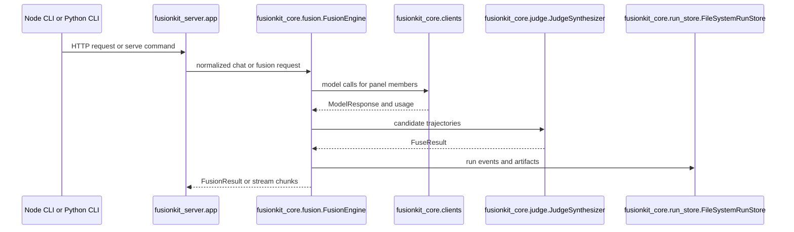

# Python reference

This page documents the uv workspace under `python/`. The root `pyproject.toml` is virtual and exists to coordinate shared tooling, dependencies, lockfile state, Ruff, Pyright, pytest, and coverage. The repository itself is not a Python package.

The Python workspace contains the FusionKit engine, the HTTP server, the PyPI CLI package named `fusionkit`, optional MLX helpers, evaluation tooling, and UniRoute routing experiments. The Node CLI invokes the Python server through `uvx` for the product path, while maintainers usually run the Python packages through `uv run`.

## Workspace commands

Use these commands from the repository root:

```bash
uv sync --all-packages
uv run pytest
uv run pyright
uv run ruff check .
```

Run a single package command by naming the package:

```bash
uv run --package fusionkit fusionkit --help
uv run --package fusionkit-server python -m uvicorn fusionkit_server.app:create_app --factory
uv run --package uniroute uniroute-demo
```

## Package map

| Package | Import package | Responsibility |
| --- | --- | --- |
| `fusionkit-core` | `fusionkit_core` | Core fusion engine, config, clients, judge, run manager, contracts, tracing, artifacts. |
| `fusionkit-server` | `fusionkit_server` | FastAPI app and OpenAI-compatible HTTP routes. |
| `fusionkit` | `fusionkit_cli` | PyPI command line interface for serving, setup, auth, prompts, benchmarks, tuning, and hill climbing. |
| `fusionkit-evals` | `fusionkit_evals` | Benchmarks, public reports, prompt tuning, Pareto analysis, hill climbing, scoring, and sandbox execution. |
| `fusionkit-mlx` | `fusionkit_mlx` | Optional MLX launcher utilities. |
| `uniroute` | `uniroute` | NumPy model routing algorithms and synthetic evaluation helpers. |
| `uniroute-mlx` | `uniroute_mlx` | Local model and OpenAI-compatible bridge for UniRoute experiments. |

## Request flow



## `fusionkit-core`

`fusionkit-core` is the core implementation package. It contains the runtime types, configuration model, provider clients, fusion engine, judge synthesizer, run manager, contract models, tracing, metrics, artifacts, and provider metadata helpers.

### `fusionkit_core.config`

This module defines the configuration that the Python engine consumes.

`EndpointAuth` describes how a model endpoint obtains credentials. It is used by provider resolution and subscription auth flows. `EndpointCapabilities` records whether an endpoint supports tools, streaming, or other model features. `CostMetadata` stores token pricing or cost metadata used by budget and report logic. `RunBudget` describes run-level budget limits. `SamplingConfig` carries temperature, top-p, max-token, and related sampling controls. `PromptOverrides` points to judge and synthesizer prompt files. `ModelEndpoint` is the per-model endpoint definition. `FusionConfig` is the top-level engine configuration. `load_config(path)` reads a config file from disk and returns a validated `FusionConfig`.

Example:

```python
from fusionkit_core.config import load_config

config = load_config(".fusionkit/fusion.yaml")
for endpoint in config.models:
    print(endpoint.id, endpoint.provider)
```

### `fusionkit_core.types`

This module contains the runtime data structures shared by clients, producers, the engine, and the judge.

`ToolCall` represents a requested tool invocation. `ChatMessage` represents a normalized chat message. `Usage` stores input, output, and total token counts. `CallMetrics` stores latency and provider metadata. `ModelResponse` is the normalized response from a provider client. `StreamChunk` represents incremental streaming output. `TrajectorySynthesis` captures judge synthesis metadata. `Trajectory` is a candidate path produced by a model or agent. `FusionAnalysis` stores parsed judge analysis. `FusionResult` is the final fused result returned by the engine.

Example:

```python
from fusionkit_core.types import ChatMessage

message = ChatMessage(role="user", content="Summarize the codebase.")
print(message.model_dump())
```

### `fusionkit_core.clients`

This module owns provider-specific model clients and error classification.

`ProviderCallError` wraps provider failures with status, retry, and category information. `classify_provider_error()` converts HTTP status codes and error bodies into provider error categories. `ChatClient` is the protocol implemented by all clients. `OpenAICompatibleClient`, `AnthropicModelClient`, `CodexResponsesClient`, and `GoogleModelClient` call real providers. `FakeModelClient` supports tests and deterministic examples. `build_client(endpoint)` builds one client from a `ModelEndpoint`. `build_clients(config)` builds all configured clients.

Private conversion helpers are relevant because they preserve wire compatibility. `_openai_messages()`, `_openai_tools()`, `_anthropic_messages()`, `_anthropic_tools()`, `_codex_input()`, `_codex_tools()`, `_google_contents()`, and `_google_tools()` map normalized FusionKit messages and tools into vendor payloads. `_loads_arguments()` safely normalizes tool-call argument JSON.

Example:

```python
from fusionkit_core.clients import build_clients
from fusionkit_core.config import load_config

config = load_config(".fusionkit/fusion.yaml")
clients = build_clients(config)
print(sorted(clients))
```

### `fusionkit_core.fusion`

`FusionEngine` coordinates model calls and synthesis. It receives normalized messages, dispatches panel calls through configured clients, records trajectories, handles direct model calls, and invokes the judge synthesizer for fused responses. It is the central class for raw endpoint behavior and benchmark runs.

`normalize_messages(messages)` accepts runtime `ChatMessage` instances or mapping objects and returns a list of validated `ChatMessage` objects. `_trajectory_metrics()` and `_optional_int()` are internal helpers used to compute fusion metrics and normalize optional numeric fields.

Example:

```python
from fusionkit_core.config import load_config
from fusionkit_core.fusion import FusionEngine

engine = FusionEngine(load_config(".fusionkit/fusion.yaml"))
result = engine.chat([
    {"role": "user", "content": "Write a test plan for the gateway."}
])
print(result.output)
```

### `fusionkit_core.judge`

This module evaluates and synthesizes candidate trajectories.

`FuseResult` is the judge output wrapper. `JudgeSynthesizer` builds judge prompts, calls the configured judge model, parses analysis, selects or synthesizes final output, and returns metrics. `accumulate_tool_call()` merges streaming tool-call fragments. `parse_analysis(content)` parses structured judge analysis from a model response.

Internal helpers such as `_consolidated_trajectory()`, `_synthesis_metrics()`, `_best_trajectory_output()`, `_selected_trajectory_id()`, `_rationale()`, `_judge_parse_status()`, `_synthesis_id()`, `_last_user_text()`, and `_extract_json()` are relevant when changing judge output parsing or telemetry.

Example:

```python
from fusionkit_core.judge import parse_analysis

analysis = parse_analysis('{"winner":"model-a","rationale":"clearer answer"}')
print(analysis.rationale)
```

### `fusionkit_core.run` and `fusionkit_core.run_models`

These modules implement native run lifecycle and its data model.

`FusionRunManager` owns run creation, event append, idempotency, tool execution pauses, tool result submission, artifact writing, inspection, budget validation, and run metrics. `make_id(prefix)` creates stable prefixed identifiers. `canonical_json(value)` and `hash_json(value)` are used for idempotency, request hashing, and artifact identity.

`RunBaseModel` is the base Pydantic model. `NativeRunError`, `ToolExecutionPolicy`, `ToolPausePlaceholder`, `ToolResultSubmission`, `FusionRunEvent`, `IdempotencyRecord`, `CreateRunResult`, `RunStateSummary`, `TrajectoryInspection`, `RunInspection`, and `RunEventPage` are the public run lifecycle models. `RunStore` and `ArtifactWriter` are protocols implemented by storage packages.

Private helpers such as `_request_from_events()`, `_runtime_messages()`, `_sampling_from_request()`, `_model_call_record()`, `_pending_tool_actions_from_events()`, `_endpoint_for_trajectory()`, `_run_cost_estimate()`, `_budget_error()`, `_validate_tool_policy()`, `_policy_cache_key()`, `_trajectory_id_for_source()`, and `_run_metrics()` are relevant when changing run state or budget behavior.

Example:

```python
from fusionkit_core.run import canonical_json, hash_json, make_id

run_id = make_id("run")
payload = {"run_id": run_id, "state": "created"}
print(canonical_json(payload))
print(hash_json(payload))
```

### `fusionkit_core.run_store`

`FileSystemRunStore` persists native runs, event logs, pending tool actions, idempotency records, artifacts, and inspection state on disk. It is the default durable store for local server usage.

Private helpers such as `_read_json()`, `_write_json()`, `_artifact_from_payload()`, `_optional_str()`, `_latest_pending_action()`, and `_dedupe_artifacts()` are important when modifying persistence format or artifact listing behavior.

Example:

```python
from pathlib import Path
from fusionkit_core.run_store import FileSystemRunStore

store = FileSystemRunStore(Path("/tmp/fusionkit-runs"))
print(store.root)
```

### `fusionkit_core.contracts`

This module mirrors the model-fusion protocol in Python and attaches producer metadata.

Contract classes include `ContractBaseModel`, `ContractMetadata`, `ContractRecord`, `ContractChatMessage`, `ContractUsage`, `ContractError`, `ContractSampling`, `ArtifactRefV1`, `ContractArtifactRef`, `ModelEndpointV1`, `ModelCallRecordV1`, `FusionRunRequestV1`, `FusionRecordV1`, `HarnessRunRequestV1`, `HarnessRunResultV1`, `HarnessCandidateRecordV1`, `TrajectoryItem`, `TrajectorySynthesis`, `TrajectoryV1`, `BenchmarkScorer`, `BenchmarkTaskRecordV1`, `ToolCallPlanV1`, `ToolExecutionRecordV1`, and `EnsembleReceiptV1`.

Functions include `schema_bundle_hash()`, `producer()`, `producer_version()`, `producer_git_sha()`, `contract_metadata()`, `contract_model_for_schema()`, and `status_for_run_state()`. These functions ensure Python records can be compared with schema and TypeScript expectations.

Example:

```python
from fusionkit_core.contracts import contract_metadata, schema_bundle_hash

print(schema_bundle_hash())
print(contract_metadata("trajectory.v1").producer)
```

### `fusionkit_core.producers`

This module turns model responses or external agent output into trajectories.

`trajectory_from_response()` converts a `ModelResponse` into a `Trajectory`. `failed_trajectory()` creates a failure trajectory when a model or harness cannot produce a candidate. `trajectory_to_contract()` and `trajectory_from_contract()` convert between runtime and contract shapes. `PanelExhaustedError` signals that every panel member failed. `ToolExecutor`, `TrajectoryProducer`, `ChatTrajectoryProducer`, `ExternalTrajectoryProducer`, and `AgentTrajectoryProducer` define producer behavior.

Example:

```python
from fusionkit_core.producers import failed_trajectory

trajectory = failed_trajectory("model-a", "provider timeout")
print(trajectory.status)
```

### `fusionkit_core.credentials`

This module resolves subscription and provider credentials.

`SubscriptionAuthError` describes credential failures. `SubscriptionToken` stores resolved token values and metadata. `load_claude_code_credentials()` and `load_codex_credentials()` load local subscription auth. `resolve_credential(endpoint)` chooses the credential source for an endpoint. `clear_credential_cache()` resets cached credentials. `SubscriptionStatus` and `subscription_status()` report configured auth state.

Internal helpers read JWT claims, macOS keychain values, token environment variables, and login hints. They should be changed carefully because they affect local developer auth.

Example:

```python
from fusionkit_core.credentials import clear_credential_cache

clear_credential_cache()
```

### `fusionkit_core.providers`

This module contains provider metadata and cost helpers.

`resolve_api_key(endpoint)` finds the API key for a model endpoint. `endpoint_to_contract(endpoint)` converts a runtime endpoint into a contract record. `normalize_usage(usage)` normalizes runtime or contract usage values. `estimate_cost()` estimates cost from endpoint metadata and usage. `provider_metadata(endpoint)` returns capability and provider details used in records and diagnostics.

Example:

```python
from fusionkit_core.providers import provider_metadata

metadata = provider_metadata(endpoint)
print(metadata["provider"])
```

### `fusionkit_core.prompts`

This module builds judge and synthesizer prompt text.

`FusionIdentity` describes how FusionKit identifies itself in prompts. `format_trajectories()` formats candidate trajectories. `build_judge_prompt()` builds the user-facing judge prompt. `build_identity_block()` builds the identity preamble. `build_judge_system()` merges judge system instructions with harness system content. `build_fuse_system()` builds final synthesis system instructions.

Example:

```python
from fusionkit_core.prompts import build_judge_prompt

prompt = build_judge_prompt("Fix the parser.", trajectories)
print(prompt[:200])
```

### `fusionkit_core.trace`, `metrics`, `kernel`, `router`, and `artifacts`

`TraceEmitter`, `new_trace_id()`, `new_span_id()`, `ambient_trace_id()`, `get_emitter()`, and `emit()` provide Python trace events that line up with the fusion trace schema.

`RunRecord` and `JsonlRunLogger` write lightweight metrics records. `FusionKernel` is the Python-side kernel abstraction. `RouterDecision` and `HeuristicRouter` support simple routing decisions. `hash_bytes()`, `hash_text()`, and `LocalArtifactStore` support content-addressed artifact storage.

Example:

```python
from fusionkit_core.trace import emit, new_trace_id

trace_id = new_trace_id()
emit("model_call.started", {"model": "example"}, trace_id=trace_id)
```

## `fusionkit-server`

`fusionkit-server` exposes the fusion engine over HTTP. The central function is `create_app()` in `fusionkit_server.app`. It builds the FastAPI application, loads configuration, wires the engine, and registers OpenAI-compatible and native run routes.

The important routes are `/v1/chat/completions`, `/v1/fusion/trajectories:fuse`, and native run endpoints for creating runs, submitting tool results, inspecting runs, and retrieving events. `fusionkit_server.openai_endpoint` contains request and response helpers for OpenAI-shaped payloads.

Example:

```bash
uv run --package fusionkit-server python -m uvicorn fusionkit_server.app:create_app --factory --port 8000
```

```bash
curl http://127.0.0.1:8000/v1/chat/completions \
  -H 'content-type: application/json' \
  -d '{"model":"fusion","messages":[{"role":"user","content":"hello"}]}'
```

## `fusionkit` Python CLI

The PyPI package named `fusionkit` is implemented by `fusionkit_cli.main:app`. It is the Python CLI that the Node side can provision and that maintainers can run directly.

Core commands include `serve()` for the FastAPI fusion router, `init()` for writing config, `serve_endpoint()` for a single-endpoint HTTP server, and `prompts_dump()` for exporting built-in prompt templates.

Authentication commands include `auth_status()`, `_switch_endpoint()`, `auth_switch()`, `auth_set_default()`, and `auth_login()`. They inspect and modify endpoint auth behavior for supported subscription and API-key modes.

Evaluation commands include `run_eval()`, `pareto()`, `tiny_bench()`, `fusion_bench()`, `fusion_bench_report()`, `public_bench()`, `public_bench_baselines()`, `tune_prompts()`, `fusion_hillclimb()`, and `fusion_hillclimb_polyglot()`.

Formatting and resolution helpers include `_format_hillclimb_report()`, `_format_tuning_report()`, `_resolve_public_suite()`, and `_write_fusion_bench_reports()`.

The onboarding module provides `global_config_path()`, `resolve_config_path()`, `default_write_path()`, `write_config()`, `detect_api_keys()`, `detect_codex_model()`, `subscription_endpoint()`, and `api_key_endpoint()`.

Example:

```bash
uv run --package fusionkit fusionkit init --global
uv run --package fusionkit fusionkit prompts dump --output .fusionkit/prompts
uv run --package fusionkit fusionkit serve --config .fusionkit/fusion.yaml --port 8000
uv run --package fusionkit fusionkit auth status
```

## `fusionkit-evals`

`fusionkit-evals` contains the benchmark and optimization toolkit. It is used for local evaluation, public benchmark comparison, prompt tuning, hill climbing, and report generation.

`benchmark.py` defines the general benchmark runner abstractions. `fusion_bench.py` defines `FusionBenchRunner` and the benchmark loop for FusionKit panels. `fusion_hillclimb.py` defines the hill-climb loop, including target checks and mutation cycles. `fusion_compound.py` builds compound fusion candidates. `benchmark_panel.py`, `candidate_bank.py`, `dirty_dozen.py`, and `schema.py` define benchmark inputs and candidate storage.

`checkers.py`, `scorers.py`, `code_extract.py`, `sandbox.py`, `exec_select.py`, and `bench_verify.py` evaluate correctness and execution results. `bench_stats.py`, `bench_history.py`, `bench_runtime.py`, `fusion_reports.py`, `public_bench.py`, `public_bench_report.py`, and `public_smoke.py` produce reports and public comparison artifacts.

`prompt_tuning.py`, `pareto.py`, `polyglot.py`, `livecodebench_data.py`, and `gateway_target.py` support optimization, suite selection, and external benchmark integration. Adapters under `python/fusionkit-evals/src/fusionkit_evals/adapters/` connect to LiveCodeBench, Aider-style polyglot tasks, and selection experiments.

Example:

```bash
uv run --package fusionkit fusionkit tiny-bench --config .fusionkit/fusion.yaml
uv run --package fusionkit fusionkit fusion-bench --config .fusionkit/fusion.yaml --limit 12
uv run --package fusionkit fusionkit fusion-bench-report --input artifacts/fusion-bench/latest.json
uv run --package fusionkit fusionkit fusion-hillclimb --config .fusionkit/fusion.yaml
```

## `fusionkit-mlx`

`fusionkit-mlx` contains optional MLX helper utilities. The main module is `fusionkit_mlx.launcher`, which starts or manages local MLX serving processes for compatible Apple Silicon environments.

This package should remain optional. Product code should detect unsupported platforms and provide clear guidance rather than importing MLX-only dependencies unconditionally.

Example:

```bash
uv run --package fusionkit-mlx python -c "import fusionkit_mlx; print(fusionkit_mlx.__name__)"
```

## `uniroute`

`uniroute` implements dynamic-pool model routing experiments in NumPy. Modules include `routers`, `synthetic`, `trials`, `kmeans`, `learned_map`, `evaluate`, and `demo`.

Use this package when working on routing research or reproducing UniRoute-style model selection. It is not part of the shipped CLI path, but it remains in the workspace and has its own tests.

Example:

```bash
uv run --package uniroute uniroute-demo
uv run pytest python/uniroute/tests
```

## `uniroute-mlx`

`uniroute-mlx` bridges UniRoute routing experiments to local or OpenAI-compatible model servers. Modules include `client`, `evaluate`, `card`, and `cli`.

The package is useful for evaluating routed local models and writing router cards. It has a dedicated `uniroute-mlx` console script and tests under `python/uniroute-mlx/tests`.

Example:

```bash
uv run --package uniroute-mlx uniroute-mlx --help
uv run pytest python/uniroute-mlx/tests
```

## Change checklist

When changing Python behavior, update the module-level docs on this page, add or update pytest coverage, run Ruff, run Pyright for packages in the configured scope, and run the focused CLI command when the change affects Typer commands or HTTP serving. Schema changes should also update generated protocol bindings and the [Specs and APIs](specs-and-apis.md) page.
