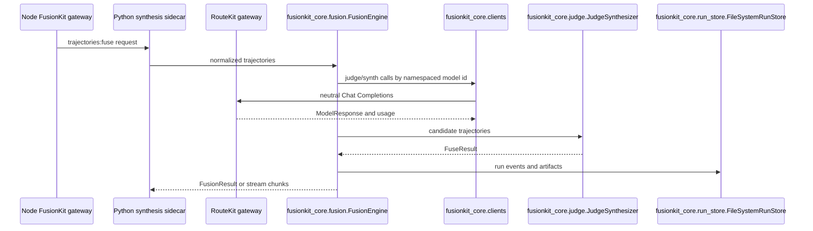

# Python reference

This page documents the uv workspace under `python/`. The root `pyproject.toml` is virtual and exists to coordinate shared tooling, dependencies, lockfile state, Ruff, Pyright, pytest, and coverage. The repository itself is not a Python package.

The Python workspace contains FusionKit's internal synthesis sidecar, optional
MLX helpers, maintainer evaluation tooling, a RouteKit-upstream test simulator,
the Hyperkit experiment platform, and UniRoute experiments. The Node CLI invokes
the sidecar through `uvx`; Python does not expose the user-facing `fusionkit`
binary or own provider accounts.

## Workspace commands

Use these commands from the repository root:

```bash
uv sync --all-packages
uv run pytest
uv run pyright
uv run ruff check .
```

Run a single package command by naming the package:

```bash
uv run --package fusionkit fusionkit-sidecar --help
uv run --package fusionkit-evals fusionkit-bench --help
uv run --package uniroute uniroute-demo
```

## Package map

| Package | Import package | Responsibility |
| --- | --- | --- |
| `fusionkit-core` | `fusionkit_core` | Fusion engine, sidecar config, neutral RouteKit client, judge, run manager, contracts, tracing, artifacts. |
| `fusionkit-server` | `fusionkit_server` | Internal FastAPI trajectory-fusion, native-run, tool-resume, and health APIs. |
| `fusionkit` | `fusionkit_cli` | PyPI runtime exposing only the internal `fusionkit-sidecar` command. |
| `fusionkit-evals` | `fusionkit_evals` | Benchmarks, public reports, prompt tuning, Pareto analysis, hill climbing, scoring, and sandbox execution. |
| `fusionkit-mlx` | `fusionkit_mlx` | Optional MLX launcher utilities. |
| `fusionkit-testkit` | `fusionkit_testkit` | Scriptable RouteKit-upstream simulator, sidecar config builders, process harness, and pytest fixtures. |
| `hyperkit` | `hyperkit` | SUT-agnostic experiment platform: `hyperkit` CLI, benchmark adapters, and compute backends. |
| `uniroute` | `uniroute` | NumPy model routing algorithms and synthetic evaluation helpers. |
| `uniroute-mlx` | `uniroute_mlx` | Local model and OpenAI-compatible bridge for UniRoute experiments. |

The root `[tool.pyright]` include covers the FusionKit packages (`fusionkit-cli`, `fusionkit-core`, `fusionkit-evals`, `fusionkit-mlx`, `fusionkit-server`, `fusionkit-testkit`, `hyperkit`), the generated protocol Python package, `scripts`, and `tests`. `uniroute` and `uniroute-mlx` predate the merge and stay outside the Pyright scope, though they remain in pytest discovery.

## Request flow



## `fusionkit-core`

`fusionkit-core` contains runtime types, the provider-neutral sidecar
configuration, one RouteKit client, the fusion engine, judge synthesizer, run
manager, contract models, tracing, metrics, and artifacts.

### `fusionkit_core.config`

This module defines the configuration that the Python engine consumes.

`FusionConfig` contains one `routekit_url`, namespaced `endpoint_ids`, default,
judge and synthesizer model ids, and fusion policy. `RunBudget`,
`SamplingConfig`, `ContextPolicy`, and `PromptOverrides` carry policy only.
Provider names, credentials, base URLs, retries, and pricing are intentionally
absent. `load_config(path)` validates this schema.

Example:

```python
from fusionkit_core.config import load_config

config = load_config(".fusionkit/fusion.yaml")
print(config.routekit_url, config.endpoint_ids)
```

### `fusionkit_core.types`

This module contains the runtime data structures shared by clients, producers, the engine, and the judge.

`ToolCall` represents a requested tool invocation. `ChatMessage` represents a normalized chat message. `Usage` stores input, output, and total token counts. `CallMetrics` stores model ID, latency, usage, and request ID. `ModelResponse` is the normalized response from a `ChatClient`. `StreamChunk` represents incremental streaming output. `TrajectorySynthesis` captures judge synthesis metadata. `Trajectory` is a candidate path produced by a model or agent. `FusionAnalysis` stores parsed judge analysis. `FusionResult` is the final fused result returned by the engine.

Example:

```python
from fusionkit_core.types import ChatMessage

message = ChatMessage(role="user", content="Summarize the codebase.")
print(message.model_dump())
```

### `fusionkit_core.clients`

This module builds the single neutral RouteKit client used by FusionKit.

`ChatClient` is the provider-neutral protocol, `RouteKitClient` speaks RouteKit's
OpenAI-compatible gateway using namespaced model ids, and `FakeModelClient`
supports deterministic tests. `build_clients(config)` creates one RouteKit
client per configured id. There are no credentials, provider branches, retry
classifiers, balancing rules, or pricing tables in Python.

Example:

```python
from fusionkit_core.clients import build_clients
from fusionkit_core.config import load_config

config = load_config(".fusionkit/fusion.yaml")
clients = build_clients(config)
print(sorted(clients))
```

### `fusionkit_core.fusion`

`FusionEngine` coordinates model calls and synthesis. It receives normalized messages, dispatches panel calls through configured clients, records trajectories, handles direct model calls, and invokes the judge synthesizer for fused responses. It is the central class for raw endpoint behavior and benchmark runs.

`normalize_messages(messages)` accepts runtime `ChatMessage` instances or mapping objects and returns a list of validated `ChatMessage` objects. `_trajectory_metrics()` and `_optional_int()` are internal helpers used to compute fusion metrics and normalize optional numeric fields.

Example:

```python
from fusionkit_core.config import load_config
from fusionkit_core.fusion import FusionEngine

engine = FusionEngine(load_config(".fusionkit/fusion.yaml"))
result = engine.chat([
    {"role": "user", "content": "Write a test plan for the gateway."}
])
print(result.output)
```

### `fusionkit_core.judge`

This module evaluates and synthesizes candidate trajectories.

`FuseResult` is the judge output wrapper. `JudgeSynthesizer` builds judge prompts, calls the configured judge model, parses analysis, selects or synthesizes final output, and returns metrics. `accumulate_tool_call()` merges streaming tool-call fragments. `parse_analysis(content)` parses structured judge analysis from a model response.

Internal helpers such as `_consolidated_trajectory()`, `_synthesis_metrics()`, `_best_trajectory_output()`, `_selected_trajectory_id()`, `_rationale()`, `_judge_parse_status()`, `_synthesis_id()`, `_last_user_text()`, and `_extract_json()` are relevant when changing judge output parsing or telemetry.

Example:

```python
from fusionkit_core.judge import parse_analysis

analysis = parse_analysis('{"winner":"model-a","rationale":"clearer answer"}')
print(analysis.rationale)
```

### `fusionkit_core.run` and `fusionkit_core.run_models`

These modules implement native run lifecycle and its data model.

`FusionRunManager` owns run creation, event append, idempotency, tool execution pauses, tool result submission, artifact writing, inspection, budget validation, and run metrics. `make_id(prefix)` creates stable prefixed identifiers. `canonical_json(value)` and `hash_json(value)` are used for idempotency, request hashing, and artifact identity.

`RunBaseModel` is the base Pydantic model. `NativeRunError`, `ToolExecutionPolicy`, `ToolPausePlaceholder`, `ToolResultSubmission`, `FusionRunEvent`, `IdempotencyRecord`, `CreateRunResult`, `RunStateSummary`, `TrajectoryInspection`, `RunInspection`, and `RunEventPage` are the public run lifecycle models. `RunStore` and `ArtifactWriter` are protocols implemented by storage packages.

Private helpers such as `_request_from_events()`, `_runtime_messages()`, `_sampling_from_request()`, `_model_call_record()`, `_pending_tool_actions_from_events()`, `_endpoint_for_trajectory()`, `_run_cost_estimate()`, `_budget_error()`, `_validate_tool_policy()`, `_policy_cache_key()`, `_trajectory_id_for_source()`, and `_run_metrics()` are relevant when changing run state or budget behavior.

Example:

```python
from fusionkit_core.run import canonical_json, hash_json, make_id

run_id = make_id("run")
payload = {"run_id": run_id, "state": "created"}
print(canonical_json(payload))
print(hash_json(payload))
```

### `fusionkit_core.run_store`

`FileSystemRunStore` persists native runs, event logs, pending tool actions, idempotency records, artifacts, and inspection state on disk. It is the default durable store for local server usage.

Private helpers such as `_read_json()`, `_write_json()`, `_artifact_from_payload()`, `_optional_str()`, `_latest_pending_action()`, and `_dedupe_artifacts()` are important when modifying persistence format or artifact listing behavior.

Example:

```python
from pathlib import Path
from fusionkit_core.run_store import FileSystemRunStore

store = FileSystemRunStore(Path("/tmp/fusionkit-runs"))
print(store.root)
```

### `fusionkit_core.contracts`

This module mirrors the model-fusion protocol in Python and attaches producer metadata.

Contract classes include `ContractBaseModel`, `ContractMetadata`, `ContractRecord`, `ContractChatMessage`, `ContractUsage`, `ContractError`, `ContractSampling`, `ArtifactRefV1`, `ContractArtifactRef`, `ModelCallRecordV1`, `FusionRunRequestV1`, `FusionRecordV1`, `HarnessRunRequestV1`, `HarnessRunResultV1`, `HarnessCandidateRecordV1`, `TrajectoryItem`, `TrajectorySynthesis`, `TrajectoryV1`, `BenchmarkScorer`, `BenchmarkTaskRecordV1`, `ToolCallPlanV1`, `ToolExecutionRecordV1`, and `EnsembleReceiptV1`.

Functions include `schema_bundle_hash()`, `producer()`, `producer_version()`, `producer_git_sha()`, `contract_metadata()`, `contract_model_for_schema()`, and `status_for_run_state()`. These functions ensure Python records can be compared with schema and TypeScript expectations.

Example:

```python
from fusionkit_core.contracts import contract_metadata, schema_bundle_hash

print(schema_bundle_hash())
print(contract_metadata("trajectory.v1").producer)
```

### `fusionkit_core.producers`

This module turns model responses or external agent output into trajectories.

`trajectory_from_response()` converts a `ModelResponse` into a `Trajectory`. `failed_trajectory()` creates a failure trajectory when a model or harness cannot produce a candidate. `trajectory_to_contract()` and `trajectory_from_contract()` convert between runtime and contract shapes. `PanelExhaustedError` signals that every panel member failed. `ToolExecutor`, `TrajectoryProducer`, `ChatTrajectoryProducer`, `ExternalTrajectoryProducer`, and `AgentTrajectoryProducer` define producer behavior.

Example:

```python
from fusionkit_core.producers import failed_trajectory

trajectory = failed_trajectory("model-a", "RouteKit call failed")
print(trajectory.status)
```

### `fusionkit_core.prompts`

This module builds judge and synthesizer prompt text.

`FusionIdentity` describes how FusionKit identifies itself in prompts. `format_trajectories()` formats candidate trajectories. `build_judge_prompt()` builds the user-facing judge prompt. `build_identity_block()` builds the identity preamble. `build_judge_system()` merges judge system instructions with harness system content. `build_fuse_system()` builds final synthesis system instructions.

Example:

```python
from fusionkit_core.prompts import build_judge_prompt

prompt = build_judge_prompt("Fix the parser.", trajectories)
print(prompt[:200])
```

### `fusionkit_core.trace`, `metrics`, `kernel`, `router`, and `artifacts`

`setup_fusion_tracing()`, `fusion_span()`, `start_fusion_span()`/`end_fusion_span()`, `emit_event()`, `context_from_headers()`, and `candidate_baggage_of()` provide OpenTelemetry-backed spans and events that follow the fusion semantic conventions (`spec/fusion-trace/registry.json`). Export is configured with the standard `OTEL_EXPORTER_OTLP_ENDPOINT` base (spans post to `/v1/traces`, events to `/v1/logs`; the signal-specific variables win).

`RunRecord` and `JsonlRunLogger` write lightweight metrics records.
`FusionKernel` is the Python-side kernel abstraction. `RouterDecision` and
`FusionModeRouter` choose internal fusion modes. `hash_bytes()`, `hash_text()`,
and `LocalArtifactStore` support content-addressed artifact storage.

Example:

```python
from fusionkit_core.trace import context_from_headers, emit_event, fusion_span

ctx = context_from_headers({"traceparent": incoming_traceparent})
with fusion_span("synthesis", "fusion.fuse", ctx) as span:
    emit_event("judge", "fusion.judge.thinking", ctx, {"fusion.raw_analysis": "..."})
```

## `fusionkit-server`

`fusionkit-server` exposes only the internal fusion sidecar HTTP API. The
central function is `create_app()` in `fusionkit_server.app`.

The routes are `/health`, `/v1/fusion/trajectories:fuse`, and native run
endpoints for creating runs, submitting tool results, inspecting runs, and
retrieving events. It has no model listing, passthrough, Cursor, Messages, or
public Chat Completions front door.

Example:

```bash
uv run --package fusionkit fusionkit-sidecar serve --config sidecar.yaml --port 8000
curl http://127.0.0.1:8000/health
```

## `fusionkit` Python sidecar

The PyPI package named `fusionkit` is implemented by
`fusionkit_cli.main:app`. It installs only `fusionkit-sidecar`; the Node
package owns the user-facing `fusionkit` binary.

Its commands are `serve`, `prompts dump`, and `--version`. It has no auth,
onboarding, provider, passthrough, benchmark, MLX, or Hyperkit commands.

Example:

```bash
uv run --package fusionkit fusionkit-sidecar prompts dump --dir .fusionkit/prompts
uv run --package fusionkit fusionkit-sidecar serve --config sidecar.yaml --port 8000
```

## `fusionkit-evals`

`fusionkit-evals` contains the benchmark and optimization toolkit. Its
`fusionkit_evals.cli:bench_app` is the canonical implementation behind the
separately installed `fusionkit-bench` entrypoint; the sidecar package contains
no benchmark command modules or dependency on this package.

`benchmark.py` defines the general benchmark runner abstractions. `fusion_bench.py` defines `FusionBenchRunner` and the benchmark loop for FusionKit panels. `fusion_hillclimb.py` defines the hill-climb loop, including target checks and mutation cycles. `fusion_compound.py` builds compound fusion candidates. `benchmark_panel.py`, `candidate_bank.py`, `dirty_dozen.py`, and `schema.py` define benchmark inputs and candidate storage.

`checkers.py`, `scorers.py`, `code_extract.py`, `sandbox.py`, `exec_select.py`, and `bench_verify.py` evaluate correctness and execution results. `bench_stats.py`, `bench_history.py`, `bench_runtime.py`, `fusion_reports.py`, `public_bench.py`, `public_bench_report.py`, and `public_smoke.py` produce reports and public comparison artifacts.

`prompt_tuning.py`, `pareto.py`, `polyglot.py`, `livecodebench_data.py`, and `gateway_target.py` support optimization, suite selection, and external benchmark integration. Adapters under `python/fusionkit-evals/src/fusionkit_evals/adapters/` connect to LiveCodeBench, Aider-style polyglot tasks, and selection experiments.

Example:

```bash
uv run --package fusionkit-evals fusionkit-bench tiny --config sidecar.yaml
uv run --package fusionkit-evals fusionkit-bench fusion --config sidecar.yaml
uv run --package fusionkit-evals fusionkit-bench fusion-report \
  --input artifacts/fusion-bench/latest.json
uv run --package fusionkit-evals fusionkit-bench hillclimb --config sidecar.yaml
```

## `fusionkit-mlx`

`fusionkit-mlx` contains optional MLX helper utilities. The main module is `fusionkit_mlx.launcher`, which starts or manages local MLX serving processes for compatible Apple Silicon environments.

This package should remain optional. Product code should detect unsupported platforms and provide clear guidance rather than importing MLX-only dependencies unconditionally.

Example:

```bash
uv run --package fusionkit-mlx python -c "import fusionkit_mlx; print(fusionkit_mlx.__name__)"
```

## `fusionkit-testkit`

`fusionkit-testkit` is never published. Its neutral OpenAI-compatible simulator
acts as a controllable RouteKit upstream for Python sidecar tests.
`fusionkit_testkit.endpoints` builds namespaced-model `FusionConfig` objects and
`EngineProcess` runs the real `fusionkit-sidecar` child process. RouteKit-wire
coverage belongs to the TypeScript RouteKit gateway tests.

The standalone simulator runs as a console script:

```bash
uv run --package fusionkit-testkit fusionkit-sim --port 0
```

## `hyperkit`

`hyperkit` is the system-under-test-agnostic experiment platform;
[Hyperkit](hyperkit.md) is its living reference. It remains a standalone
workspace package and is not a dependency or plugin surface of the FusionKit
sidecar distribution.

Example:

```bash
uv run --package hyperkit hyperkit --help
uv run --package hyperkit hyperkit status --workdir .hyperkit
```

## `uniroute`

`uniroute` implements dynamic-pool model routing experiments in NumPy. Modules include `routers`, `synthetic`, `trials`, `kmeans`, `learned_map`, `evaluate`, and `demo`.

Use this package when working on routing research or reproducing UniRoute-style model selection. It is not part of the shipped CLI path, but it remains in the workspace and has its own tests.

Example:

```bash
uv run --package uniroute uniroute-demo
uv run pytest python/uniroute/tests
```

## `uniroute-mlx`

`uniroute-mlx` bridges UniRoute routing experiments to local or OpenAI-compatible model servers. Modules include `client`, `evaluate`, `card`, and `cli`.

The package is useful for evaluating routed local models and writing router cards. It has a dedicated `uniroute-mlx` console script and tests under `python/uniroute-mlx/tests`.

Example:

```bash
uv run --package uniroute-mlx uniroute-mlx --help
uv run pytest python/uniroute-mlx/tests
```

## Change checklist

When changing Python behavior, update the module-level docs on this page, add or update pytest coverage, run Ruff, run Pyright for packages in the configured scope, and run the focused CLI command when the change affects Typer commands or HTTP serving. Schema changes should also update generated protocol bindings and the [Specs and APIs](specs-and-apis.md) page.
