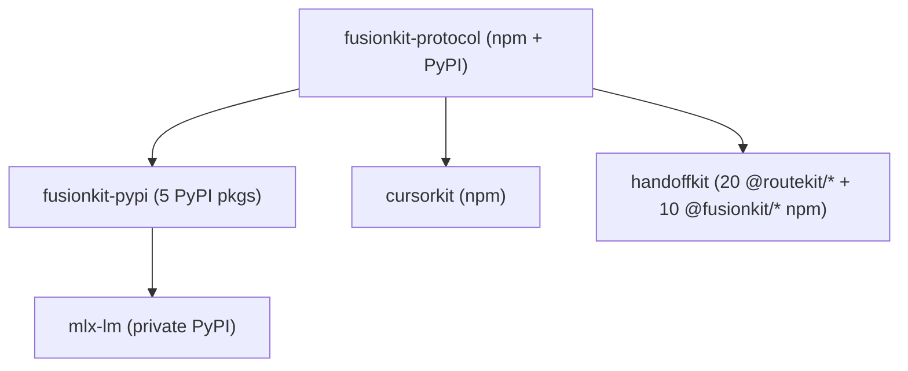

# Releasing (cross-repo, plan/apply)

The velum-labs workspace ships from four independent repositories with their own
publish mechanisms (npm via pnpm, PyPI via uv, npm+PyPI for the protocol, private
PyPI for the mlx fork). The cross-repo release coordinator
(`scripts/release.mjs`) drives all of them from `handoffkit` using a
Terraform-style `plan`/`apply` model.

It does not publish anything itself. It bumps versions in dependency order,
propagates the protocol pin, and triggers each repo's existing, gated GitHub
publish workflow (see [release-publishing.md](release-publishing.md) for
handoffkit's own workflow).

## Release units and dependency graph



The Python `uniroute` packages, app source versions, and the Docker image are
`tracked` only: visible in plans for version awareness, not independent release
units. The handoffkit npm workflow stages `apps/scope` into `@fusionkit/cli`;
`apps/docs` deploys separately through Vercel.

Each unit's `publishWorkflow` in `release/workspace.release.json` names a
workflow in that unit's own repository. For `mlx-lm` that is
`velum-private-release.yml` in the `velum-labs/mlx-lm` repo; it is not a
workflow file in this repository.

The protocol ships as two distinct packages: `spec/model-fusion-contract`
publishes `@velum-labs/model-fusion-protocol` (the cross-repo
`fusionkit-protocol` release unit above), while `packages/protocol` ships
`@fusionkit/protocol` as part of the npm monorepo (handoffkit) release.

## State files

- `release/workspace.release.json`: static topology (repos, ecosystems, tags,
  publish workflows, version sources, dependency edges, tracked surfaces).
- `release/desired.json`: target version per unit (the thing you edit).
- `release/state.json`: local, gitignored last-applied cache. It is reconcilable
  and regenerated from registries + git tags with `node scripts/release.mjs refresh`.
- `release/.plans/*.plan.json`: generated plan artifacts (gitignored).

## Workflow

```bash
# 1. Reconcile recorded state with the registries + git tags.
node scripts/release.mjs refresh

# 2. Choose target versions.
node scripts/release.mjs bump handoffkit minor          # or edit release/desired.json

# 3. Preview the ordered diff (read-only; writes a plan artifact).
node scripts/release.mjs plan                            # add -target=<unit> to scope

# 4. Apply once you have reviewed the plan (irreversible: publishes packages).
node scripts/release.mjs apply --auto-approve
```

`apply` walks the DAG: for each releasing unit it propagates the protocol pin
(if applicable, refreshing `pnpm-lock.yaml` so `--frozen-lockfile` installs
keep working), bumps versions, promotes the changelog (for units with a
`changelog` file in the topology — currently handoffkit), runs the unit's
declared `preflight` command, commits (staging only the files it changed,
never `git add -A`), pushes, then either creates a published GitHub Release
(handoffkit, cursorkit, fusionkit-pypi, mlx-lm) or pushes the
`model-fusion-protocol-v*` tag, and waits for the publish workflow before
starting dependents. Before mutating each unit it asserts a clean tree, the
expected branch, up-to-date-with-remote, and no drift from the plan. It stops
at the first failure and is safe to re-run (completed units no-op).

## Changelog and release notes

Between releases, notes accumulate by hand under the `## Unreleased` heading in
`CHANGELOG.md`. At release time the `changelog` action promotes that section to
`## <version> - <date>` (leaving a fresh empty `## Unreleased` on top), uses it
as the GitHub Release body, and regenerates the docs-site changelog page
(`apps/docs/content/docs/changelog.mdx`, via
`scripts/sync-docs-changelog.mjs`) so all three surfaces ship the same notes in
the same release commit. If nothing accumulated, a fallback "release cut"
entry is written and a warning is printed — write real notes as you land
changes. `pnpm check` fails when the docs page drifts from `CHANGELOG.md`.

## Preflight

Each unit's `preflight` command in `release/workspace.release.json` runs after
the bump and before the commit, so a broken release candidate aborts before
anything is pushed or published. HandoffKit runs `pnpm check`; the PyPI unit
builds its five declared packages in dependency order rather than every uv
workspace member.

## Agent / scripted usage

Every command accepts `--json` (one JSON document on stdout, logs on stderr) and
surfaces the URLs to poll. A non-blocking loop:

```bash
node scripts/release.mjs plan --json                            # diff + URLs; exit 1 on downgrade
node scripts/release.mjs apply --auto-approve --no-wait --json  # trigger; returns run URLs
node scripts/release.mjs status --json                          # poll run status/conclusion
node scripts/release.mjs verify --json                          # confirm published >= desired
```

Control the release commit contents with per-unit `extraCommitPaths` in the
topology or `--include <path>` at apply time; `--allow-dirty` permits applying
with an otherwise dirty tree (only tool-touched + `--include` files are staged).

## Protocol changes

Bumping `fusionkit-protocol` (`@velum-labs/model-fusion-protocol`) propagates the
new pin into the consumers released in the same plan:

- handoffkit: root `package.json` devDependencies and the `TRUSTED_THIRD_PARTY`
  allowlist in `scripts/check-repo.mjs`.
- cursorkit: `package.json` and its `modelFusionProtocol.version` field.

A consumer not being released shows as `pin-lag` in the plan; bump it too to
ship the new contract.

## Monorepo dev tooling (handoffkit-local)

Separate from releasing, for day-to-day iteration:

```bash
node scripts/monorepo.mjs graph             # @routekit/* + @fusionkit/* graph/order check
node scripts/monorepo.mjs affected origin/main   # Turbo build + test for changed projects/dependents
node scripts/monorepo.mjs clean             # purge stale release-artifacts tarballs
```

## Requirements

- `gh` authenticated with push access to each repo.
- Sibling repos checked out next to handoffkit (the coordinator resolves them
  relative to the workspace root and skips any that are absent).
