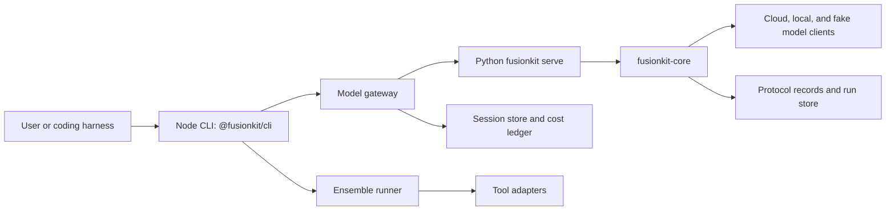
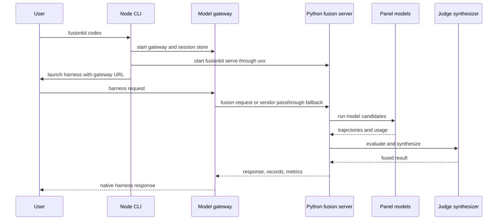

# Repository reference

This reference documents the full repository as it exists today. It is written for maintainers, package authors, release owners, and advanced users who need to understand how FusionKit is assembled across TypeScript, Python, schemas, apps, examples, and operations.

The public product is FusionKit: model fusion behind coding agents and raw inference clients. The repository also contains Warrant governance and VM-isolation packages that predate the current product focus. Those packages remain documented because they are still published, tested, and referenced by release tooling, but they are outside the shipped ensemble runtime path unless a page says otherwise.

## How to use this reference

Start with the product path if you are debugging the `fusionkit` command. Start with the package map if you are planning code changes. Start with the protocol section if you are changing schemas, generated bindings, traces, or records. Start with the examples section if you need a runnable scenario that proves a behavior.

Each package entry names responsibility, scope, entry points, relevant functions or types, tests, and a practical example. Public exports receive priority. Private helpers are documented when they carry important behavior, safety properties, or cross-package contracts. For deeper symbol-level documentation, use [TypeScript reference](typescript-reference.md), [Python reference](python-reference.md), [Source symbol index](source-symbol-index.md), [Generated code API reference](generated/code-api.md), [Specs and APIs](specs-and-apis.md), [Apps and examples](apps-and-examples.md), [Repository coverage map](repository-coverage-map.md), and [Operations and scripts](operations-and-scripts.md).



The most important operational fact is the process boundary. The Node CLI owns harness UX, tool launchers, worktrees, sessions, gateway behavior, and user configuration. The Python server owns the raw inference endpoint, model client calls, judge and synthesizer prompts, run records, benchmarks, and much of the evaluation loop.

## Top-level repository layout

The root `package.json` is a private pnpm workspace named `warrant`. It pins Node 22 or newer and pnpm 10.33.4. Its scripts are the standard maintainer commands: `pnpm check` runs repository invariants, `pnpm build` compiles TypeScript project references, `pnpm test` runs compiled Node tests and demo smoke tests, and `pnpm verify` runs all three in order.

The root `pyproject.toml` is a virtual uv workspace. It is not a Python package by itself. It binds every package under `python/` into one lockfile and configures shared Ruff, Pyright, pytest, and coverage settings. `uv sync --all-packages` prepares the Python workspace, and `uv run pytest` runs the Python test suite.

The `packages/` directory contains the TypeScript workspace. Product packages include the CLI, ensemble runtime, model gateway, protocol, workspace helpers, tool integrations, local model adapter, and kernel. Legacy or platform packages include the plane, runner, SDK, handoff SDK, compute adapter, and session backends.

The `python/` directory contains the Python implementation of the fusion engine, server, CLI, MLX helpers, evaluation tools, and UniRoute experiments. The PyPI package named `fusionkit` is the Python CLI and server driver. The Node CLI invokes this Python side through `uvx`.

The `apps/` directory contains two standalone apps. `apps/docs` is the Fumadocs documentation site. `apps/scope` is the local observability UI for fusion traces and run inspection. These apps have their own package manifests and are not part of the root pnpm workspace.

The `spec/` directory contains JSON Schemas, OpenAPI contracts, generated TypeScript and Python bindings, fixtures, fusion trace contracts, and dated design specifications. Schema changes should be treated as protocol changes and coordinated with generated code.

The `examples/` directory contains runnable demo packages. Most are legacy Warrant platform examples. The FusionKit-specific examples are especially useful for runtime-kernel, MLX, and benchmark workflows.

The `docs/` directory is the maintainer documentation layer. The public site under `apps/docs/content/docs/` is the canonical user-facing layer when the two overlap.

## Product architecture

FusionKit supports two primary usage modes. In coding-harness mode, commands such as `fusionkit codex`, `fusionkit claude`, and `fusionkit cursor` launch an existing agent CLI and place a model ensemble behind it. In raw endpoint mode, `fusionkit serve` exposes an OpenAI-compatible endpoint that clients can call directly.

The ensemble path begins in `@fusionkit/cli`. The CLI reads `.fusionkit/fusion.json`, resolves provider and local model configuration, runs preflight checks, starts the Python fusion engine when needed, starts the model gateway, and launches the selected harness integration. The gateway translates the harness dialect into the internal chat and trajectory shape, records cost and session state, and either proxies to a vendor model or routes through the fusion backend.

The Python side receives model calls, runs panel members, captures trajectories, and synthesizes results. `fusionkit_core.fusion.FusionEngine` coordinates model clients and judge synthesis. `fusionkit_core.judge.JudgeSynthesizer` evaluates candidate trajectories and returns the selected or synthesized output. `fusionkit_core.run.FusionRunManager` creates durable native run records, tool policy pauses, idempotency records, and protocol artifacts.



## TypeScript packages

### `@fusionkit/cli`

`@fusionkit/cli` is the primary product surface and publishes the `fusionkit` binary. Its entry script is `packages/cli/src/index.ts`, which builds the Commander program and handles top-level process errors. The command tree is built by `buildProgram()` in `packages/cli/src/cli.ts`.

The package owns launcher commands such as `codex`, `claude`, `cursor`, and `serve`; the generic `fusion` command group; `local`; `models`; `runtime`; `sessions`; `config`; `setup`; `doctor`; `status`; and lower-level ensemble helpers. The product path depends heavily on `registerFusion`, `registerEnsemble`, `registerLocal`, `registerModels`, `registerSessions`, `registerConfig`, `registerSetup`, and `registerDoctor`.

Important behavior includes preflight validation through `PreflightError`, version reporting that names both the npm CLI and pinned PyPI synthesizer, bare invocation help, and fail-closed policy error reporting for governed execution paths.

Example:

```bash
pnpm --filter @fusionkit/cli build
node packages/cli/dist/index.js doctor
node packages/cli/dist/index.js config show
node packages/cli/dist/index.js codex --budget 1.25
```

### `@fusionkit/ensemble`

`@fusionkit/ensemble` is the TypeScript ensemble runtime and the largest public surface in the workspace. It owns command harnesses, candidate worktrees, judge synthesis adapters, runtime-kernel workflow composition, advanced operators, schedulers, tool execution, isolation helpers, and legacy model-fusion workflow bridges.

The product-facing functions are `runEnsemble`, `ensemble`, `buildPanelPrompt`, `runFusionPanels`, `runFusionPanelWorkflow`, `runUnifiedHarnessE2E`, `setToolHarnessProvider`, and `createFusionKitJudgeSynthesizer`. These coordinate panel execution, harness selection, per-model worktrees, trajectory capture, and fused output.

The runtime-kernel exports include `GraphBuilder`, `graph`, `refs`, `registerWorkflow`, `listWorkflows`, `getWorkflow`, `runWorkflow`, `FusionRuntime`, `StaticDAGScheduler`, `DirectFastPathScheduler`, `InMemoryKernelStateStore`, and `createRuntimeReplayRecord`. These are used when fusion behavior is represented as typed operator graphs instead of a single imperative flow.

The operator exports include `ModelGenerateOperator`, `PanelGenerateOperator`, `JudgeCompareOperator`, `SynthesizeOperator`, `RouteOperator`, `SelectOperator`, `RepairOperator`, `ReviewOperator`, `PairRankOperator`, `TreeExpandOperator`, `TreeScoreOperator`, `EvidenceSourceOperator`, `DelegateOperator`, `GenFuserOperator`, and `SchemaValidationOperator`. Scheduler exports include `BestOfNScheduler`, `FixedLayerMoAScheduler`, `RankFuseScheduler`, `ExecutionSelectRepairScheduler`, `TreeSearchScheduler`, `AdaptiveRouterScheduler`, `AgenticDelegationScheduler`, `OfflineArchitectureSearchScheduler`, and `LearnedWorkflowScheduler`.

Worktree and isolation exports include `createWorktreePlan`, `cleanupWorktreePlan`, `cleanupCandidateWorktree`, `diffCandidateWorktree`, `sealCandidateWorktree`, `defaultOutputRoot`, `createCliContainerDriver`, `runCandidateCommandWithIsolation`, `secretAbsenceMetadata`, and `secretValueHash`.

Example:

```ts
import { graph, refs, registerBuiltInWorkflows, runWorkflow } from "@fusionkit/ensemble";

registerBuiltInWorkflows();

const workflow = graph("example-direct-model")
  .task("prompt", { kind: "task.input", input: refs.input("request") })
  .build();

await runWorkflow(workflow, {
  input: { request: "Summarize the repository architecture." }
});
```

### `@fusionkit/model-gateway`

`@fusionkit/model-gateway` exposes native harness dialects over local or fused model backends. It is the bridge between coding agents and the fusion backend. The gateway supports OpenAI Chat Completions, Anthropic Messages, OpenAI Responses, fusion frontdoor workflows, cost metering, session persistence, MLX backend resolution, ACP adapter installation, and provenance capture.

The primary server export is `startGateway()`, which returns a `Gateway`. Backend exports include `OpenAiBackend`, `MlxBackend`, `FusionBackend`, `createBackend`, `resolveBackendConfig`, and `DEFAULT_MLX_MODEL`. The gateway's fusion path is driven by `runFusionFrontdoorTurn`, `streamFusionFrontdoorTurn`, `runFrontdoorRequest`, `FrontdoorRequestScheduler`, and the frontdoor operator exports such as `frontdoorResolveModelOperator`, `frontdoorPanelOperator`, `frontdoorFuseOperator`, and `frontdoorVendorProxyOperator`.

Session and cost exports include `defaultSessionsDir`, `FileSystemSessionStore`, `InMemorySessionStore`, `emptySessionCost`, `addTurnCost`, `meterTurn`, `estimateCost`, `lookupPricing`, `parseUsage`, `parseUsageFromSse`, `formatUsd`, and `turnCostLine`. These are the relevant functions when debugging budgets or session totals.

Dialect adapter exports include `handleAnthropicMessages`, `chatToAnthropicMessage`, `anthropicToChat`, `openAiSseToAnthropic`, `handleResponses`, `chatToResponses`, `responsesToChat`, `openAiSseToResponses`, `effectiveModel`, `withDefaultModel`, and `isStream`.

Example:

```ts
import { FileSystemSessionStore, startGateway } from "@fusionkit/model-gateway";

const gateway = await startGateway({
  host: "127.0.0.1",
  port: 4319,
  backend: { kind: "openai", baseUrl: "http://127.0.0.1:8000/v1", apiKey: "local" },
  sessions: new FileSystemSessionStore("~/.fusionkit/sessions")
});

console.log(gateway.url);
await gateway.close();
```

### `@fusionkit/protocol`

`@fusionkit/protocol` is the zero-runtime-dependency contract layer. It defines Warrant contracts, receipts, event chains, manifests, policies, checkpoints, handoff envelopes, model-fusion schemas, generated OpenAPI clients, hashing, signing, verification, generated trace conventions, and validation helpers.

Validation and normalization exports include `parseHostAllowlistEntry`, `parsePoolName`, `parseSecretName`, `parseWorkspaceManifestPath`, `assertWireTrajectory`, `isWireTrajectory`, `normalizeWireTrajectories`, and the generated model-fusion assertion functions such as `assertHarnessRunRequestV1`, `assertHarnessRunResultV1`, `assertModelFusionRecord`, `assertEnsembleReceiptV1`, and `assertToolExecutionRecordV1`.

Cryptographic and provenance exports include `canonicalize`, `sha256Hex`, `sha256PrefixedHex`, `hashCanonical`, `hashCanonicalSha256`, `requestHash`, `responseHash`, `artifactHash`, `schemaBundleHash`, `generateEd25519KeyPair`, `keyIdFromPublicPem`, `signData`, `verifyData`, `contractHash`, `signContract`, `appendEvent`, `verifyChain`, `signReceipt`, `verifyRunnerReceipt`, and `verifyReceiptBundle`.

Trace exports are the generated fusion semantic-convention constants (`ATTR`, span/marker name lists, `EXPORTABLE_ATTRIBUTES`); the OpenTelemetry-backed span helpers live in `@fusionkit/tracing`.

Example:

```ts
import {
  assertWireTrajectory,
  normalizeWireTrajectories,
  schemaBundleHash
} from "@fusionkit/protocol";

const trajectories = normalizeWireTrajectories([candidateTrajectory]);
for (const trajectory of trajectories) {
  assertWireTrajectory(trajectory);
}

console.log(schemaBundleHash());
```

### `@fusionkit/workspace`

`@fusionkit/workspace` captures and materializes git workspaces. It is used by the CLI, runner, handoff SDK, and ensemble worktree flows when code must be copied safely, compared, or pulled back.

The public functions include `captureWorkspace`, `materializeWorkspace`, `collectOutputs`, `pullSessionOutputs`, `gitText`, `parseWorkspaceRelativePath`, and `resolveInsideWorkspace`. The exported types describe capture options, materialized sessions, output collection, and path validation.

The important invariant is that paths are resolved inside the workspace boundary and secret-pattern denial is applied during capture or materialization flows. This package should be touched whenever behavior changes how repository contents move between local workspaces, sessions, and outputs.

Example:

```ts
import { captureWorkspace, materializeWorkspace } from "@fusionkit/workspace";

const manifest = await captureWorkspace({ root: process.cwd() });
await materializeWorkspace({
  root: "/tmp/fusionkit-session",
  manifest
});
```

### `@fusionkit/tools`

`@fusionkit/tools` defines the integration contract used by per-harness packages. It is small but central: a new coding tool becomes available to the CLI by implementing `ToolIntegration` and registering it in the tool registry.

Important exports include process helpers from `proc`, the `ToolIntegration` type family, `createToolRegistry`, constants such as `FUSION_PANEL_MODEL`, `LOCAL_MODEL_LABEL`, and `CURSOR_BRIDGE_MODEL_NAME`, environment compatibility helpers such as `readEnv`, `envFlagEnabled`, and `legacyEnvName`, plus `buildSkippedCandidate` for harness candidate reporting.

Example:

```ts
import { createToolRegistry } from "@fusionkit/tools";
import { codexTool } from "@fusionkit/tool-codex";

const registry = createToolRegistry();
registry.register(codexTool);
console.log(registry.list().map((tool) => tool.name));
```

### Tool integration packages

`@fusionkit/tool-codex`, `@fusionkit/tool-claude`, `@fusionkit/tool-cursor`, and `@fusionkit/tool-opencode` adapt specific harnesses to FusionKit.

`@fusionkit/tool-codex` exports `codexTool`, launcher helpers, Codex harness creation, Codex response parsing, and harness input and result types. It is used when the CLI launches Codex behind the gateway or runs Codex as an ensemble candidate.

`@fusionkit/tool-claude` exports `claudeTool`, `createClaudeCodeHarness`, `claudeEnv`, `launchClaude`, and Claude Code harness types. It is used for Claude Code launcher and ensemble behavior.

`@fusionkit/tool-cursor` exports `cursorTool`, Cursor harness helpers, `startCursorBridge`, Cursor launch instructions, and bridge helpers for the Cursor IDE path. This package is important when debugging `fusionkit cursor --ide`.

`@fusionkit/tool-opencode` exports `opencodeTool`, `launchOpencode`, `opencodeConfig`, and `opencodeModelArg`. It currently provides launcher configuration rather than a full ensemble harness.

Example:

```ts
import { claudeTool } from "@fusionkit/tool-claude";
import { codexTool } from "@fusionkit/tool-codex";
import { cursorTool } from "@fusionkit/tool-cursor";

const tools = [codexTool, claudeTool, cursorTool];
for (const tool of tools) {
  console.log(`${tool.name}: ${tool.modes.join(", ")}`);
}
```

### `@fusionkit/adapter-ai-sdk`

`@fusionkit/adapter-ai-sdk` connects app-owned AI SDK loops to FusionKit and Warrant capabilities. It exposes governed remote tools, swarm tools, handoff-aware models, routed models, worktree agents, and managed MLX server helpers.

Important exports include `remoteTools`, `swarmTools`, `handoffModel`, `withModel`, `loadRouterCard`, `routedModel`, `withRoutedModel`, `runWorktreeAgent`, `worktreeDiff`, `defaultMlxDir`, `MlxCapabilityError`, `MlxEnv`, `managedModelServer`, and `mlxServer`.

Use this package when an application owns the loop but wants selected calls or tools to run through FusionKit or governed sessions.

Example:

```ts
import { mlxServer } from "@fusionkit/adapter-ai-sdk";

const server = await mlxServer({
  model: "mlx-community/Qwen3-4B-4bit",
  port: 8080
});

console.log(server.baseUrl);
await server.close();
```

### `@fusionkit/kernel`

`@fusionkit/kernel` is the dependency-free runtime kernel substrate. It re-exports runtime, graph utilities, graph validation, artifact types, and wire artifacts. It is suitable for packages that need typed artifacts, operators, graphs, schedulers, budgets, traces, outcomes, streaming, and replay primitives without depending on the larger ensemble package.

Important exports come from `runtime.ts`, `graph-utils.ts`, `graph-validation.ts`, `artifact-types.ts`, and `wire-artifacts.ts`. Use it when defining or validating operator graphs outside the full ensemble package.

Example:

```ts
import { validateOperatorGraph } from "@fusionkit/kernel";

const issues = validateOperatorGraph(myGraph);
if (issues.length > 0) {
  throw new Error(issues.map((issue) => issue.message).join("\n"));
}
```

### Legacy and platform TypeScript packages

`@fusionkit/plane` is the Warrant control plane. It exports `Plane`, `startPlaneServer`, `defaultPolicy`, `evaluatePolicy`, `ClaimTokenService`, `ContractService`, `ReceiptService`, `SqliteStore`, `SecretStore`, key-management helpers, authorization helpers, `IdpVerifier`, `RateLimiter`, `Metrics`, retention helpers, and domain error types. It owns policy evaluation, approval records, receipt countersignature, secret release, audit export, metrics, and durable SQLite storage.

`@fusionkit/runner` is the outbound execution worker. It exports `Runner`, `CapabilityMismatchError`, session backend types, execution kinds, and preparation helpers. It claims work from the plane, executes sessions through a configured backend, enforces egress integration, and reports receipts.

`@fusionkit/sdk` exports `PlaneClient` and `PlaneClientError`. It is the thin TypeScript client for the plane API and offline receipt verification helpers.

`@fusionkit/handoff` exports `defineHandoffConfig`, `Handoff`, `handoff`, `HandoffRun`, `checkpoint` helpers, `targets`, `agents`, `localFirst`, `triggers`, `branch`, `reviewStrategies`, and `scorecardFor`. It provides the continuation-first SDK on top of Warrant primitives.

`@fusionkit/adapter-compute` exports `governedCompute`, `GovernedSandbox`, and `withCompute`. It presents a ComputeSDK-shaped sandbox interface backed by governed runner sessions.

`@fusionkit/session-hermetic` exports `HermeticSessionBackend`, `hermeticBackend`, and `toJustBashNetwork`. It implements a virtual filesystem and just-bash interpreter backend with interpreter-enforced network policy.

`@fusionkit/session-vercel-sandbox` exports `VercelSandboxBackend`, `vercelSandboxBackend`, `shellQuote`, `listWorkspaceFiles`, `writeMirroredFile`, `vercelCredentialsFromEnv`, `toVercelNetwork`, and sandbox types. It bridges governed sessions to Vercel Sandbox microVMs.

`@fusionkit/session-harness` exports `AiSdkHarnessBackend`, `harnessBackend`, `isAgentRunFor`, Pi harness helpers, auth helpers, and `TranscriptRecorder`. It drives vendor harnesses through AI SDK harness bindings inside governed sessions.

`@fusionkit/testkit` exports `git`, `makeRepo`, `uploadWorkspace`, `mockRunRequest`, `withStackAndRepo`, and `startStack`. It is the shared fixture package for in-process plane and runner tests.

`@fusionkit/example-utils` exports demo manifest parsing, mock model helpers, live model helpers, and narration utilities used by examples.

Example:

```ts
import { Plane } from "@fusionkit/plane";
import { Runner } from "@fusionkit/runner";
import { hermeticBackend } from "@fusionkit/session-hermetic";

const plane = new Plane({ storage: "memory" });
const runner = new Runner({
  planeUrl: "http://127.0.0.1:4310",
  backend: hermeticBackend()
});

console.log(Boolean(plane), Boolean(runner));
```

## Python packages

### `fusionkit-core`

`fusionkit-core` contains the core local model-fusion primitives. It is the implementation center for configuration, provider clients, routing, model calls, trajectory production, judge synthesis, run records, artifacts, metrics, tracing, and protocol conversions.

`fusionkit_core.config` defines `EndpointAuth`, `EndpointCapabilities`, `CostMetadata`, `RunBudget`, `SamplingConfig`, `PromptOverrides`, `ModelEndpoint`, `FusionConfig`, and `load_config()`. These models describe the Python server's source of truth after the Node CLI has resolved configuration.

`fusionkit_core.clients` defines `ProviderCallError`, `ChatClient`, `OpenAICompatibleClient`, `AnthropicModelClient`, `CodexResponsesClient`, `GoogleModelClient`, `FakeModelClient`, `build_client()`, `build_clients()`, and `classify_provider_error()`. Provider clients normalize vendor-specific behavior into the common chat and usage model.

`fusionkit_core.fusion` defines `FusionEngine` and `normalize_messages()`. The engine runs panel calls, direct calls, streaming calls, tool-aware calls, and fusion requests.

`fusionkit_core.judge` defines `FuseResult`, `JudgeSynthesizer`, `accumulate_tool_call()`, and `parse_analysis()`. The synthesizer reads candidate trajectories, calls the judge model, produces rationale and final output, and emits metrics.

`fusionkit_core.run` defines `FusionRunManager`, `make_id()`, `canonical_json()`, and `hash_json()`. The run manager owns native run lifecycle, tool policy pauses, idempotency, artifact writing, event pages, inspections, budget errors, and run metrics.

`fusionkit_core.run_models` defines `NativeRunError`, `ToolExecutionPolicy`, `ToolPausePlaceholder`, `ToolResultSubmission`, `FusionRunEvent`, `IdempotencyRecord`, `CreateRunResult`, `RunStateSummary`, `TrajectoryInspection`, `RunInspection`, `RunEventPage`, `RunStore`, and `ArtifactWriter`.

`fusionkit_core.contracts` defines the Python model-fusion contract models, including `ContractMetadata`, `ArtifactRefV1`, `ModelEndpointV1`, `ModelCallRecordV1`, `FusionRunRequestV1`, `FusionRecordV1`, `HarnessRunRequestV1`, `HarnessRunResultV1`, `HarnessCandidateRecordV1`, `TrajectoryV1`, `ToolCallPlanV1`, `ToolExecutionRecordV1`, `EnsembleReceiptV1`, `schema_bundle_hash()`, `producer()`, `producer_version()`, `producer_git_sha()`, `contract_metadata()`, `contract_model_for_schema()`, and `status_for_run_state()`.

`fusionkit_core.types` defines the runtime chat and fusion data models: `ToolCall`, `ChatMessage`, `Usage`, `CallMetrics`, `ModelResponse`, `StreamChunk`, `TrajectorySynthesis`, `Trajectory`, `FusionAnalysis`, and `FusionResult`.

`fusionkit_core.producers` defines trajectory production utilities: `trajectory_from_response()`, `failed_trajectory()`, `trajectory_to_contract()`, `trajectory_from_contract()`, `PanelExhaustedError`, `ToolExecutor`, `TrajectoryProducer`, `ChatTrajectoryProducer`, `ExternalTrajectoryProducer`, and `AgentTrajectoryProducer`.

`fusionkit_core.run_store` defines `FileSystemRunStore`, which persists run state, events, artifacts, tool pauses, idempotency records, and inspections to the local filesystem.

`fusionkit_core.trace` defines `setup_fusion_tracing()`, `fusion_span()`, `start_fusion_span()`, `end_fusion_span()`, `emit_marker()`, `context_from_headers()`, and `candidate_baggage_of()` over the OpenTelemetry SDK.

`fusionkit_core.artifacts` defines `hash_bytes()`, `hash_text()`, and `LocalArtifactStore`.

`fusionkit_core.router` defines `RouterDecision` and `HeuristicRouter`.

Example:

```python
from fusionkit_core.config import load_config
from fusionkit_core.fusion import FusionEngine

config = load_config(".fusionkit/fusion.yaml")
engine = FusionEngine(config)
result = engine.chat([
    {"role": "user", "content": "Explain this repository in one paragraph."}
])
print(result.output)
```

### `fusionkit-server`

`fusionkit-server` exposes the Python fusion engine over HTTP. The central function is `fusionkit_server.app.create_app()`. It wires configuration, model clients, the fusion engine, native run APIs, and OpenAI-compatible routes. `fusionkit_server.openai_endpoint` contains endpoint helpers for OpenAI-shaped requests and responses.

The important routes include `/v1/chat/completions` for OpenAI-compatible chat, `/v1/fusion/trajectories:fuse` for trajectory fusion, and native run APIs used by harness integrations and benchmarks.

Example:

```bash
uv run --package fusionkit-server python -m uvicorn fusionkit_server.app:create_app --factory --port 8000
curl http://127.0.0.1:8000/v1/chat/completions \
  -H 'content-type: application/json' \
  -d '{"model":"fusion","messages":[{"role":"user","content":"hello"}]}'
```

### `fusionkit` Python CLI

The PyPI package named `fusionkit` is implemented under `python/fusionkit-cli` and exposes `fusionkit = "fusionkit_cli.main:app"`. It uses Typer.

The command functions include `serve()`, `init()`, `prompts_dump()`, `serve_endpoint()`, `run_eval()`, `pareto()`, `tiny_bench()`, `fusion_bench()`, `fusion_bench_report()`, `public_bench()`, `public_bench_baselines()`, `tune_prompts()`, `fusion_hillclimb()`, and `fusion_hillclimb_polyglot()`. Auth-related functions include `auth_status()`, `auth_switch()`, `auth_set_default()`, and `auth_login()`.

The onboarding module defines `global_config_path()`, `resolve_config_path()`, `default_write_path()`, `write_config()`, `detect_api_keys()`, `detect_codex_model()`, `subscription_endpoint()`, and `api_key_endpoint()`.

Example:

```bash
uv run --package fusionkit fusionkit init --global
uv run --package fusionkit fusionkit serve --config .fusionkit/fusion.yaml --port 8000
uv run --package fusionkit fusionkit prompts dump --dir .fusionkit/prompts
```

### `fusionkit-evals`

`fusionkit-evals` contains benchmarks, prompt tuning, public benchmark reporting, hill climbing, Pareto analysis, sandboxed execution, and scoring utilities.

Important modules include `fusion_bench`, `fusion_hillclimb`, `fusion_compound`, `benchmark`, `benchmark_panel`, `dirty_dozen`, `public_bench`, `public_bench_report`, `prompt_tuning`, `pareto`, `exec_select`, `candidate_bank`, `bench_verify`, `bench_stats`, and `gateway_target`.

Key symbols include `FusionBenchRunner`, `BenchmarkRunner`, `run_climb`, `check_target`, scorer functions, code extraction helpers, and report writers. Adapters under `python/fusionkit-evals/src/fusionkit_evals/adapters/` connect the evaluation system to LiveCodeBench, Aider-style polyglot tasks, and selection experiments.

Example:

```bash
uv run --package fusionkit fusionkit fusion-bench --config .fusionkit/fusion.yaml --limit 12
uv run --package fusionkit fusionkit fusion-bench-report --input artifacts/fusion-bench/latest.json
uv run --package fusionkit fusionkit fusion-hillclimb --config .fusionkit/fusion.yaml
```

### `fusionkit-mlx`

`fusionkit-mlx` contains optional MLX helper utilities. The important module is `fusionkit_mlx.launcher`, which supports local MLX serving and lifecycle integration used by the Node local-model path and Python experiments.

Use this package only on machines that can run MLX. The Node CLI should fail early with platform guidance when a user requests local MLX on an unsupported platform.

### `uniroute` and `uniroute-mlx`

`uniroute` is a NumPy implementation of dynamic-pool UniRoute model routing. It exposes routers, synthetic data helpers, trial utilities, k-means helpers, learned maps, evaluation helpers, and a `uniroute-demo` script.

`uniroute-mlx` bridges UniRoute concepts to locally served models. It exposes `uniroute-mlx` as a CLI, client helpers, evaluation helpers, and router-card generation. These packages predate the current FusionKit merge and are not included in the root Pyright scope, but they are part of the uv workspace and pytest discovery.

Example:

```bash
uv run --package uniroute uniroute-demo
uv run --package uniroute-mlx uniroute-mlx --help
```

## Apps

`apps/docs` is the public documentation site. It uses Next.js 15, React 19, Fumadocs, MDX content, a generated OpenAPI bridge, and a Mermaid component. Content lives under `apps/docs/content/docs/`. The site has its own `pnpm-workspace.yaml`, lockfile, scripts, and Vercel configuration.

Relevant files include `source.config.ts`, `lib/source.ts`, `lib/openapi.ts`, `scripts/generate-openapi.ts`, `components/mermaid.tsx`, and `content/docs/meta.json`. When user-facing content overlaps with maintainer docs, the site should be considered canonical.

Example:

```bash
cd apps/docs
pnpm install
pnpm dev
```

`apps/scope` is the local observability companion. It is used to inspect fusion traces, sessions, judge flow, and run state. It is also standalone and should be installed and tested from its own directory.

Example:

```bash
cd apps/scope
pnpm install
pnpm test
```

## Protocols, schemas, and generated code

The model-fusion contract lives under `spec/model-fusion-contract/`. JSON Schemas define records such as trajectories, harness run requests, harness run results, fusion records, model call records, tool execution records, and ensemble receipts. The OpenAPI contract lives under `spec/model-fusion-contract/openapi/`. Fixtures live under `spec/model-fusion-contract/fixture/`.

Generated TypeScript bindings live under `spec/model-fusion-contract/gen/typescript/` and are consumed by `@fusionkit/protocol`. Generated Python bindings live under `spec/model-fusion-contract/python/` as `velum_model_fusion_protocol`.

The fusion semantic conventions live under `spec/fusion-trace/registry.json` (span names, attribute keys, sensitivity classes). Runtime tracers in TypeScript and Python emit OpenTelemetry spans that follow the registry; bindings are generated by `scripts/generate-trace-conventions.mjs`.

When changing a schema, update the schema, regenerate bindings, update fixtures, update protocol assertions, and run both TypeScript and Python tests that consume the affected contract. The repository includes `scripts/generate_protocol_codegen.py` for code generation.

Example:

```bash
uv run python scripts/generate_protocol_codegen.py
pnpm build
uv run pytest tests/test_model_fusion_contract.py
```

## Examples

Every package under `examples/` is runnable through the root demo harness when it is non-interactive. `scripts/demo.mjs` and `examples/manifest.json` coordinate example execution.

The FusionKit-oriented examples are `examples/runtime-kernel`, `examples/mlx`, and `examples/bench`. `runtime-kernel` demonstrates composing runtime-kernel workflows. `mlx` is an Apple Silicon smoke test for the owned MLX server path. `bench` is an executable performance-budget benchmark.

The governance and platform examples document retained Warrant functionality. `governed-run` demonstrates a governed run and offline-verifiable receipt. `dry-run` shows disclosure before execution. `offline-verify` proves receipt tamper evidence. `consent-secrets` demonstrates consent-gated secret release. `egress-policy` demonstrates deny-by-default network policy. `handoff` demonstrates continuation handoff. `parallel-fanout` demonstrates parallel continuation and review. `model-escalation` demonstrates deterministic local-to-cloud routing. `ai-sdk-loop` demonstrates app-owned AI SDK loops with governed remote tools. `swarm` demonstrates a cloud orchestrator harness driving local workers. `compute-sandbox` shows a ComputeSDK-shaped sandbox. `hermetic-session` shows the just-bash session backend. `microvm-isolation-bench` measures local and optional live Vercel Sandbox isolation timings. `control-panel` and `seed` support interactive UI exploration. `golden-interface` presents a higher-level interface over Warrant primitives.

Example:

```bash
pnpm build
pnpm demo all
pnpm demo runtime-kernel
pnpm demo governed-run
```

## Scripts and automation

`scripts/check-repo.mjs` enforces repository invariants, required files, and dependency allowlists. It is the first command in `pnpm verify`.

`scripts/demo.mjs` runs examples through a manifest-driven harness. Use it after building packages.

`scripts/release.mjs` coordinates release planning, applying, graph inspection, and state refresh. It works with files under `release/`, including desired state, current state, and workspace release metadata.

`scripts/generate_protocol_codegen.py` regenerates protocol bindings from schemas and OpenAPI contracts.

`scripts/monorepo.mjs` provides workspace helper behavior behind `pnpm mono`.

Fusion end-to-end harness scripts such as `scripts/fusion-*-e2e.mjs` are used to validate specific coding-harness flows.

Example:

```bash
pnpm check
pnpm build
pnpm test
pnpm release:plan
pnpm release:graph
```

## Configuration and runtime files

`.fusionkit/fusion.json` is the committed example of the repository-level FusionKit config. Prompt overrides live under `.fusionkit/prompts/`, especially `judge.md` and `synthesizer.md`. The Node CLI treats this tree as the source of truth and derives the Python server YAML from it.

Runtime sessions are stored outside the repository under `~/.fusionkit/sessions/`. Gateway sessions include metadata, turn records, cost accounting, and resume identifiers.

Release state lives under `release/`. Changes to this directory should be reviewed as release workflow changes, not product behavior changes.

CI lives under `.github/workflows/`. The workflows cover repository checks, TypeScript build and tests, Python tests, demo smoke tests, npm release, PyPI release, and docs deployment.

## Testing and verification

The standard full verification command is:

```bash
pnpm verify
```

This runs repository checks, TypeScript build, and Node tests. The Python side is validated with:

```bash
uv run pytest
uv run pyright
uv run ruff check .
```

The docs app and scope app are standalone and should be validated from their own directories when changed:

```bash
cd apps/docs && pnpm build
cd apps/scope && pnpm test
```

For documentation-only changes, `pnpm check` is the most relevant root command because it catches repository invariant drift. Building the docs app is relevant when content under `apps/docs/` changes. Full `pnpm verify` is useful when examples or package references changed in a way that could indicate code drift.

## High-value maintenance examples

To add a new coding tool, create `packages/tool-<name>/`, implement a `ToolIntegration`, optionally provide a harness adapter, export it from the package entry point, register it in the CLI registry, add focused tests, and document the tool in the package map and CLI reference.

To add a model-fusion contract field, update the JSON Schema, add or update fixtures, regenerate TypeScript and Python bindings, update protocol assertion exports, update server and client code, and run schema, TypeScript, and Python tests.

To add a Python provider client, implement the `ChatClient` protocol, normalize messages and tools into the provider shape, normalize usage into `Usage`, map provider errors through `classify_provider_error()`, add config support in `ModelEndpoint`, and test both success and failure paths.

To add a runtime-kernel workflow, define artifact types and operator specs, validate the graph with graph-validation helpers, register the workflow, add a runnable example or test fixture, and document where the workflow sits in the fusion path.

To update user-facing docs, change `apps/docs/content/docs/` first when the material overlaps with the public site. Then update maintainer docs in `docs/` when contributors need deeper implementation detail.
