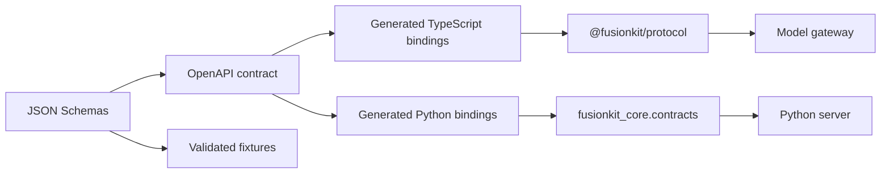

# Specs and APIs

This page documents the repository's protocol contracts, HTTP APIs, generated bindings, fixtures, trace conventions, and schema maintenance workflow. It is the first page to read before changing anything under `spec/`, generated protocol code, or server request and response shapes.

## Contract ownership

FusionKit has two kinds of contracts. Runtime HTTP contracts are served by the model gateway and Python fusion server. Durable protocol contracts are JSON records that can be stored, validated, signed, compared, and exchanged between TypeScript and Python packages.

The durable protocol layer is more stable than the implementation that produces it. If a field is added to a schema, the change must flow through schema files, fixtures, generated TypeScript bindings, generated Python bindings, validation helpers, server code, tests, and documentation.



## Model-fusion contract

The model-fusion contract lives under `spec/model-fusion-contract/`. It contains JSON Schemas, OpenAPI, fixtures, generated packages, and protocol metadata.

The important record families are:

| Record | Purpose |
| --- | --- |
| `artifact-ref.v1` | References a persisted artifact by kind, URI, hash, and metadata. |
| `model-endpoint.v1` | Describes a configured model endpoint and provider capabilities. |
| `model-call-record.v1` | Records a provider call, usage, status, provenance, and output hash. |
| `fusion-run-request.v1` | Describes the request that started a fusion run. |
| `fusion-record.v1` | Captures fused output, selected candidates, status, and metrics. |
| `harness-run-request.v1` | Describes a harness task submitted to a coding agent. |
| `harness-run-result.v1` | Captures the final result of a harness execution. |
| `harness-candidate-record.v1` | Records a candidate produced by a panel member. |
| `trajectory.v1` | Captures steps, output, tool calls, status, and synthesis metadata. A fused (consolidated) trajectory also carries the folded fusion result — decision, rationale, and metrics — which replaced the former standalone `judge-synthesis-record.v1` schema. |
| `benchmark-task-record.v1` | Describes a benchmark problem and scorer metadata. |
| `tool-call-plan.v1` | Describes planned tool calls and policy expectations. |
| `tool-execution-record.v1` | Records a tool execution, side effects, status, and output. |
| `ensemble-receipt.v1` | Bundles a complete evidence set for ensemble execution. |

Fixtures live under `spec/model-fusion-contract/fixture/`. Each schema should have minimal and realistic examples when the record is externally meaningful. Fixtures are not decorative examples. They are the safest source for documentation snippets because they should remain valid as schemas evolve.

## Registry data

`spec/registry/` is the source-of-truth JSON for cross-stack registry data: `providers.json` (base URLs, key env vars, key probes, discovery), `subscriptions.json` (Claude Code / Codex subscription auth metadata), `model-catalog.json` and `local-catalog.json` (cloud and local model catalogs), `model-capabilities.json` (model-family capability quirks), `pricing.json` (curated default pricing), and `fusion.json` (fusion defaults). `scripts/generate-registry.mjs` generates the `@fusionkit/registry` TypeScript bindings and the Python `fusionkit_core._generated.registry_data` module from the same files, so the two stacks cannot drift; `scripts/generate-pricing.mjs` and `scripts/generate-local-catalog.mjs` refresh and validate their respective files.

## Expected-behavior inventory

`spec/testing/expected-behaviors.json` is the complete claimed behavior inventory for the test matrix (see [Testing](testing.md)). `scripts/generate-expected-behaviors.mjs` renders it into the reviewable `docs/generated/expected-behaviors.md`; run `pnpm docs:generate-behaviors` to regenerate and `pnpm docs:check-behaviors` (part of `pnpm check`) to catch drift.

## Design specs

`spec/2026-06-13-local-model-harness-bridge-spec.md` is the dated local-model harness bridge design spec, retained alongside the machine-readable contracts.

## Generated TypeScript bindings

Generated TypeScript protocol code is consumed through `@fusionkit/protocol`. The package exports model-fusion types and assertion functions from `packages/protocol/src/index.ts`.

Important exported validators include `assertArtifactRefV1()`, `assertBenchmarkTaskRecordV1()`, `assertEnsembleReceiptV1()`, `assertHarnessCandidateRecordV1()`, `assertHarnessRunRequestV1()`, `assertHarnessRunResultV1()`, `assertJudgeSynthesisRecordV1()`, `assertModelCallRecordV1()`, `assertModelFusionRecord()`, `assertToolCallPlanV1()`, and `assertToolExecutionRecordV1()`.

The generated OpenAPI client exports `executeHarnessTask()`, `MODEL_FUSION_HARNESS_EXECUTOR_PATH`, `MODEL_FUSION_OPENAPI_SOURCE_HASH`, and request and response types. Use those exports rather than manually copying endpoint strings or payload shapes.

Example:

```ts
import {
  assertHarnessRunRequestV1,
  executeHarnessTask
} from "@fusionkit/protocol";

assertHarnessRunRequestV1(request);

const result = await executeHarnessTask({
  baseUrl: "http://127.0.0.1:4319",
  request
});

console.log(result.status);
```

## Generated Python bindings

Generated Python protocol code lives under `spec/model-fusion-contract/python/` as `velum_model_fusion_protocol`. The FusionKit Python core also defines runtime contract models in `fusionkit_core.contracts`, because the engine needs Pydantic models with producer metadata and local conversion behavior.

Use `fusionkit_core.contracts.contract_model_for_schema()` when code needs to resolve a schema name to a Python model. Use `schema_bundle_hash()` to compare local schemas with generated expectations. Use `contract_metadata()` when creating new records that need producer, version, and git metadata.

Example:

```python
from fusionkit_core.contracts import contract_metadata, contract_model_for_schema

model = contract_model_for_schema("trajectory.v1")
metadata = contract_metadata("trajectory.v1")
print(model.__name__, metadata.producer_version)
```

## HTTP API surfaces

FusionKit exposes several local HTTP surfaces. They are local development and harness APIs unless deployed explicitly.

### Python fusion server

The Python fusion server is created by `fusionkit_server.app.create_app()`. It exposes OpenAI-compatible chat and model-fusion endpoints.

| Route | Purpose |
| --- | --- |
| `/v1/chat/completions` | OpenAI-compatible chat route for direct model calls and fused responses. |
| `/v1/fusion/trajectories:fuse` | Trajectory fusion route used when candidates already exist. |
| Native run routes | Create runs, inspect run state, page events, submit tool results, and inspect artifacts. |

Example:

```bash
uv run --package fusionkit-server python -m uvicorn fusionkit_server.app:create_app --factory --port 8000
curl http://127.0.0.1:8000/v1/chat/completions \
  -H 'content-type: application/json' \
  -d '{"model":"fusion","messages":[{"role":"user","content":"hello"}]}'
```

### Model gateway

The model gateway is started by `startGateway()` from `@fusionkit/model-gateway`. It exposes the wire dialects expected by coding harnesses.

| Dialect | Route family | Used by |
| --- | --- | --- |
| OpenAI Chat Completions | `/v1/chat/completions` | Cursor and OpenAI-compatible clients. |
| Anthropic Messages | `/v1/messages` and token helpers | Claude Code. |
| OpenAI Responses | `/v1/responses` | Codex. |
| Fusion gateway routes | Fusion-specific frontdoor routes and headers | Harness integration and diagnostics. |

Important response headers include `FUSION_RUN_ID_HEADER`, `FUSION_STATUS_HEADER`, `FUSION_REPORT_HEADER`, `FUSION_EVIDENCE_HEADER`, and `MODEL_CALL_ID_HEADER`. These headers are useful when correlating a harness response with persisted sessions, traces, and protocol records.

### Governance plane

The governance plane is created by `startPlaneServer()` from `@fusionkit/plane`. It is outside the current FusionKit ensemble product path but remains documented because examples, SDKs, and release artifacts still include it.

The plane API owns contracts, claims, approvals, principal auth, secrets, receipts, audit export, metrics, retention, and control panel serving. Use `PlaneClient` from `@fusionkit/sdk` rather than hand-written HTTP calls.

## Fusion tracing (OpenTelemetry)

Fusion traces with OpenTelemetry: real spans and log-based events over OTLP/HTTP, W3C `traceparent`/`baggage` propagation, and standard `OTEL_*` configuration. The semantic conventions — span/event names, attribute keys, and per-attribute sensitivity classes — live in `spec/fusion-trace/registry.json`; `node scripts/generate-trace-conventions.mjs` regenerates the TypeScript, Python, and scope bindings, and `pnpm check` fails when they drift.

TypeScript span helpers live in `@fusionkit/tracing`, the Fusion conventions facade over the generic `@routekit/tracing` OTel runtime; `@fusionkit/protocol` re-exports only generated constants. Python helpers live in `fusionkit_core.trace`. Units of work (turn, candidate, judge, model call) are real spans on the traces signal; live point-in-time signals (steps, judge thinking, cost beats) are OTel events — log records with an `event.name` and trace/span correlation on the logs signal — so the scope dashboard updates while a unit is still running.

Example:

```ts
import { initFusionTracing, newSessionCarrier, startFusionSpan } from "@fusionkit/tracing";
import { ATTR } from "@fusionkit/protocol";

initFusionTracing({ serviceName: "my-service" });
const session = newSessionCarrier();
const judge = startFusionSpan("judge", "fusion.judge", session.carrier, {
  [ATTR.FUSION_JUDGE_MODEL]: "gpt-5.5"
});
judge.event("judge", "fusion.judge.thinking", { [ATTR.FUSION_RAW_ANALYSIS]: "..." });
judge.end({ status: "succeeded", attributes: { [ATTR.FUSION_DECISION]: "synthesize" } });
```

## Schema change workflow

When changing a schema, make the schema change first and update fixtures second. Then regenerate code and update TypeScript and Python consumers. Do not update generated bindings by hand.

Recommended workflow:

```bash
uv run python scripts/generate_protocol_codegen.py
pnpm check
pnpm build
uv run pytest tests
```

After code generation, inspect generated diffs for unexpected churn. Generated code should change only where schema or OpenAPI inputs changed.

Update these docs when the schema change affects a package author or API client:

| Change | Documentation to update |
| --- | --- |
| New record type | This page, `docs/typescript-reference.md`, and `docs/python-reference.md`. |
| New HTTP endpoint | This page and the relevant CLI or gateway page. |
| New trace span or attribute | `spec/fusion-trace/registry.json`, regenerated bindings, this page, and observability docs. |
| New benchmark contract | This page and benchmark docs. |
| Backward-incompatible field change | Release docs, protocol release docs, and migration notes. |

## Contract examples

A minimal trajectory fixture should include an id, source model or harness, status, messages or steps, output, usage when available, and synthesis metadata when it has been judged. A realistic trajectory fixture should include tool calls, metrics, redaction status, and enough provenance to reconstruct how the output was produced.

A harness run request fixture should include task text, harness kind, repository or workspace metadata, requested model, budget or policy constraints, and artifact expectations. A harness run result fixture should include status, output, artifacts, trajectory references, usage, and errors when applicable.

A model call record should include provider, model id, request hash, response hash, usage, status, producer metadata, and a timestamp. If the call failed, it should include a structured error kind and message rather than only a free-form string.

## API compatibility rules

Generated validators are the compatibility gate. If a runtime payload cannot pass the relevant assertion in `@fusionkit/protocol` or model validation in `fusionkit_core.contracts`, it should not be persisted as a protocol record.

Do not duplicate schema name strings in new packages when `MODEL_FUSION_SCHEMA_NAMES` or `contract_model_for_schema()` can be used. Do not hand-roll JSON hashing when `canonicalize()`, `hashCanonicalSha256()`, `requestHash()`, or `responseHash()` are available. Do not invent span names or attribute keys outside `spec/fusion-trace/registry.json` when the existing conventions and span helpers can express the signal.
