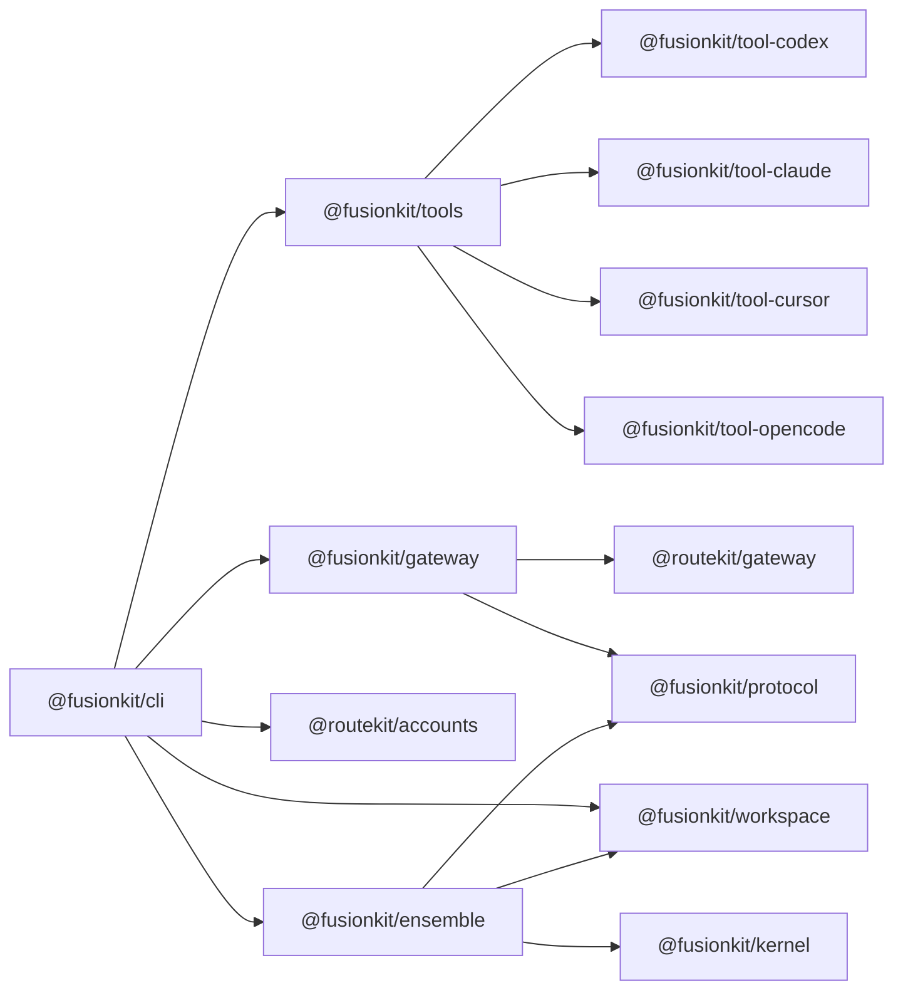

# TypeScript reference

This page documents the TypeScript workspace under `packages/`. It is intended for maintainers who need to find the right package, understand the public exports, and make changes without accidentally crossing product boundaries.

The workspace uses ESM, TypeScript project references, pnpm, Node 22 (effectively `>=22.19.0`, since `.npmrc` sets `engine-strict=true` and the pinned `undici` requires it), and package entry points rooted at `packages/<name>/src/index.ts` unless noted otherwise. Tests usually live under `packages/<name>/src/test/` and run after `pnpm build` through the root `pnpm test` command.

## Product package flow



The FusionKit product path starts in `@fusionkit/cli`. The CLI registers tool integrations, resolves configuration, starts the model gateway, starts or connects to the Python fusion engine, and launches the selected harness. The gateway owns wire dialect translation and session state. The ensemble package owns panel execution, worktrees, judge synthesis adapters, and runtime-kernel workflows. Protocol and workspace packages provide shared contracts and git-safe file movement.

## `@fusionkit/cli`

`@fusionkit/cli` publishes the `fusionkit` binary and is the single user-facing Node entry point. The binary entry file is `packages/cli/src/index.ts`. It imports `buildProgram()` from `packages/cli/src/cli.ts`, prints help on bare invocation, parses the command line, and maps known failures to stable process exits.

`buildProgram()` constructs the Commander tree. It sets the command name, description, combined npm and PyPI version string, positional option behavior, and command groups. It calls the command registration helpers in a fixed order: fusion, setup, doctor, config, prompts, proxy, sessions, models, ensemble, install, completion, complete (hidden), runtime, telemetry, version, and stop. If a new product command needs to appear in the root CLI, this is the file that proves it is registered.

The important behavior around errors is also part of the public user experience. `PolicyDeniedError` prints a fail-closed policy denial and exits with status 2. `PreflightError` prints a direct environment or prerequisite error and exits with status 1. Unknown errors print as `error: <message>` and exit with status 1.

Relevant files:

| File | Responsibility |
| --- | --- |
| `packages/cli/src/index.ts` | Binary entry point, help behavior, top-level error mapping. |
| `packages/cli/src/cli.ts` | Commander program construction and registration order. |
| `packages/cli/src/commands/fusion.ts` | Product launchers for fused sessions and single-model `--direct` mode. |
| `packages/cli/src/local.ts` | Direct local-model gateway lifecycle. |
| `packages/cli/src/commands/models.ts` | Local model cache commands. |
| `packages/cli/src/commands/sessions.ts` | Session list, show, and removal commands. |
| `packages/cli/src/commands/config.ts` | Configuration inspection and YAML export. |
| `packages/cli/src/commands/doctor.ts` | Preflight checks and environment diagnosis. |
| `packages/cli/src/commands/setup.ts` | Python engine pre-provisioning. |
| `packages/cli/src/fusion-quickstart.ts` | Pinned PyPI synthesizer version and quickstart helpers. |

Example:

```bash
node packages/cli/dist/index.js --version
node packages/cli/dist/index.js doctor
node packages/cli/dist/index.js config show
node packages/cli/dist/index.js codex --budget 1.25
```

When adding or changing a command, update `docs/cli.md`, add a focused command test if one exists for the command group, and run `pnpm build` before exercising the compiled CLI.

## `@fusionkit/ensemble`

`@fusionkit/ensemble` is the TypeScript implementation center for model-fusion orchestration. It exposes the imperative ensemble runner, harness abstractions, candidate worktree management, judge synthesis, trace emission, runtime-kernel workflow helpers, operator graph machinery, schedulers, tool execution, and isolation helpers.

The product-facing exports are the first place to look when debugging a fused run. `runEnsemble()` and `ensemble()` run harness-agnostic ensemble tasks. `buildPanelPrompt()`, `runFusionPanels()`, `runFusionPanelWorkflow()`, and `createFusionKitJudgeSynthesizer()` wire the FusionKit panel and judge flow. `runUnifiedHarnessE2E()` exercises the tool harness matrix, and `setToolHarnessProvider()` injects a harness provider for unified tests or launcher integration.

The harness layer defines the types that connect a coding tool to the ensemble runner. `HarnessAdapter`, `HarnessRunInput`, `HarnessCandidateOutput`, `HarnessTrajectory`, `TrajectoryStep`, `HarnessToolRecord`, `ReviewEvidence`, `EnsembleRunResult`, `EnsemblePolicy`, `VerificationProfile`, and candidate isolation types describe what a panel member can do and what evidence it returns.

The judge layer exports `createMockJudgeSynthesizer()`, `runJudgeSynthesis()`, and types such as `JudgeInput`, `JudgeCandidateEvidence`, `JudgeSynthesizer`, `JudgeSynthesisOutput`, `JudgePatch`, and `SynthesisFailureSummary`. Use the mock synthesizer in tests that need deterministic comparison or failure behavior without calling a model.

The runtime-kernel layer exports `GraphBuilder`, `graph()`, `refs`, `registerWorkflow()`, `listWorkflows()`, `getWorkflow()`, and `runWorkflow()`. It also exports validation helpers such as `validateOperatorGraph()`, `assertValidOperatorGraph()`, `validateSchedulerGraph()`, and `explainGraph()`. These are the APIs to use when a fusion workflow is represented as a typed graph.

Operator exports are grouped by workflow maturity. The direct fusion operators are `ModelGenerateOperator`, `PanelGenerateOperator`, `JudgeCompareOperator`, and `SynthesizeOperator`. Advanced operators include `RouteOperator`, `SelectOperator`, `RepairOperator`, `ReviewOperator`, `PairRankOperator`, `TreeExpandOperator`, `TreeScoreOperator`, `EvidenceSourceOperator`, `DelegateOperator`, `CalibrateSignalOperator`, `ArchitectureEvaluateOperator`, `OfflineModelMergeOperator`, `GenFuserOperator`, and `SchemaValidationOperator`.

Scheduler exports include `StaticDAGScheduler`, `DirectFastPathScheduler`, `BestOfNScheduler`, `FixedLayerMoAScheduler`, `RankFuseScheduler`, `ExecutionSelectRepairScheduler`, `TreeSearchScheduler`, `AdaptiveRouterScheduler`, `AgenticDelegationScheduler`, `OfflineArchitectureSearchScheduler`, and `LearnedWorkflowScheduler`. These are runtime policies, not user CLI commands.

Worktree exports include `createWorktreePlan()`, `cleanupWorktreePlan()`, `cleanupCandidateWorktree()`, `diffCandidateWorktree()`, `sealCandidateWorktree()`, and `defaultOutputRoot()`. These functions define how panel candidates work in isolated git worktrees and how the final diff is collected.

Tool-execution exports include `createToolExecutor()`, `registerDemoTools()`, `sideEffectsForTool()`, `executeFusionKitToolBatch()`, `FusionKitToolExecutorClient`, `startFusionKitToolExecutorServer()`, and error types for tool executor failures. Isolation exports include `createCliContainerDriver()`, `runCandidateCommandWithIsolation()`, `secretAbsenceMetadata()`, and `secretValueHash()`.

Example:

```ts
import {
  createMockHarness,
  createMockJudgeSynthesizer,
  runEnsemble
} from "@fusionkit/ensemble";

const result = await runEnsemble({
  task: "Add input validation to the parser.",
  models: [{ id: "fast" }, { id: "careful" }],
  harness: createMockHarness(),
  judge: createMockJudgeSynthesizer()
});

console.log(result.summary.status);
```

## `@routekit/gateway`

`@routekit/gateway` is the neutral HTTP router. It owns `Backend`,
`startGateway()`, Chat/Responses/Anthropic/Cursor dialect adapters, SSE, ACP,
single-call cost/provenance records, `RouterConfig`, `CatalogBackend`,
`EndpointPool`, `CapacityPool`, and OpenAI-compatible, Anthropic, Google GenAI,
and Codex Responses egress. Endpoint IDs are opaque and endpoint instances are
balanced without managing local server processes.

```ts
import { CatalogBackend, startGateway } from "@routekit/gateway";

const backend = new CatalogBackend({
  config: {
    endpoints: [{
      endpointId: "primary",
      model: "provider-model",
      baseUrl: "https://provider.example/v1",
      dialect: "openai"
    }]
  }
});
const gateway = await startGateway({ backend });
```

## `@routekit/accounts`

`@routekit/accounts` owns subscription credentials, account sources, quota
tracking, account pools, provider relays, and proxy/client wire contracts. Its
selection policies reuse RouteKit's generic `CapacityPool`.

## `@fusionkit/gateway`

`@fusionkit/gateway` builds on RouteKit with `FusionBackend`, frontdoor
operators, panel/synthesis orchestration, session stores, aggregate cost and
budget accounting, trajectory conversion, Fusion headers, and managed MLX
lifecycle. Pricing and per-call metering are imported from RouteKit.

## `@fusionkit/protocol`

`@fusionkit/protocol` is the shared contract and verification package. It should stay dependency-light because every other package relies on it for types, validation, hashing, signing, and generated model-fusion contracts.

Constants and validators include `ACTOR_KINDS`, `AGENT_KINDS`, `CHECKPOINT_TIERS`, `DISCLOSURE_MODES`, `MODEL_FUSION_SCHEMA_NAMES`, `PROTOCOL_VERSIONS`, `RUN_EVENT_TYPES`, `RUN_STATUSES`, `SESSION_ISOLATIONS`, `parseHostAllowlistEntry()`, `parsePoolName()`, `parseSecretName()`, and `parseWorkspaceManifestPath()`.

Execution helpers include `defaultExecutionSpec()` and `executionFromRunRequest()`. Tool policy helpers include `evaluateToolPolicy()`, `toolCallKey()`, `toolArgumentsHash()`, `modelFusionSideEffects()`, and `toolSideEffectClassFromModelFusion()`.

Canonical JSON and hashing exports include `canonicalize()`, `sha256Hex()`, `sha256PrefixedHex()`, `hashCanonical()`, `hashCanonicalSha256()`, `requestHash()`, `responseHash()`, `artifactHash()`, `schemaBundleHash()`, and `SHA256_PREFIX`.

Wire trajectory exports include `assertWireTrajectory()`, `isWireTrajectory()`, and `normalizeWireTrajectories()`. Model-fusion generated validators include `assertArtifactRefV1()`, `assertBenchmarkTaskRecordV1()`, `assertEnsembleReceiptV1()`, `assertHarnessCandidateRecordV1()`, `assertHarnessRunRequestV1()`, `assertHarnessRunResultV1()`, `assertJudgeSynthesisRecordV1()`, `assertModelCallRecordV1()`, `assertModelFusionRecord()`, `assertToolCallPlanV1()`, and `assertToolExecutionRecordV1()`.

Key, contract, chain, and receipt exports include `generateEd25519KeyPair()`, `keyIdFromPublicPem()`, `signData()`, `verifyData()`, `contractHash()`, `signContract()`, `appendEvent()`, `verifyChain()`, `signReceipt()`, `verifyRunnerReceipt()`, `verifyReceiptBundle()`, `buildReceiptStory()`, and `summarizeRunEvent()`.

Trace exports are the generated semantic-convention constants: `ATTR`, `FUSION_SPAN_NAMES`, `FUSION_EVENT_NAMES`, `FUSION_SCOPES`, and `EXPORTABLE_ATTRIBUTES`. The OTel-backed helpers (`initFusionTracing()`, `startFusionSpan()`, `emitFusionEvent()`, `newSessionCarrier()`, carrier/header/env propagation, and the in-process span and event listeners) live in `@fusionkit/tracing`.

Example:

```ts
import {
  assertHarnessRunRequestV1,
  canonicalize,
  hashCanonicalSha256,
  normalizeWireTrajectories
} from "@fusionkit/protocol";

assertHarnessRunRequestV1(request);
const trajectories = normalizeWireTrajectories(candidatePayloads);
const digest = hashCanonicalSha256(JSON.parse(canonicalize(trajectories)));
console.log(digest);
```

## `@fusionkit/workspace`

`@fusionkit/workspace` is responsible for safe git workspace capture and materialization. Its APIs are used when a local repository needs to become a governed session, a panel worktree, or a returned output set.

The public functions include `captureWorkspace()`, `materializeWorkspace()`, `collectOutputs()`, `pullSessionOutputs()`, `gitText()`, `parseWorkspaceRelativePath()`, and `resolveInsideWorkspace()`. The exported types describe capture inputs, materialized sessions, output collection options, and path validation results.

Use `parseWorkspaceRelativePath()` and `resolveInsideWorkspace()` instead of hand-rolled path joins whenever user-controlled or contract-controlled paths are involved. Use `gitText()` when a package needs a small git command wrapper consistent with workspace behavior.

Example:

```ts
import {
  captureWorkspace,
  collectOutputs,
  materializeWorkspace
} from "@fusionkit/workspace";

const manifest = await captureWorkspace({ root: process.cwd() });
await materializeWorkspace({ root: "/tmp/fusionkit-session", manifest });
const outputs = await collectOutputs({ root: "/tmp/fusionkit-session" });
console.log(outputs.files.length);
```

## `@fusionkit/tools`

`@fusionkit/tools` defines the interface between the CLI and per-harness packages. A tool integration tells the CLI how to launch a tool, whether it supports fusion or local modes, and whether it can provide an ensemble harness adapter.

The important exports are the `ToolIntegration` type family, process helper types, `createToolRegistry()`, `ToolRegistry`, constants such as `FUSION_PANEL_MODEL`, `LOCAL_MODEL_LABEL`, and `CURSOR_BRIDGE_MODEL_NAME`, environment compatibility helpers such as `readEnv()`, `envFlagEnabled()`, plus `buildSkippedCandidate()`.

Example:

```ts
import { createToolRegistry } from "@fusionkit/tools";
import { codexTool } from "@fusionkit/tool-codex";
import { claudeTool } from "@fusionkit/tool-claude";

const registry = createToolRegistry();
registry.register(codexTool);
registry.register(claudeTool);
console.log(registry.list().map((tool) => tool.name));
```

## Tool packages

`@fusionkit/tool-codex` exports `codexTool`, launcher helpers, Codex harness creation, response parsing, and harness types. Use this package when debugging `fusionkit codex`, Codex Responses translation, or Codex panel members.

`@fusionkit/tool-claude` exports `claudeTool`, Claude Code harness creation, `claudeEnv()`, `launchClaude()`, and Claude Code harness environment types. Use this package when debugging `fusionkit claude` or Claude Code candidate execution.

`@fusionkit/tool-cursor` exports `cursorTool`, Cursor harness helpers, `startCursorBridge()`, `cursorInstructions()`, `cursorIdeInstructions()`, and `launchCursor()`. Use this package when debugging Cursor terminal launch, Cursor IDE launch, or the local desktop bridge.

`@fusionkit/tool-opencode` exports `opencodeTool`, `launchOpencode()`, `opencodeConfig()`, and `opencodeModelArg()`. It provides launcher support and local-model configuration but does not currently own a full ensemble harness path.

Example:

```ts
import { cursorTool } from "@fusionkit/tool-cursor";
import { opencodeTool } from "@fusionkit/tool-opencode";

console.log(cursorTool.name);
console.log(opencodeTool.modes);
```

## `@fusionkit/adapter-ai-sdk`

`@fusionkit/adapter-ai-sdk` is the AI SDK side of FusionKit local-model flows: managed MLX local-model helpers and worktree agent utilities. It is not the main CLI path. The governed helpers (`remoteTools()`, `swarmTools()`, `handoffModel()`, `routedModel()`) moved to the legacy `@fusionkit/handoff` package.

Important exports include `runWorktreeAgent()`, `worktreeDiff()`, `defaultMlxDir()`, `MlxCapabilityError`, `MlxEnv`, `managedModelServer()`, and `mlxServer()`.

Example:

```ts
import { defaultMlxDir, mlxServer } from "@fusionkit/adapter-ai-sdk";

console.log(defaultMlxDir());

const server = await mlxServer({
  model: "mlx-community/Qwen3-4B-4bit",
  port: 8080
});

await server.close();
```

## `@fusionkit/kernel`

`@fusionkit/kernel` is the small dependency-free runtime kernel package. It re-exports runtime types and helpers, graph utilities, graph validation, artifact types, and wire artifact helpers.

Use it when code needs to define or validate artifacts, operators, graphs, schedulers, budgets, traces, outcomes, replay records, or wire artifacts without importing the full ensemble package.

Example:

```ts
import { explainGraph, validateOperatorGraph } from "@fusionkit/kernel";

const issues = validateOperatorGraph(operatorGraph);
if (issues.length > 0) {
  console.error(explainGraph(operatorGraph));
}
```

## `@routekit/cli-ui` and `@routekit/cli-core`

`@routekit/cli-ui` is a brand-configurable terminal UX layer with rich Ink and ordered plain-text presenters. `@routekit/cli-core` composes it with brand-neutral command context, structured errors, common parsing, completion, version formatting, and test helpers.

Important exports include `createPresenter()`, `InkPresenter`, `PlainPresenter`, prompt helpers (`select()`, `multiselect()`, `confirm()`, `text()`, `fuzzySelect()`), `runWizard()`, `fuzzyFilter()`/`fuzzyMatch()`, and the theme, runtime, and format helpers re-exported from the entry point.

## `@fusionkit/harness-core`

`@fusionkit/harness-core` is the single coding-agent harness contract: driver, instance, and session interfaces, the canonical harness event union (with raw provider envelopes), a tagged error taxonomy with derived retryability, deferred-based approvals with explicit policies, status probes with an identity-checked disk cache, and an explicit driver registry. The tool packages implement this contract; the panel fanout and launchers consume it.

Important exports include `HARNESS_KINDS`, `isHarnessKind()`, `HarnessError`, `asHarnessError()`, `isRetryable()`, `PANEL_APPROVAL_POLICY`, `PendingRequests`, `createDeferred()`, `decideApproval()`, `readCachedStatus()`/`writeCachedStatus()`, `DriverRegistry`, and the `HarnessDriver`/`HarnessInstance`/`SessionHandle` type family.

## `@fusionkit/registry`

`@fusionkit/registry` provides typed accessors over the generated registry data in `spec/registry/*.json`: provider metadata (base URLs, key env vars, key probes, discovery), subscription auth metadata, the fusion model identity, the cloud and local model catalogs, model-family capability quirks, and default pricing. Both stacks are generated from the same JSON by `scripts/generate-registry.mjs`, so the Node and Python sides cannot drift. It has zero runtime dependencies.

Important exports include `REGISTRY`, `PROVIDERS`, and the provider, catalog, capability, and pricing accessor types and helpers in `packages/registry/src/index.ts`.

## RouteKit shared cores

`@routekit/runtime` owns process supervision, child environments, cleanup, atomic files and locks, ports, timeouts, and parameterized portless service registration. `@routekit/config-core` owns layered resolution and validated/migrating JSON IO. `@routekit/telemetry-core` owns parameterized consent, redaction, anonymous event properties, and bounded shutdown.

## `@fusionkit/tracing`

`@routekit/tracing` owns the generic OpenTelemetry engine integration: providers, W3C propagation, in-process listeners, and policy-based export redaction. `@fusionkit/tracing` is the thin conventions facade over the fusion semantic conventions in `spec/fusion-trace/registry.json`.

Important exports include `initFusionTracing()`, `flushFusionTracing()`, `shutdownFusionTracing()`, `startFusionSpan()`, `emitFusionEvent()`, `newSessionCarrier()`, carrier helpers (`carrierFromHeaders()`, `carrierFromEnv()`, `headersOf()`, `envOf()`), and the in-process span/event listener registration (`addSpanListener()`, `addFusionEventListener()`).

## Governance and VM platform packages

The packages in this section live under `legacy/packages/` and are outside the root pnpm workspace (`pnpm-workspace.yaml` covers `packages/*` and `examples/*` only). They remain in the repository and are still documented, but they are outside the current FusionKit ensemble product path unless a page explicitly describes a bridge.

`@fusionkit/plane` is the Warrant control plane. Its central exports are `Plane`, `startPlaneServer()`, `defaultPolicy()`, `evaluatePolicy()`, `ClaimTokenService`, `ContractService`, `ReceiptService`, `SqliteStore`, `SecretStore`, key provider types, `hashToken()`, `principalCan()`, `toPrincipal()`, `IdpVerifier`, `RateLimiter`, `createLogger()`, and `Metrics`. It owns contracts, policy decisions, approvals, secret release, receipt countersignature, rate limiting, audit export, retention, and control-plane HTTP serving.

`@fusionkit/runner` is the outbound execution worker. It exports `Runner`, `CapabilityMismatchError`, execution preparation helpers, session backend types, and backend execution kinds. It claims authorized work, prepares execution, drives the configured session backend, and emits runner receipts.

`@fusionkit/sdk` exports `PlaneClient` and `PlaneClientError`. It is the client package for control-plane HTTP APIs and receipt verification helpers.

`@fusionkit/handoff` exports `defineHandoffConfig()`, `Handoff`, `handoff()`, `HandoffRun`, checkpoint helpers, `targets`, `agents`, `localFirst()`, `triggers`, `branch()`, `reviewStrategies`, and `scorecardFor()`. It implements continuation workflows over the governance primitives.

`@fusionkit/adapter-compute` exports `governedCompute()`, `GovernedSandbox`, and `withCompute()`. It provides a ComputeSDK-shaped abstraction backed by governed runner sessions.

`@fusionkit/session-hermetic` exports `HermeticSessionBackend`, `hermeticBackend()`, and `toJustBashNetwork()`. It provides a virtual filesystem session backend using just-bash and interpreter-enforced network policy.

`@fusionkit/session-vercel-sandbox` exports `VercelSandboxBackend`, `vercelSandboxBackend()`, `shellQuote()`, `listWorkspaceFiles()`, `writeMirroredFile()`, `vercelCredentialsFromEnv()`, and `toVercelNetwork()`. It mirrors workspace files into Vercel Sandbox and maps network policy to sandbox configuration.

`@fusionkit/session-harness` exports `AiSdkHarnessBackend`, `harnessBackend()`, `isAgentRunFor()`, Pi harness helpers, auth helpers, `TranscriptRecorder`, and transcript types. It drives agent harnesses inside governed sessions and records structured transcripts.

Example:

```ts
import { Plane } from "@fusionkit/plane";
import { Runner } from "@fusionkit/runner";
import { hermeticBackend } from "@fusionkit/session-hermetic";

const plane = new Plane({ storage: "memory" });
const runner = new Runner({
  planeUrl: "http://127.0.0.1:4310",
  backend: hermeticBackend()
});

console.log(Boolean(plane), Boolean(runner));
```

## Test and support packages

`@fusionkit/testkit` (root `packages/testkit`, never published) is the cross-stack E2E tooling described in [Testing](testing.md). It exports `startProviderSim()`, `startEngine()`, `simRouterConfigYaml()`, `scriptFusedTurn()`/`judgeAnalysis()`, the `DOOR_PROFILES` door axis with `callDoor()`, real-CLI runners (`runClaudeCode()`, `runCodexExec()`, `runOpenCode()`), SSE observation helpers (`parseSse()`, `sseText()`, `sseReasoning()`, `sseDone()`), skip-gating (`detectStackTooling()`, `stackToolingSkip()`, `cliAvailable()`, `cliSkip()`), and process plumbing (`spawnCaptured()`, `waitForHttpReady()`, `freePort()`). The old in-process plane/runner fixtures (`git()`, `makeRepo()`, `startStack()`, `withStackAndRepo()`) live in `legacy/packages/testkit`.

`@fusionkit/example-utils` exports demo manifest parsing, mock model helpers, live model helpers, and narration utilities. Use it when adding examples rather than duplicating manifest or narration code.

Example:

```ts
import { simRouterConfigYaml, startEngine, startProviderSim } from "@fusionkit/testkit";

const sim = await startProviderSim();
const engine = await startEngine({
  configYaml: simRouterConfigYaml({ simUrl: sim.url, members: [{ id: "m1", model: "m1" }] })
});
```

## Change checklist

When changing a TypeScript package, identify whether it is product path, protocol path, or governance path. Update the nearest docs page for that package, update public exports only when another package needs the symbol, add tests next to the changed source, run `pnpm build`, and run either the focused compiled test or root `pnpm test` when behavior changes.
