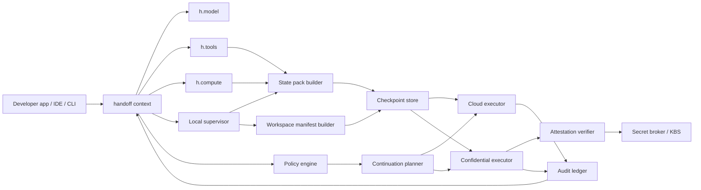
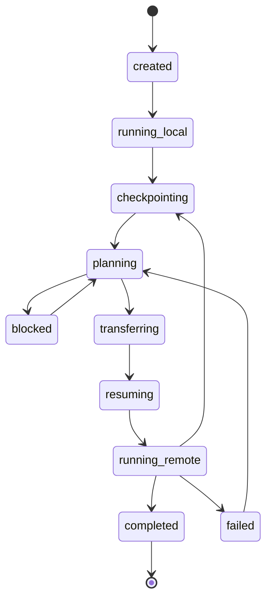
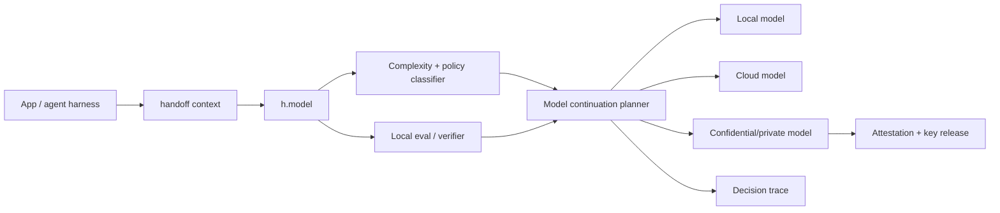

# Local-first handoff platform SDK spec

Date: 2026-06-11
Status: Draft
Owner: Velum Labs

Design note: this document is the current artifact. Treat implementation as blocked until the SDK shape, adapter boundaries, and demo flows below are agreed.

## 1. Thesis

Build an SDK and platform for moving AI work across execution boundaries without making developers redesign their agent, workspace, or model stack.

The core abstraction is not "live VM migration." The core abstraction is a *handoff contract*: a portable, signed description of the run state, workspace state, capability needs, privacy policy, and resume semantics. VM/container snapshots are useful implementation strategies, but they are too brittle to be the product boundary.

The platform should make these transitions feel seamless:

- Local agent session to cloud executor.
- Cloud executor back to local machine for inspection or hands-on work.
- Local model to stronger cloud model when the task exceeds local capability.
- Standard cloud executor to confidential/private compute when data or policy requires it.
- One provider/runtime to another without changing application code.

The Apple reference point is not the Apple API surface itself. The pattern worth stealing is: local-first execution, typed semantic app capabilities, dynamic model/tool profiles, evaluations, and an attested private cloud tier for tasks too hard for local models.[^apple-intelligence][^app-intents][^pcc]

## 2. Product shape

Working name: `HandoffKit`.

The product should expose one primary developer surface: a continuation context returned by `handoff(...)`. That context plugs into existing AI SDK, ComputeSDK, CLI, IDE, or agent harness code instead of replacing them.

Golden shape:

```ts
import { generateText } from "ai";
import { handoff, localFirst, targets } from "@handoff/core";

const h = handoff({
  workspace: ".",
  models: { local, cloud, private },
  compute: { local, cloud, private },
  policy: localFirst()
});

const result = await generateText({
  model: h.model,
  prompt: "Refactor this repo and run tests",
  tools: h.tools({ shell, fs, git })
});

if (h.needs(targets.cloud())) {
  await h.continueIn(targets.cloud());
}
```

That is the API north star. Everything else exists to make this shape safe, resumable, auditable, and extensible.

The continuation context exposes four developer-facing capabilities:

1. `h.model`: an AI SDK-compatible model that can start local and escalate according to policy.
2. `h.tools(...)`: wrapped tools that checkpoint tool calls, file changes, approvals, artifacts, and policy decisions.
3. `h.compute`: a ComputeSDK-shaped compute surface for apps that already manage sandboxes directly.
4. `h.continueIn(...)` and `h.parallel(...)`: explicit continuation and parallel workspace forking when the app or user knows work should move.

Platform internals stay behind that context:

- Run registry.
- Local supervisor.
- Checkpoint store.
- Policy engine.
- Continuation planner.
- Audit ledger.
- Attestation verifier.
- Cloud executor fleet.
- Secret broker.

Provider packages still matter, but as setup and adapters, not as the hot-path mental model. A developer should configure providers once, then write normal AI SDK or ComputeSDK-shaped code.

### 2.1 Sellable devtool wedge

Do not lead with "handoff SDK" as the product. That is too abstract. Also do not reduce the product to pitting agents against each other. Parallel attempts are useful, but they are one pattern inside a larger shift.

Lead with:

> The coordination layer for hybrid distributed AI compute.

Concrete promise:

> Start work wherever it naturally begins, move it to the right runtime when conditions change, preserve state across the boundary, and prove what moved, why it moved, who saw it, and how to resume.

The emerging paradigm is not "local vs cloud." It is a fluid compute graph:

- Local laptop or desktop for low-latency interaction, private context, IDE state, and user trust.
- Cloud sandbox for long-running tasks, dependency-heavy builds, parallelism, and durability while the laptop sleeps.
- Private/confidential runtime for sensitive data, secrets, regulated workflows, and customer-controlled environments.
- Browser/desktop sandbox for GUI tasks and web automation.
- Model runtime for local, cloud, private, specialized, or fallback model execution.
- Tool runtime for commands, files, databases, browsers, app intents, APIs, and enterprise systems.
- Mobile or edge device for personal context, sensors, location, notifications, and user approval.

The product opportunity is to make this graph programmable without forcing every application developer to build their own run broker, state packer, runtime planner, secret boundary, artifact layer, and audit trail.

The coding-agent wedge is still a good first market because the pain is visible, not because agent tournaments are the end state. The pain developers already feel:

- Work starts locally but needs more compute, time, isolation, or durability.
- Long-running tasks die when the laptop sleeps or the terminal disconnects.
- Agents and tools need to cross from IDE context to sandbox execution without losing state.
- Teams need shared visibility into what ran where, with which files, models, tools, secrets, and costs.
- Security teams need policy and audit across local, cloud, and private runtimes without blocking developer flow.

Product surface:

```sh
hk run "fix auth bug" --target cloud
hk continue --target private
hk run "migrate billing tests" --agent claude
hk run "try three implementation strategies" --parallel 3
```

What happens underneath:

1. A hosted run broker owns the durable run.
2. The local supervisor captures semantic state, workspace state, tool history, and policy context.
3. The continuation planner selects a target runtime based on capability, locality, cost, privacy, latency, and user intent.
4. The target runtime resumes with scoped tools, mounts, secrets, artifacts, and audit.
5. Status, logs, diffs, previews, screenshots, costs, and policy events stream back to the original UI or another authorized surface.
6. Results return to the local workspace, a PR, a dashboard, or a domain-specific action receipt.

Parallelism should be framed as topology, not competition. Sometimes the graph fans out because the user wants multiple strategies; sometimes it moves from local to cloud because the laptop is overloaded; sometimes it moves from cloud to private because secrets become necessary; sometimes it returns local because the user needs hands-on control.

```ts
import { anthropic } from "@ai-sdk/anthropic";
import { branch, reviewStrategies, targets } from "@handoff/core";
import { claudeCode } from "@handoff/agent-claude-code";

const agent = claudeCode({ model: anthropic("claude-opus-4-6") });

const runs = await h.parallel([
  "smallest safe fix",
  "compatibility-preserving refactor",
  "rewrite with better test coverage"
], {
  continueIn: targets.cloud(),
  isolate: branch(),
  agent
});

const selected = await h.review(runs, {
  choose: reviewStrategies.testsPassSmallestDiff()
});

await selected.pull();
```

This is not the point of the company. It is one demo of the general compute graph.

The durable control plane is the company:

- Run broker: owns runs when any individual runtime disappears.
- State layer: captures semantic state, workspace state, tool history, approvals, artifacts, and resumable checkpoints.
- Runtime planner: decides where work should continue across local, cloud, private, browser, mobile, and customer-owned runtimes.
- Workspace manager: provisions sandboxes across Vercel Sandbox, E2B, Modal, Daytona, customer VPC, or owned executors.
- Agent and app adapters: Claude Code, Codex, Cursor-style agents, OpenAI Agents SDK, LangGraph, App Intents, browser agents, enterprise workflow agents, and custom harnesses.
- Review and approval layer: diffs, tests, previews, screenshots, action receipts, risk summaries, scorecards, comments, and human approval.
- Policy layer: repo allowlists, branch rules, network egress, secret scopes, model allowlists, spend limits, retention, data classes, locality, and attestation requirements.
- Integrations: CLI, IDE, GitHub app, Slack app, Linear, web dashboard, API, and domain-specific surfaces.
- Audit layer: who started the run, what data moved, which model/runtime saw it, which commands/tools/actions ran, which secrets were released, and what artifacts were produced.

Ideal ICP:

- Engineering teams adopting agentic coding tools and hitting local/cloud/private boundary problems.
- Platform teams standardizing how AI work moves across developer laptops, CI, cloud sandboxes, and customer-controlled runtimes.
- Security-conscious startups and scaleups that want agent productivity without ungoverned local or cloud sprawl.
- Enterprise teams building internal assistants that need typed tool execution, approvals, secrets, audit, and runtime locality.

Packaging:

- Developer tier: local CLI, cloud continuation, durable runs, GitHub PRs, basic dashboard.
- Team tier: shared dashboard, Slack/GitHub apps, branch/workspace policies, cost controls, run history.
- Enterprise tier: SSO, audit export, VPC or BYO compute, custom retention, network egress policy, secret manager integration, compliance reports.

Pricing shape:

- Seat fee for the control plane.
- Usage fee or margin on managed cloud/private workspaces.
- BYO compute option for teams that want Vercel/E2B/Modal/customer VPC billing directly.
- Enterprise premium for SSO, audit, VPC, data residency, policy packs, attestation, and secret controls.

Positioning:

> Not another coding agent. Not another sandbox SDK. The coordination layer for hybrid distributed AI compute.

## 3. Design principles

- Local-first, not local-only. Start on the user's machine when possible, then escalate intentionally.
- Semantic state beats process state. Capture the plan, transcript, tool calls, files, diffs, approvals, and next actions. Use process/VM snapshots only when they are safe and valuable.
- Handoff is a policy decision. The SDK should not silently leak data to cloud because a local model got confused.
- Confidential compute is a verifiable tier, not a boolean. The platform needs attestation evidence, measured images, key-release policy, transparency logs, and runtime limits.
- Harness and compute are separate. The harness owns model calls, approvals, tracing, recovery, policy, and run state. Compute owns files, commands, ports, packages, and snapshots.[^openai-sandbox]
- Resume must be observable. Every handoff emits a manifest, audit event, state hash, policy decision, and resumption proof.
- Provider neutrality matters, but should be invisible in the hot path. Apple-style dynamic profiles and language-model protocols are the right setup shape: swap models/tools/instructions inside a session without changing app code.[^apple-intelligence]
- Typed descriptors beat magic strings. Follow the AI SDK pattern: provider functions and helper factories return composable objects; strings are for provider-native IDs, human text, wire tags, and CLI aliases.
- Fail closed. If continuation planning, attestation, or checkpointing cannot satisfy policy, pause and ask rather than falling back to a weaker unsafe path.

### 3.1 Non-goals and hard boundaries

HandoffKit should be opinionated about what it is not. Otherwise it becomes a vague orchestration platform.

Non-goals:

- Not a new agent framework. Existing agent frameworks, coding harnesses, App Intents, LangGraph, OpenAI Agents SDK, and custom loops should sit above it.
- Not a new sandbox provider. Vercel Sandbox, E2B, Modal, Daytona, local Docker, customer VPCs, and confidential runtimes should sit below it.
- Not a generic workflow engine. It should own continuation, state, policy, artifacts, and audit across runtime boundaries, not every business process.
- Not magic live migration. Process, container, and microVM snapshots are optional accelerators, not the portable contract.
- Not an enterprise policy dashboard first. Policy and audit matter, but the first user experience must make continuation feel natural.
- Not a remote desktop product. Browser and desktop sandboxes can be targets, but the primitive is resumable work, not pixels.

Hard boundaries:

- HandoffKit owns the run record, state envelope, continuation decision, audit trail, and resume contract.
- Providers own execution, model inference, filesystem implementation, sandbox startup, and low-level isolation.
- Domain adapters own domain semantics: coding agents, Siri-like assistants, browser agents, enterprise workflows, CI, and PR review.

### 3.2 Product invariant

Every meaningful transition must answer five questions:

1. What moved?
2. Why did it move?
3. Who or what approved it?
4. Which runtime, model, tools, data, and secrets saw it?
5. How can the user resume, inspect, revoke, or reproduce it?

If the platform cannot answer those questions, it is just remote execution with branding.

## 4. Reference lessons

### 4.1 Apple Intelligence and Private Cloud Compute

Relevant design patterns:

- Foundation Models exposes local and Private Cloud Compute models through a native API, plus a provider protocol for other language models.[^apple-intelligence]
- Dynamic Profiles let a continuous session swap models, tools, and instructions in real time.[^apple-intelligence]
- App Intents schemas provide typed semantic capabilities that Siri can understand and execute without brittle phrase definitions.[^app-intents]
- Private Cloud Compute is explicitly for requests that exceed on-device models, but maintains a device-like privacy contract.[^pcc]
- PCC's requirements are the right north star for a private cloud tier: stateless computation, enforceable guarantees, no privileged runtime access, non-targetability, and verifiable transparency.[^pcc]
- Apple is extending PCC beyond Apple data centers using NVIDIA Confidential Computing, Intel TDX, and Google's Titan chip while preserving the same requirements.[^pcc-google]

What to borrow:

- Local first as default UX.
- Capability profiles that can change mid-session.
- Typed app/tool schemas instead of prompt-only integration.
- Evaluations as part of the SDK, not a separate MLOps afterthought.
- Attested cloud compute with public/verifiable measurements.

What not to borrow:

- Platform lock-in.
- Device-specific APIs.
- Assuming the platform controls every app, model, OS, and hardware root of trust.

### 4.2 Cursor Cloud Agents

Cursor's cloud agent model is a strong product reference: cloud agents clone repos, run in isolated VMs, set up dependencies/secrets, execute tests, push branches, produce artifacts, and can be started from web, desktop, Slack, GitHub, Linear, or API.[^cursor-cloud]

The Cursor CLI handoff gesture is especially instructive: prepend `&` to send the local conversation to a cloud agent and pick it up on web or mobile.[^cursor-cli]

What to borrow:

- The handoff UX should be one gesture.
- The cloud environment must be able to build/test/interact, not just think.
- Artifacts are part of the handoff contract: logs, screenshots, diffs, previews.
- Repo branch/worktree is often a better handoff unit than raw process memory.

### 4.3 Vercel Sandbox and Conductor

Conductor is the clearest product reference for this SDK's first implementation target: parallel coding agents move from laptop-bound execution to cloud workspaces without changing the user-facing interface.[^vercel-conductor-sandbox]

The key lesson is not just "use a sandbox." The key lesson is that cloud execution should disappear behind the same control surface developers already use. Conductor users can keep directing Claude Code, Codex, and other coding agents, but the work runs in remote Vercel Sandboxes when local hardware becomes the bottleneck.[^vercel-conductor-sandbox]

What to borrow:

- Same UI before and after cloud migration. Users should not have to learn a new cloud dashboard to keep working.
- Parallel isolated branches/workspaces as the natural unit of cloud execution.
- Fast sandbox startup as a product requirement, not an implementation detail.
- Model/harness agnosticism: Claude Code, Codex, and future agents should sit above the same runtime handoff layer.
- Laptop sleep should not kill work. Remote execution should make long-running agents boring.
- Provider trust matters. Teams choosing to run code outside their machine need clear provider choice, reliability, and audit posture.

Implication for HandoffKit:

The first coding demo can borrow Conductor's Cloud Workspaces: start local, continue selected work in cloud sandboxes, review diffs/artifacts, and pull results back. But Conductor is a wedge example, not the whole thesis. The broader product is the continuation layer across the hybrid compute graph.

### 4.4 OpenAI sandbox agents

OpenAI's sandbox docs make the correct architectural split: harness/control plane outside, sandbox execution plane inside. The manifest defines fresh-session workspace content, mounts, environment, repos, files, users, and groups; saved state and snapshots are separate from the manifest.[^openai-sandbox]

What to borrow:

- Workspace manifests.
- Mounts instead of prompt-stuffing data rooms.
- Explicit saved-state and snapshot semantics.
- Provider-specific sandbox clients hidden behind one contract.
- Secrets as runtime configuration, never prompt content.

### 4.5 LangGraph persistence

LangGraph's checkpoint model is the closest agent-runtime precedent: state snapshots are saved at execution boundaries, grouped by thread IDs, enabling human-in-the-loop, memory, time travel, and fault tolerance.[^langgraph]

What to borrow:

- Every resumable run needs a stable `thread_id`.
- Checkpoints happen at semantic boundaries, not arbitrary CPU instructions.
- Pending writes matter: if one parallel node fails, completed node outputs should not be recomputed unnecessarily.
- Time travel/forking is a first-class debugging primitive.

### 4.6 CRIU, Firecracker, and Kubernetes checkpoint/restore

CRIU can freeze a running container or process and restore it later, enabling snapshots and live migration.[^criu] Kubernetes now has a checkpoint/restore working group focused on resource utilization, faster startup, fault tolerance, migration, and AI/ML workloads.[^k8s-cr]

Firecracker microVM snapshots serialize guest memory and emulated hardware state and can resume a microVM in another Firecracker process, but network/vsock connectivity is not guaranteed, snapshot files must be secured by the integrator, disk files are managed separately, and version/platform compatibility matters.[^firecracker]

What to borrow:

- Process/container/microVM snapshots are useful accelerators.
- Snapshot formats need versioning and compatibility checks.
- Snapshot files are sensitive artifacts requiring encryption, authentication, retention policy, and lifecycle management.

What to avoid:

- Presenting arbitrary process migration as seamless. It is not.
- Depending on network connection survival.
- Assuming GPU state, open file descriptors, local devices, or host-specific paths will restore cleanly.

### 4.7 Model routers

Microsoft Foundry's model router analyzes prompt complexity, reasoning needs, task type, and routing settings to pick an underlying model while honoring deployment/data-zone boundaries.[^foundry-router] OpenRouter exposes provider routing controls such as provider order, fallbacks, required parameters, zero-data-retention endpoints, latency, throughput, price, and provider allow/deny lists.[^openrouter]

What to borrow:

- Routing policy must include quality, cost, latency, data retention, region, tool support, context window, and parameter compatibility.
- The effective context window is constrained by the smallest eligible model unless the policy filters models appropriately.[^foundry-router]
- Automatic failover is good only inside an approved model/provider subset.

### 4.8 ComputeSDK

ComputeSDK is the closest public API analogue for the compute half of this product. It exposes one TypeScript-native sandbox API across providers such as E2B, Modal, Vercel, Daytona, CodeSandbox, Cloudflare, and others; the same application code can create sandboxes, run commands, manipulate filesystems, use terminals, expose ports, and switch providers through configuration.[^computesdk-intro][^computesdk-features]

What to borrow:

- Provider packages plus a common core API. Keep dependencies lean and let developers install only the runtimes they need.
- A provider-agnostic `sandbox.create()`, `runCommand`, filesystem, terminal, and port-forwarding surface.
- Built-in provider strategies: priority, round-robin, and fallback-on-error.
- Provider affinity tracking: operations like destroy/snapshot should route to the owning provider automatically.
- Time-to-interactive and reliability benchmarks as first-class product artifacts, not marketing afterthoughts.

What to add beyond ComputeSDK:

- Handoff envelopes, semantic checkpoints, policy decisions, attestation evidence, and audit trails.
- Bidirectional local/cloud continuation, not just sandbox creation.
- Privacy-aware continuation planning and secret release.
- Resume semantics across agent state, model state, workspace state, and runtime state.

### 4.9 Vercel AI SDK

Vercel AI SDK is the closest public API analogue for the model/tool half of this product. It standardizes model providers through a language model specification, exposes `generateText` and `streamText`, supports tool calling, structured output, multi-step loops, lifecycle callbacks, provider metadata, and UI stream protocols.[^ai-sdk-intro][^ai-sdk-providers][^ai-sdk-tools][^ai-sdk-generating]

What to borrow:

- A tiny, obvious TypeScript API that hides provider differences.
- Providers as swappable modules, including local/self-hosted models such as Ollama, LM Studio, Browser AI, and OpenAI-compatible endpoints.[^ai-sdk-providers]
- Tool definitions with schemas, strict mode where supported, execution hooks, and approval gates.
- Step-level callbacks and `steps` traces. These are exactly the semantic boundaries a handoff system needs for checkpoints.
- Streaming primitives that can carry text, reasoning, tool calls, tool results, files, sources, and provider metadata.
- `prepareStep`-style dynamic model/tool selection within an agent loop. This is analogous to Apple Dynamic Profiles and should be part of the `h.model` design.[^ai-sdk-tools]

What to add beyond AI SDK:

- A handoff policy layer above provider selection.
- Runtime continuity for the tools those models call.
- Privacy disclosure modes and confidential-compute eligibility.
- Auditability of model escalation decisions.
- A compute-state counterpart to message/model state.

## 5. Core abstractions

### 5.1 Handoff context

The object returned by `handoff(...)`. This is the only abstraction most developers should touch directly. It binds workspace, model providers, compute providers, policy, checkpoints, trace, artifacts, and audit into one continuation surface.

Responsibilities:

- Provide AI SDK-compatible `model`.
- Wrap tools with checkpointing and policy enforcement through `tools(...)`.
- Provide ComputeSDK-shaped `compute` when direct sandbox control is needed.
- Decide whether a run needs another runtime with `needs(...)`.
- Continue work explicitly with `continueIn(...)`.
- Fork isolated attempts with `parallel(...)`.
- Return trace, summary, envelope, and artifact metadata.

### 5.2 Run

A long-lived unit of work behind a handoff context.

Fields:

- `run_id`: stable global ID.
- `thread_id`: semantic execution thread.
- `owner`: user/team/service principal.
- `origin`: local machine, cloud executor, CI, Slack, IDE, API.
- `status`: running, paused, handing_off, resumed, failed, completed.
- `policy`: privacy, locality, budget, residency, model/provider allowlist.
- `current_runtime`: runtime where the run is currently active.
- `checkpoints`: ordered checkpoint references.
- `audit_log`: append-only event references.

### 5.3 Runtime

An execution environment capable of running some part of the work.

Examples:

- `local-process`: local CLI/IDE process.
- `local-container`: Docker/Podman container.
- `cloud-container`: managed container executor.
- `cloud-microvm`: Firecracker/Kata microVM.
- `confidential-container`: Kata/CoCo/TDX/SEV-SNP runtime.
- `confidential-gpu`: CPU TEE plus GPU confidential compute.
- `browser-sandbox`: remote desktop/browser sandbox.
- `model-provider`: local/cloud model endpoint.

Runtime fields:

- `runtime_id`
- `kind`
- `location`
- `hardware`
- `os_image`
- `capabilities`
- `attestation_support`
- `network_policy`
- `secret_policy`
- `snapshot_support`
- `cost_model`

### 5.4 Capability profile

A typed description of what a runtime or model can do.

Compute capability examples:

- shell
- filesystem
- git
- browser
- desktop
- ports
- GPU
- persistent volume
- container checkpoint
- microVM snapshot
- confidential attestation

Model capability examples:

- context window
- modalities
- tool calling
- structured output
- reasoning mode
- local/private/cloud/confidential
- data retention mode
- region/data zone
- latency class
- cost class
- supported parameters

### 5.5 Handoff envelope

The portable object passed between runtimes.

```ts
type HandoffEnvelope = {
  version: "handoff.v1";
  run: RunDescriptor;
  source: RuntimeDescriptor;
  target?: RuntimeSelector;
  policy: HandoffPolicy;
  state: StatePack;
  workspace: WorkspaceManifest;
  capabilities: CapabilityRequirements;
  secrets: SecretClaims;
  artifacts: ArtifactRef[];
  audit: AuditContext;
  signatures: Signature[];
};
```

A handoff envelope must be signed and content-addressed. The target runtime should refuse to resume if policy, state hashes, image measurements, or secrets do not verify.

### 5.6 State pack

A resumable state bundle.

Levels:

- `semantic`: task, transcript, plan, messages, tool calls, approvals, next actions, memory, structured graph state.
- `filesystem`: changed files, git diff, worktree branch, mounted artifact references, generated outputs.
- `process`: process tree, memory image, file descriptors where supported.
- `container`: OCI image, writable layer, CRIU checkpoint, volume references.
- `microvm`: guest memory, VM state, disk references, device config.

Default: `semantic+filesystem`.

Raw process/container/microVM state is optional and must never be the only resumption path.

### 5.7 Workspace manifest

Fresh-session workspace contract.

Fields:

- repos and refs
- local directories to materialize
- files to inject
- mounts
- env var names, excluding secret values
- setup commands
- output directories
- expected ports
- ignore patterns
- retention policy

### 5.8 Attestation evidence

Proof that the target runtime is the expected runtime.

Fields:

- hardware root of trust
- firmware measurement
- guest/kernel/image measurement
- workload/container measurement
- GPU evidence if applicable
- timestamp and nonce
- verifier identity
- policy decision
- key-release decision
- transparency log inclusion proof if supported

Confidential Containers' Trustee model is a good reference: KBS orchestrates the attestation exchange, the Attestation Service verifies evidence against reference values, and resources/secrets are released only when policy allows.[^nvidia-attestation]

### 5.9 Resumption token

A short-lived credential allowing the target runtime to resume a run.

Properties:

- scoped to one run and one target runtime
- bound to attestation evidence when required
- expires quickly
- does not contain raw secrets
- revocable
- logged

## 6. Handoff tiers

### Tier 0: Remote continuation

No compute state moves. The local harness continues to own the run, but uses a remote model/tool call.

Use for:

- local app calling a stronger cloud model
- local app delegating one tool invocation
- low-latency escalation

### Tier 1: Semantic continuation

Move transcript, graph state, plan, tool call history, approvals, and next action.

Use for:

- agents
- chat sessions
- coding assistants
- workflows with durable checkpoints

This is the default tier.

### Tier 2: Workspace continuation

Move semantic state plus workspace manifest, diffs, artifacts, mounts, and environment setup.

Use for:

- coding agents
- data analysis
- report generation
- long-running file workflows

This should be the MVP target.

### Tier 3: Container checkpoint continuation

Move semantic/workspace state plus a container checkpoint.

Use for:

- long initialization workloads
- notebooks
- local services
- resumable pipelines

Risks:

- kernel/runtime compatibility
- device and network state
- credentials in memory
- architecture mismatch
- checkpoint file sensitivity

### Tier 4: MicroVM snapshot continuation

Move semantic/workspace state plus microVM memory/state/disk references.

Use for:

- controlled runtime fleets
- fast warm starts
- high-isolation workloads

Risks:

- snapshot version compatibility
- disk consistency
- network loss
- host trust boundary
- large artifact movement
- snapshot encryption and lifecycle

### Tier 5: Provider-native continuation

Delegate to provider-specific session movement.

Examples:

- Cursor local to cloud agent.
- Hosted sandbox saved state.
- IDE remote desktop handoff.

Use provider-native continuation when available, but normalize it into the same run/checkpoint/audit model.

## 7. Runtime continuation architecture



Components:

- `handoff(...)` context: application API and CLI surface.
- Local supervisor: observes local workspace/process and builds state packs.
- Checkpoint store: encrypted, content-addressed state/artifact storage.
- Continuation planner: selects target runtime based on capabilities, policy, cost, locality, and user intent.
- Cloud executor: runs work in standard container/microVM sandbox.
- Confidential executor: runs work in TEE-backed container/microVM.
- Attestation verifier: validates target evidence before secret release/resume.
- Secret broker: releases scoped credentials only after policy and attestation pass.
- Audit ledger: append-only record of continuation decisions, hashes, evidence, and artifacts.

### 7.1 Run lifecycle

A run should have a small, explicit lifecycle. Ambiguous state is poison for hybrid compute.



State semantics:

- `created`: run exists, no runtime has started meaningful work.
- `running_local`: local supervisor owns execution.
- `checkpointing`: state pack, workspace manifest, artifacts, and audit event are being created.
- `planning`: continuation planner is choosing a target or deciding to stay put.
- `blocked`: policy, consent, budget, capability, or attestation is missing.
- `transferring`: encrypted state pack is moving to the target runtime.
- `resuming`: target runtime is verifying envelope and recreating execution context.
- `running_remote`: non-local runtime owns execution.
- `completed`: no further action required.
- `failed`: run stopped, but the last valid checkpoint remains resumable unless policy forbids it.

Required invariant: at most one runtime is the authoritative writer for a run unless the run is explicitly forked with an isolation strategy.

### 7.2 Continuation planner contract

The planner should be deterministic by default. Model-assisted planning can rank options later, but v1 should be explainable policy logic.

Inputs:

- current run state and active runtime
- requested target or implicit trigger
- capability requirements
- policy, data classes, locality, budget, and consent state
- available runtime providers and health
- workspace size and transfer cost
- secret requirements
- attestation requirements
- recent failures and retry budget

Outputs:

- `stay`: continue in current runtime
- `continue`: move to one target runtime
- `fanOut`: fork into multiple isolated runtimes
- `ask`: require user or admin approval
- `deny`: fail closed with a policy reason

A planner decision must include:

- target runtime descriptor
- required handoff tier
- required disclosure mode
- state pack contents
- secret release plan
- expected cost range
- rollback/resume strategy
- human-readable explanation

## 8. Model continuation architecture



Planning inputs:

- prompt complexity
- required context length
- required modalities
- tool-calling needs
- structured-output needs
- local model confidence
- verifier/evaluator result
- latency target
- cost budget
- privacy classification
- data residency
- provider allowlist
- zero-retention or confidential-compute requirement
- previous failures

Continuation and escalation triggers:

- local model confidence below threshold
- local answer fails verifier
- local context window too small
- task requires unavailable modality/tool
- task requires stronger reasoning profile
- user explicitly requests cloud
- policy requires confidential runtime
- local runtime under resource pressure

Disclosure modes:

- `none`: cloud forbidden.
- `metadata-only`: send task metadata, not payload.
- `redacted`: transform input before cloud.
- `minimal-context`: send only relevant chunks.
- `full-context`: send all needed state.
- `attested-full-context`: send full context only to attested target.

## 9. Confidential compute tier

The platform should expose confidentiality as a policy-backed runtime class.

### 9.1 Tiers

- `standard-cloud`: TLS, IAM, provider controls.
- `zdr-cloud`: provider zero-data-retention contract.
- `cpu-tee`: AMD SEV-SNP, Intel TDX, AWS Nitro Enclaves, or equivalent.
- `cpu-gpu-tee`: CPU TEE plus NVIDIA Confidential Computing GPU or equivalent.
- `pcc-like`: stateless computation, no privileged runtime access, non-targetability, verifiable transparency, public measurements.

### 9.2 Required controls for confidential mode

- Signed runtime images.
- Measured boot or measured container launch.
- Remote attestation with nonce.
- Secret release only after attestation policy pass.
- Encrypted state pack transfer directly to measured runtime.
- No plaintext secrets in prompts, logs, manifests, or snapshots.
- Ephemeral per-run keys.
- Configurable retention and cryptographic erasure.
- Restricted debug/SSH access.
- Public or customer-visible measurement history for high-trust deployments.
- Audit event for every policy and key-release decision.

### 9.3 Hard truth

A normal cloud VM with encryption at rest is not private compute. A TEE without a clear software measurement, no-privileged-access story, and key-release policy is also not enough for the strongest claim. The SDK should label tiers honestly.

## 10. SDK APIs

The SDK should optimize for seamless continuation, not explicit infrastructure orchestration. Provider architecture is necessary, but it is not the product surface. The top-level API should feel like this:

> Run locally. If the task needs more, continue elsewhere. Preserve state, policy, tools, files, and audit automatically.

Providers still matter, but mostly as setup. The hot path should be a tiny continuation context that can be passed into existing AI SDK, ComputeSDK, CLI, or agent code.

### 10.1 Golden API shape

```ts
import { generateText } from "ai";
import { ollama } from "ollama-ai-provider";
import { openai } from "@ai-sdk/openai";
import { e2b } from "@computesdk/e2b";
import { handoff, localFirst, localProcess, targets } from "@handoff/core";

const h = handoff({
  workspace: ".",
  models: {
    local: ollama("qwen3:8b"),
    cloud: openai("gpt-5.5")
  },
  compute: {
    local: localProcess(),
    cloud: e2b()
  },
  policy: localFirst()
});

const { text } = await generateText({
  model: h.model,
  prompt: "Refactor this repo and run tests",
  tools: h.tools({ shell, fs, git })
});
```

That should be enough for the common case. The model starts local, tools run locally, checkpoints happen at tool and filesystem boundaries, and the run can continue in cloud if policy and capability require it.

Explicit handoff is one line:

```ts
await h.continueIn(targets.cloud());
```

Or inside an agent loop:

```ts
if (h.needs(targets.cloud())) {
  await h.continueIn(targets.cloud());
}
```

### 10.2 Before and after: AI SDK app

Before:

```ts
import { generateText } from "ai";
import { openai } from "@ai-sdk/openai";

const result = await generateText({
  model: openai("gpt-5.5"),
  prompt,
  tools
});
```

After:

```ts
import { generateText } from "ai";
import { handoff, localFirst } from "@handoff/core";

const h = handoff({
  workspace: ".",
  models: { local, cloud },
  compute: { local, cloud },
  policy: localFirst()
});

const result = await generateText({
  model: h.model,
  prompt,
  tools: h.tools(tools)
});
```

The developer still uses `generateText`. HandoffKit supplies an AI SDK-compatible model and wrapped tools. The wrapped model handles local/cloud escalation. The wrapped tools handle checkpointing, filesystem capture, policy checks, and compute continuation.

### 10.3 Before and after: ComputeSDK app

Before:

```ts
import { compute } from "computesdk";

const sandbox = await compute.sandbox.create({ provider: "e2b" });
await sandbox.filesystem.writeFile("task.md", task);
await sandbox.runCommand("npm test");
```

After:

```ts
import { compute } from "computesdk";
import { handoff, localFirst } from "@handoff/core";

const h = handoff({
  workspace: ".",
  compute: { cloud: compute },
  policy: localFirst()
});

const sandbox = await h.compute.sandbox.create({ provider: "e2b" });
await sandbox.filesystem.writeFile("task.md", task);
await sandbox.runCommand("npm test");
```

The developer still uses a ComputeSDK-shaped sandbox. HandoffKit wraps it so command execution, file writes, port exposure, snapshots, and provider metadata become part of the continuation trace.

### 10.4 Full coding-agent example

```ts
import { streamText } from "ai";
import { consent, dataClasses, handoff, localFirst, targets, triggers } from "@handoff/core";

const h = handoff({
  name: "repo-refactor",
  workspace: ".",
  models: {
    local: ollama("qwen3:8b"),
    cloud: openai("gpt-5.5"),
    private: privateGateway("frontier-reasoner")
  },
  compute: {
    local: localProcess(),
    cloud: e2b({ template: "node-22" }),
    private: confidentialNode({ image: "node-22-tdx" })
  },
  policy: localFirst({
    continueWhen: [
      triggers.needsLongContext(),
      triggers.testsTooSlow(),
      triggers.toolUnavailable(),
      triggers.userRequested()
    ],
    requireConsentFor: [consent.personalData(), consent.secrets()],
    requireAttestationFor: [dataClasses.secrets()],
    maxSpendUsd: 25
  })
});

const result = streamText({
  model: h.model,
  system: "You are a coding agent. Prefer local execution. Continue in cloud only when useful.",
  prompt: "Implement the migration and run tests.",
  tools: h.tools({
    read: fs.read,
    write: fs.write,
    shell: shell.exec,
    diff: git.diff
  })
});

for await (const event of result.fullStream) {
  if (event.type === "handoff-needed") {
    await h.continueIn(event.target);
  }
}

console.log(await h.summary());
```

Important: `handoff-needed` is a stream event, not a separate orchestration API. It can surface in the same stream UI developers already use for text, tool calls, and tool results.

### 10.5 Conductor-style parallel cloud workspaces

The Conductor/Vercel Sandbox shape should be implementable directly with HandoffKit: local interface, remote parallel execution, isolated branches, model/harness agnostic agents.

```ts
import { openai } from "@ai-sdk/openai";
import { handoff, branch, localFirst, reviewStrategies, targets, triggers } from "@handoff/core";
import { vercelSandbox } from "@handoff/vercel-sandbox";
import { codex } from "@handoff/agent-codex";

const h = handoff({
  workspace: ".",
  models: {
    local: ollama("qwen3:8b"),
    cloud: openai("gpt-5.5")
  },
  compute: {
    local: localProcess(),
    cloud: vercelSandbox({ runtime: "node-22" })
  },
  policy: localFirst({
    allowAutoContinueTo: [targets.cloud()],
    continueWhen: [
      triggers.parallelismRequested(),
      triggers.laptopResourcePressure(),
      triggers.longRunningTask()
    ],
    maxParallelRuns: 8,
    maxSpendUsd: 50
  })
});

const runs = await h.parallel([
  "try the simple refactor",
  "try the compatibility-preserving refactor",
  "try the more aggressive cleanup"
], {
  continueIn: targets.cloud(),
  isolate: branch({ base: "main" }),
  agent: codex({ model: openai("gpt-5.5-codex") })
});

for await (const event of h.stream(runs)) {
  if (event.type === "artifact.ready") {
    console.log(event.runId, event.diffUrl, event.previewUrl, event.logsUrl);
  }
}

const selected = await h.review(runs, { choose: reviewStrategies.testsPassSmallestDiff() });
await selected.pull();
```

Expected UX:

- The app still feels like the local coding-agent UI.
- Local resource pressure or explicit parallelism causes cloud continuation.
- Each agent gets an isolated branch/workspace.
- The user reviews diffs, logs, previews, screenshots, and test results in one place.
- Closing the laptop does not stop the runs.
- Claude Code, Codex, Cursor-style agents, and future harnesses are all just agent adapters on top.

Vercel Sandbox should be a first-class runtime provider because it directly matches this flow, but not the only provider. The SDK's abstraction boundary should allow E2B, Modal, Daytona, customer VPC, and confidential runtimes to implement the same continuation contract.

### 10.6 Explicit continuation sample

Sometimes the app knows exactly when it wants cloud.

```ts
const h = handoff({ workspace: ".", models, compute, policy: localFirst() });

await h.checkpoint("before expensive test suite");

const cloud = await h.continueIn(targets.cloud(), {
  reason: "test suite takes 18 minutes locally",
  run: "npm test",
  notifyWhen: "blocked-or-done"
});

console.log(cloud.url);
console.log(cloud.auditUrl);
```

Expected semantics:

1. Capture semantic state: prompt, transcript, tool calls, pending plan, approvals.
2. Capture workspace state: git ref, diff, relevant files, ignored files, package manager state.
3. Evaluate policy: data classes, spend, region, provider allowlist, attestation requirement.
4. Create handoff envelope.
5. Restore in target runtime.
6. Resume from the same task boundary.
7. Stream status back to the same UI.

### 10.7 Implicit continuation sample

Sometimes the SDK should continue automatically because policy allows it.

```ts
const h = handoff({
  workspace: ".",
  models,
  compute,
  policy: localFirst({
    allowAutoContinueTo: [targets.cloud()],
    continueWhen: [triggers.contextOverflow(), triggers.toolTimeout()],
    maxSpendUsd: 10
  })
});

const { text } = await generateText({
  model: h.model,
  prompt: "Analyze the whole repo and produce a migration plan",
  tools: h.tools({ read, grep, shell })
});
```

If the local model context overflows or the local shell times out, HandoffKit creates the checkpoint and resumes remotely. The app receives a normal AI SDK result plus a trace:

```ts
console.log(await h.trace());

// [
//   { type: "model.started", target: "local" },
//   { type: "checkpoint.created", id: "chk_..." },
//   { type: "policy.allowed", reason: "context_overflow", target: "cloud" },
//   { type: "runtime.resumed", target: "cloud:e2b" },
//   { type: "model.completed", target: "cloud" }
// ]
```

### 10.8 Sensitive-data sample

```ts
const h = handoff({
  workspace: ".",
  models,
  compute,
  policy: localFirst({
    dataClass: dataClasses.secrets(),
    allowAutoContinueTo: [targets.privateCloud()],
    deny: [targets.standardCloud()],
    requireAttestation: true
  })
});

await generateText({
  model: h.model,
  prompt: "Debug this production config",
  tools: h.tools({ read, shell })
});
```

If only standard cloud is available, this fails closed:

```ts
throw new HandoffPolicyError({
  code: "ATTESTATION_REQUIRED",
  message: "Policy requires an attested runtime for dataClass=secrets.",
  allowedTargets: ["private"],
  deniedTargets: ["cloud"]
});
```

If private compute is available, the app code does not change. HandoffKit releases secrets only after attestation and records the evidence in the trace.

### 10.9 What `handoff(...)` returns

```ts
type Handoff = {
  model: LanguageModel;
  tools<T extends ToolSet>(tools: T): T;
  compute: ComputeSdkLike;

  checkpoint(message?: string): Promise<CheckpointRef>;
  continueIn(target: HandoffTarget, opts?: ContinueOptions): Promise<ContinueResult>;
  needs(target: HandoffTarget): boolean;

  parallel(tasks: string[], opts?: ParallelOptions): Promise<HandoffRun[]>;
  stream(runs?: HandoffRun[]): AsyncIterable<HandoffEvent>;
  review(runs: HandoffRun[], opts?: ReviewOptions): Promise<HandoffRun>;

  trace(): Promise<HandoffTrace>;
  summary(): Promise<HandoffSummary>;
  envelope(): Promise<HandoffEnvelope>;
};

type HandoffTarget = RuntimeTarget;

type ParallelOptions = {
  continueIn?: RuntimeTarget;
  isolate?: IsolationStrategy;
  agent?: HandoffAgent;
};

type RuntimeTarget = {
  kind: "runtime-target";
  id: string;
  requirements?: CapabilityRequirements;
};

type IsolationStrategy = {
  kind: "isolation-strategy";
  id: string;
  baseRef?: string;
};

type HandoffAgent = {
  provider: string;
  id: string;
  capabilities: AgentCapabilities;
  start(run: AgentRunContext): Promise<AgentRunHandle>;
  resume?(run: AgentRunContext): Promise<AgentRunHandle>;
};

type HandoffRun = {
  id: string;
  status: "queued" | "running" | "blocked" | "failed" | "completed";
  target: HandoffTarget;
  branch?: string;
  diffUrl?: string;
  previewUrl?: string;
  logsUrl?: string;
  pull(): Promise<void>;
};

type HandoffEvent =
  | { type: "checkpoint.created"; checkpoint: CheckpointRef }
  | { type: "handoff-needed"; target: HandoffTarget; reason: string }
  | { type: "runtime.resumed"; runId: string; target: HandoffTarget }
  | { type: "artifact.ready"; runId: string; diffUrl?: string; previewUrl?: string; logsUrl?: string }
  | { type: "policy.denied"; reason: string };

type ReviewOptions = {
  choose?: ReviewStrategy;
};

type ReviewStrategy = {
  kind: "review-strategy";
  id: string;
  weights?: Record<string, number>;
};
```

`agent` is intentionally an adapter object, not a string. This should feel like the Vercel AI SDK model pattern: `openai("gpt-5.5")`, `ollama("qwen3:8b")`, `claudeCode({ model: anthropic("claude-opus-4-6") })`, `codex({ model: openai("gpt-5.5-codex") })`. Strings are acceptable CLI aliases, not SDK contracts.

#### 10.9.1 Continue, checkpoint, and planner contracts

The earlier type sketch needs a concrete continuation result. Without this, the API hides too much critical state.

```ts
type ContinueOptions = {
  reason?: string;
  run?: string | CommandSpec | ResumeHandler;
  notifyWhen?: "blocked" | "done" | "blocked-or-done" | "never";
  requireConsent?: ConsentRequirement[];
  maxSpendUsd?: number;
  dryRun?: boolean;
};

type ContinueResult = {
  runId: string;
  checkpoint: CheckpointRef;
  target: HandoffTarget;
  tier: HandoffTier;
  status: "planned" | "transferring" | "resuming" | "running" | "blocked" | "denied";
  url?: string;
  auditUrl?: string;
  estimatedCostUsd?: { min: number; max: number };
  explanation: string;
  pull(): Promise<void>;
  cancel(): Promise<void>;
};

type CheckpointRef = {
  id: string;
  hash: string;
  tier: HandoffTier;
  createdAt: string;
  envelopeUrl?: string;
};

type HandoffTier =
  | "remote"
  | "semantic"
  | "workspace"
  | "container-checkpoint"
  | "microvm-snapshot"
  | "provider-native";

type PlanningDecision = {
  decision: "stay" | "continue" | "fanOut" | "ask" | "deny";
  target?: HandoffTarget;
  targets?: HandoffTarget[];
  tier: HandoffTier;
  disclosure: DisclosureMode;
  requiredConsent: ConsentRequirement[];
  requiredSecrets: SecretClaim[];
  estimatedCostUsd?: { min: number; max: number };
  reason: string;
};

type DisclosureMode =
  | "none"
  | "metadata-only"
  | "redacted"
  | "minimal-context"
  | "full-context"
  | "attested-full-context";
```

`dryRun` is important. Developers and security teams need to ask "what would move?" without moving anything.

### 10.10 No magic strings in semantic SDK configuration

The SDK should avoid stringly typed configuration for HandoffKit semantics. Follow the AI SDK pattern: provider functions and helper factories return typed descriptors, and the core API composes those descriptors.

Good:

```ts
handoff({ policy: localFirst() });
await h.continueIn(targets.cloud());
await h.parallel(tasks, { isolate: branch({ base: "main" }) });
await h.review(runs, { choose: reviewStrategies.testsPassSmallestDiff() });
```

Bad:

```ts
handoff({ policy: "local-first" });
await h.continueIn("cloud");
await h.parallel(tasks, { isolate: "branch" });
await h.review(runs, { choose: "tests-pass-and-smallest-diff" });
```

Allowed strings:

- Provider-native model IDs, like `openai("gpt-5.5")`.
- Human-authored prompts, task names, branch names, and shell commands.
- Wire-protocol event tags in emitted traces, as long as application-facing inputs use typed helpers.
- CLI aliases, like `hk claude`, because shell UX is text by nature.

The important part is what is not exposed in the hot path: no registry lookup, no checkpoint store, no attestation verifier, no artifact store, no provider selection object. Those exist, but they are configuration and internals.

### 10.11 Domain-specific adapters from the general API

Do not narrow the core SDK for specific domains. Siri-like assistants, coding agents, browser agents, and enterprise workflow agents should be adapters built from the same general primitives: models, tools, runtime targets, policies, checkpoints, review, and audit.

A Siri-like assistant should look like this without changing the core API:

```ts
import { foundationModel, privateCloudCompute } from "@handoff/apple";
import { appIntents } from "@handoff/app-intents";
import { siriAgent } from "@handoff/agent-siri";
import { handoff, localFirst, targets, triggers, consent } from "@handoff/core";

const intents = appIntents({ calendar, messages, maps, reminders, mail });

const h = handoff({
  models: {
    local: foundationModel(),
    private: privateCloudCompute()
  },
  tools: intents,
  policy: localFirst({
    allowAutoContinueTo: [targets.privateCloud()],
    continueWhen: [
      triggers.needsCrossAppPlan(),
      triggers.needsLongContext(),
      triggers.lowConfidence()
    ],
    requireConsentFor: [
      consent.calendarWrite(),
      consent.messageSend(),
      consent.locationShare(),
      consent.purchase()
    ],
    deny: [targets.standardCloud()]
  })
});

const siri = siriAgent({
  model: h.model,
  tools: h.tools(intents)
});

await siri.run("Move my gym to after my last meeting and text Ben the new time.");
```

This is not a separate Siri API. It is a domain adapter using the general HandoffKit API. App Intents are just typed tools. Private Cloud Compute is just a runtime/model target with stronger policy requirements. User approval is just review/consent over typed tool execution.

### 10.12 Providers still exist, but off the hot path

Provider setup should feel like AI SDK provider setup: define it once, use simple handles everywhere.

```ts
export const handoffDefaults = defineHandoffConfig({
  models: {
    local: ollama("qwen3:8b"),
    cloud: openai("gpt-5.5"),
    private: gateway("private/frontier")
  },
  compute: {
    local: localProcess(),
    cloud: computeSdk.e2b("node-22"),
    private: confidential("node-22-tdx")
  },
  policy: localFirst({
    maxSpendUsd: 25,
    requireAttestationFor: [dataClasses.secrets()]
  })
});
```

Then app code is just:

```ts
const h = handoff({ workspace: "." });
```

This is the ergonomic target. Provider architecture is how the SDK stays extensible, not what the developer should think about every time.

### 10.13 Design rule

If a normal AI SDK or ComputeSDK user cannot understand the first example in 30 seconds, the API is wrong.

The product is not `moveRun`, `HandoffProvider`, or `HandoffEnvelope`. Those are implementation concepts. The product is:

```ts
await h.continueIn(targets.cloud());
```

Everything else exists to make that line safe, resumable, auditable, and boring.

## 11. Unknown unknowns and sharp edges

### 11.1 Process and VM migration

- Open TCP connections often will not survive.
- Local device handles, sockets, pseudo-terminals, file watchers, and OS-specific APIs may not restore.
- CPU architecture and kernel feature mismatches can break checkpoints.
- GPU state migration is still specialized and workload-dependent.
- Snapshots may capture secrets in memory.
- Snapshot files become high-value exfiltration targets.
- Disk consistency is separate from memory consistency.
- Randomness, clocks, machine identity, hostnames, and licenses can behave incorrectly after restore.
- Restoring a process can duplicate side effects unless external actions are idempotent.

### 11.2 Agent state

- Prompt transcript is insufficient; need tool outputs, hidden plans where available, approvals, refusals, working memory, file diffs, and next action.
- Some providers do not expose enough internal state for perfect continuation.
- Model handoff changes behavior. A cloud model resuming a local model's trajectory may not preserve style, assumptions, or latent plan.
- KV cache migration across model/provider boundaries is generally not portable.
- Streaming handoff mid-generation is mostly a UX illusion unless the provider supports it.

### 11.3 Security and privacy

- Logs and traces can leak more than prompts.
- Artifacts can contain secrets copied from mounted data.
- Tool outputs can reveal private data even if prompts are redacted.
- Attestation evidence is hard for developers to understand; the SDK needs human-readable trust summaries.
- TEE side channels and supply-chain risks do not disappear.
- Runtime debugging and support access can violate private-compute claims.
- Non-targetability is extremely hard outside tightly controlled fleets.

### 11.4 Product and developer experience

- If setup takes longer than re-running the task in cloud, handoff loses.
- Developers need to know whether work is active locally, active remotely, paused, or duplicated.
- Bidirectional handoff is harder than local-to-cloud only.
- Cost controls must be visible before handoff.
- Handoff failures need recoverable partial state, not opaque errors.
- Local-first products need good offline semantics.

### 11.5 Governance

- Enterprises need provider/model allowlists, data residency, retention policy, audit export, and per-team budgets.
- Regulated users may require proof that only approved runtimes saw data.
- Cloud fallback must not silently violate customer contracts.

### 11.6 Failure semantics

Failures must be first-class product states, not logs users decode manually.

Failure classes:

- `policy_denied`: policy forbids the target, disclosure mode, model, region, provider, or data class.
- `consent_required`: a user or admin approval is required before continuing.
- `capability_mismatch`: target cannot satisfy tools, OS, package, GPU, browser, network, or model requirements.
- `attestation_failed`: evidence is missing, stale, unverifiable, or does not match policy.
- `secret_release_denied`: runtime may resume, but required secret cannot be released.
- `checkpoint_failed`: state pack or workspace manifest could not be created.
- `transfer_failed`: state pack could not be uploaded, downloaded, or decrypted.
- `resume_failed`: target runtime could not restore enough state to continue.
- `side_effect_conflict`: external action may have been duplicated or partially applied.
- `budget_exceeded`: projected or actual spend exceeds policy.

Every failure should return:

- stable error code
- human-readable explanation
- last valid checkpoint
- safe next actions
- whether retry is safe
- whether user/admin consent can unblock it

### 11.7 Threat model

The platform should explicitly defend against:

- accidental prompt, log, trace, artifact, or manifest secret leakage
- malicious or compromised runtime provider
- compromised local supervisor
- stale or replayed handoff envelope
- confused deputy secret release
- malicious workspace files that exfiltrate secrets during resume
- policy downgrade during fallback
- unbounded spend or runaway remote process
- artifact tampering between runtime and reviewer
- hidden support/debug access violating confidential-compute claims

Minimum controls for v1:

- signed handoff envelopes
- nonce-bound resumption tokens
- content hashes for state packs and artifacts
- per-run scoped credentials
- secret-name manifests without secret values
- deny-by-default network egress option
- explicit budget ceiling
- audit event for every policy decision and secret release
- redaction before storage, not only before display

### 11.8 Adoption risks

The main risk is not technical impossibility. The main risk is that the abstraction is correct but not urgent.

Ways this can fail:

- Users prefer starting directly in cloud instead of moving work across boundaries.
- Agent vendors add enough cloud continuation that the pain shrinks.
- Sandbox vendors add run history, audit, secrets, and PR flows.
- Security teams like the audit story but developers do not adopt the hot path.
- Developers like the hot path but teams will not trust another runtime broker.
- The setup burden exceeds the value of continuation.

Mitigation: the first demo must show an obvious moment where the runtime boundary changes because the work demands it, not because the product wants to show off.

## 12. MVP

Goal: prove a useful local-to-cloud handoff without pretending arbitrary live migration works.

### 12.1 Design-phase scope

Do now:

- Refine the continuation-first API until `await h.continueIn(targets.cloud())` feels obvious and safe.
- Add concrete before/after examples for AI SDK users, ComputeSDK users, CLI users, and coding-agent loops.
- Add a Conductor-style parallel cloud workspace example backed by a Vercel Sandbox runtime provider.
- Define the minimal `handoff(...)` context: AI SDK-compatible `model`, wrapped `tools`, ComputeSDK-shaped `compute`, `checkpoint`, `continueIn`, `trace`, and `envelope`.
- Define provider configuration as setup, not the hot-path user experience.
- Define the handoff envelope schema.
- Define the semantic checkpoint schema.
- Define the filesystem/workspace manifest schema.
- Define ComputeSDK, AI SDK, and agent adapter providers.
- Define model continuation as middleware/provider wrapping, not a parallel model SDK.
- Define disclosure modes and denial behavior.
- Define audit event taxonomy.
- Define demo scripts as real-looking code samples plus expected traces.
- Decide package boundaries: core SDK, ComputeSDK adapter, AI SDK adapter, agent adapters, CLI, executor.

Do not do yet:

- Implement the SDK.
- Implement provider adapters.
- Implement cloud executors.
- Implement confidential compute.
- Create production package structure.
- Pick final vendor dependencies.

### 12.2 Later implementation scope

Build:

- TypeScript SDK.
- Local CLI supervisor.
- Continuation-first `handoff(...)` API.
- Provider configuration and custom adapter API.
- Runtime/model/agent continuation middleware API.
- Semantic checkpoint format.
- Filesystem/workspace manifest format.
- ComputeSDK provider adapter for sandbox creation, command execution, filesystem operations, background processes, and port URLs.
- Vercel Sandbox runtime provider as a first concrete cloud workspace target.
- AI SDK provider adapter for model calls, tool calls, approvals, lifecycle callbacks, step traces, and provider metadata.
- Cloud Docker executor for the first owned runtime.
- Optional confidential executor interface with mock attestation first.
- Model continuation middleware supporting one local provider and one cloud provider.
- Audit log and run status UI/CLI.

Do not build in MVP:

- General VM live migration.
- GPU state migration.
- Production TEE integration.
- Full remote desktop.
- Multi-cloud scheduler.
- Public marketplace.

### 12.3 MVP demo flows

1. Coding agent handoff
   - Start local repo task.
   - Agent uses `h.model` and `h.tools(...)` inside normal AI SDK streaming.
   - Agent calls `await h.continueIn(targets.cloud())`, or SDK emits `handoff-needed`.
   - Cloud runs tests and creates artifact/diff.
   - Pull back locally.

2. Hybrid compute continuation
   - Start from the same local repo/UI.
   - Continue work to a cloud sandbox when the task needs durability, isolation, or heavier compute.
   - Continue work to a private runtime when secrets or sensitive data become necessary.
   - Stream logs, diffs, previews, screenshots, costs, and policy events back to the local UI.
   - Pull results back to the local workspace, PR, dashboard, or action receipt.

3. Optional parallel fan-out
   - Fork multiple implementation strategies with `h.parallel(...)` when useful.
   - Treat each branch as a topology fan-out, not an agent competition.
   - Review outputs with tests, diffs, previews, screenshots, cost, and risk summary.
   - Select or merge the useful result.

4. Agent run control plane
   - Start a run from CLI, Slack, GitHub, or IDE.
   - Hosted run broker owns the run after local disconnect.
   - User watches logs/artifacts from web or Slack.
   - GitHub app opens or updates a PR.
   - Audit view shows commands, models, runtimes, secrets, costs, and approvals.

5. Model escalation
   - Start with local model.
   - Local model fails confidence/verifier threshold.
   - `h.model` escalates to cloud model with minimal context.
   - Decision trace shows why.

6. Confidential policy simulation
   - Mark input as `sensitive`.
   - Standard cloud route denied.
   - Confidential route requires attestation.
   - Mock attestation passes and releases scoped secret.
   - Audit log records policy decision.

### 12.4 Success criteria

- A developer can add handoff to an AI SDK app by replacing `model` with `h.model` and `tools` with `h.tools(tools)`.
- A developer can explicitly continue work elsewhere with one line: `await h.continueIn(targets.cloud())`.
- A developer can continue work from local to cloud, cloud to private, and private back to local without changing the application-level control surface.
- A team can start, observe, stop, review, and resume a run after the original laptop, cloud sandbox, or model runtime disconnects.
- A reviewer can compare fan-out attempts when the compute graph branches, using tests, diff, preview, logs, screenshots, cost, and risk summary.
- A local run can be resumed in cloud with transcript, task, workspace diff, and artifacts intact.
- Cloud executor can run a command/test and return logs/artifacts.
- The trace can explain every continuation/escalation/fallback decision.
- No secret values appear in manifests, prompts, or audit logs.
- Every handoff has a content-addressed checkpoint and audit trail.

### 12.5 Validation plan

The MVP should be judged by concrete runs, not by API elegance alone.

Golden demos:

1. Local to cloud coding task
   - Start in local repo.
   - Create checkpoint.
   - Continue to cloud sandbox.
   - Run tests remotely.
   - Return diff, logs, and pull command.

2. Cloud to private continuation
   - Start in cloud sandbox.
   - Task requests a secret.
   - Standard cloud route is denied.
   - Private runtime route passes mock attestation.
   - Scoped secret is released.
   - Audit explains the decision.

3. Dry-run planning
   - Run `h.continueIn(targets.cloud(), { dryRun: true })`.
   - Show exactly what files, prompts, artifacts, secrets, regions, providers, and costs would be involved.
   - Move nothing.

4. Failure recovery
   - Force a resume failure.
   - Show last valid checkpoint.
   - Retry to a different compatible runtime without losing state.

5. Fan-out without competition framing
   - Fork three strategies only after explicit user intent.
   - Show each as a branch of the compute graph.
   - Merge or pull one useful result.

Kill criteria:

- If setup requires more than ten minutes for a normal TypeScript repo, the wedge is too heavy.
- If the audit trail cannot explain what moved in one screen, the trust story is fake.
- If local-to-cloud continuation is slower or flakier than manually rerunning in cloud, the product loses.
- If secrets appear in prompts, logs, manifests, or audit output, the architecture is broken.
- If the demo cannot explain why the runtime boundary changed, the product is too abstract.

## 13. V1 requirements

### Functional requirements

1. SDK exposes a continuation-first `handoff(...)` context.
2. SDK can wrap AI SDK-compatible models and tools without changing the app's model-call structure.
3. SDK can wrap ComputeSDK-shaped sandboxes without changing the sandbox-call structure.
4. SDK can create semantic checkpoints.
5. SDK can create filesystem checkpoints from git diff/worktree state.
6. SDK can continue runs across local, cloud, private, browser, mobile, and customer-owned runtime targets.
7. SDK can fork parallel runs into isolated branch/workspace contexts when fan-out is useful.
8. Hosted run broker can own a run after any individual runtime disconnects.
9. Review layer can compare branched attempts by tests, diff, preview, logs, screenshots, cost, and risk summary.
10. GitHub integration can open or update a PR from a selected run.
11. Slack or web integration can show run status, request approvals, and surface artifacts.
12. SDK can package a signed handoff envelope.
13. Cloud executor can restore from a handoff envelope.
14. Cloud executor can run commands and expose artifacts.
15. SDK can pull results back to the local workspace, PR, dashboard, or domain-specific action receipt.
16. Model continuation middleware can select among provider models using policy and capability constraints.
17. Model continuation middleware can escalate from local to cloud based on verifier/confidence/context/tool triggers.
18. Policy engine can block cloud handoff for sensitive data unless confidential requirements are satisfied.
19. Audit ledger records checkpoint, continuation, resume, policy, model escalation, and secret-release events.
20. Secret broker injects secrets into runtime, never into prompt or manifest.

### Non-functional requirements

1. Checkpoint envelope schema is versioned.
2. State packs are encrypted at rest and in transit.
3. Large artifacts are content-addressed and deduplicated.
4. Handoff failures are resumable from last valid checkpoint.
5. SDK supports dry-run continuation planning.
6. Runtime capability mismatch fails before upload when possible.
7. CLI shows cost and privacy implications before cloud handoff when policy requires consent.
8. Audit logs are exportable as JSONL.

## 14. Data model sketch

```ts
type AuditEvent = {
  event_id: string;
  run_id: string;
  ts: string;
  actor: string;
  action:
    | "run.created"
    | "checkpoint.created"
    | "handoff.requested"
    | "run.forked"
    | "continuation.planned"
    | "policy.allowed"
    | "policy.denied"
    | "attestation.verified"
    | "secret.released"
    | "runtime.resumed"
    | "model.continued"
    | "artifact.created";
  input_hashes: string[];
  output_hashes: string[];
  policy_ref?: string;
  runtime_ref?: string;
  attestation_ref?: string;
  redactions?: string[];
};
```

```ts
type HandoffPolicy = {
  locality: LocalityPolicy;
  confidential: ConfidentialityPolicy;
  dataClasses: DataClass[];
  allowedProviders?: ProviderRef[];
  allowedRegions?: RegionRef[];
  retention: RetentionPolicy;
  maxSpendUsd?: number;
  requireConsent?: ConsentRequirement[];
  requireAudit?: boolean;
};
```

### 14.1 Minimum persisted objects

The service should persist fewer objects than the product surface implies. Most views can be derived.

```ts
type RunRecord = {
  id: string;
  owner: ActorRef;
  createdAt: string;
  updatedAt: string;
  status: RunStatus;
  origin: SurfaceRef;
  currentRuntime?: RuntimeRef;
  policyRef: string;
  latestCheckpoint?: string;
};

type CheckpointRecord = {
  id: string;
  runId: string;
  parentId?: string;
  tier: HandoffTier;
  envelopeHash: string;
  statePackHash: string;
  workspaceHash?: string;
  artifactHashes: string[];
  createdAt: string;
};

type ArtifactRecord = {
  id: string;
  runId: string;
  kind: "diff" | "log" | "preview" | "screenshot" | "trace" | "receipt" | "file";
  hash: string;
  url?: string;
  redactionStatus: "raw" | "redacted" | "safe";
  retention: RetentionPolicy;
};

type PolicyDecisionRecord = {
  id: string;
  runId: string;
  checkpointId?: string;
  decision: "allow" | "deny" | "ask";
  reason: string;
  inputsHash: string;
  policyHash: string;
  createdAt: string;
};

type AttestationRecord = {
  id: string;
  runId: string;
  runtimeRef: RuntimeRef;
  nonce: string;
  evidenceHash: string;
  verifier: string;
  result: "pass" | "fail";
  createdAt: string;
};
```

Do not persist derived scorecards, summaries, or dashboards as source of truth. Persist events, hashes, artifacts, and policy decisions. Recompute views.

### 14.2 Idempotency and side effects

Hybrid compute makes duplicated side effects likely. The SDK needs an idempotency discipline.

Rules:

- Every tool call gets an idempotency key.
- External writes require either approval, a dry-run phase, or a provider-specific idempotency guarantee.
- Resume should replay read-only context freely, but should not replay write actions without checking prior side-effect receipts.
- Action receipts belong in the state pack and audit log.
- If HandoffKit cannot prove whether an external write happened, it must surface `side_effect_conflict` instead of retrying silently.

## 15. Roadmap

### Phase 0: Design spike

- Finalize continuation-first API.
- Finalize before/after code samples.
- Finalize provider contracts for runtimes, models, stores, and attesters.
- Finalize handoff envelope schema.
- Define continuation-planning examples.
- Define fake local/cloud/confidential provider fixtures.
- Create golden handoff envelope examples.

### Phase 1: Useful SDK

- TypeScript SDK and CLI.
- `hk run`, `hk claude`, `hk codex`, and `hk cursor` wrapper commands.
- Local supervisor.
- Hosted run broker for durable run ownership.
- Docker cloud executor.
- Vercel Sandbox provider for fast cloud workspaces.
- Git/workspace checkpointing.
- Local/cloud/private continuation planner.
- Parallel branch/workspace fan-out.
- Review scorecards for tests, diffs, logs, previews, screenshots, cost, and risk.
- Model continuation middleware.
- Audit JSONL.

### Phase 2: Agent integrations

- Agent provider adapters for Claude Code, Codex, Cursor-style agents, and custom harnesses.
- GitHub app for PR creation, checks, comments, and run links.
- Slack app for starting, approving, monitoring, and reviewing runs.
- Web dashboard for run history, artifacts, costs, and policy events.
- LangGraph adapter.
- OpenAI Agents SDK sandbox adapter.
- MCP tool/mount manifest adapter.

### Phase 3: Confidential runtime

- CoCo/Kata/TDX integration.
- Trustee/KBS-compatible attestation verifier.
- Signed executor images.
- Secret-release policy.
- Measurement transparency log.

### Phase 4: Snapshot accelerators

- CRIU checkpoint plugin for controlled Linux containers.
- Firecracker snapshot plugin for homogeneous fleets.
- Snapshot encryption/lifecycle manager.
- Restore compatibility checker.

### Phase 5: Enterprise control plane

- Web dashboard.
- SSO and SCIM.
- Policy packs.
- Budgeting.
- Audit export.
- Provider allowlists.
- Data residency.
- Team secret stores.
- Network egress controls.
- VPC and BYO compute deployments.
- Compliance reports for agentic software work.

## 16. Open questions

- Which exact first buyer persona owns the initial budget: individual power users, platform teams, security teams, engineering managers, or teams building internal AI assistants?
- Should the cloud executor be owned infrastructure, customer infrastructure, or bring-your-own-provider from day one?
- How much local process observation is acceptable before the SDK feels invasive?
- Should model continuation planning be deterministic/policy-only first, or use a small classifier model?
- What is the minimum truthful confidential-compute claim for v1?
- Do we need a human-facing trust label like browser HTTPS lock icons for attested runtimes?
- Which CLI convention should become the memorable gesture: `hk run`, `hk &`, agent-specific wrappers, or all three?

### 16.1 Default answers until disproven

Open questions should not block the next artifact. Use these defaults until evidence says otherwise:

- First buyer: platform engineering lead at a 20 to 500 engineer company already using coding agents.
- First runtime path: local repo to managed cloud sandbox, then private/customer runtime simulation.
- First provider posture: bring-your-own-provider plus one managed default.
- First policy mode: local-first with explicit consent for cloud and fail-closed for secrets.
- First confidential claim: mock attestation and honest labeling only. Do not claim production TEE privacy until measured runtime and key release are real.
- First CLI gesture: `hk run` for explicit starts, `hk continue` for explicit continuation, agent wrappers later.
- First model planner: deterministic policy and verifier thresholds, no planner model.

## 17. Recommendation

Start with the hybrid distributed compute problem, using coding agents as the first wedge. Do not make the product primarily about pitting agents against each other. Fan-out is useful, but it is one continuation pattern inside a larger compute graph.

Reason: the durable shift is that AI work no longer lives in one process, model, machine, or trust boundary. A single run may start in an IDE, use a local model, call tools on the laptop, continue in a cloud sandbox, request a stronger model, move to a private runtime when secrets appear, wait for human approval on Slack, and return results to a PR or local workspace. Most teams will not want to build that coordination layer themselves.

The fastest credible route is still coding agents, because the pain is visible and urgent. But the wedge should demonstrate hybrid continuation, not agent tournaments:

- local IDE to cloud sandbox for durability and heavier compute
- cloud sandbox to private runtime for secrets or sensitive data
- model runtime changes without app rewrite
- tool/runtime state preserved across boundaries
- artifacts, approvals, cost, policy, and audit attached to the run

MVP product promise:

> Start work anywhere. Continue it on the right runtime. Preserve state. Prove what moved, why it moved, who saw it, and how to resume.

Startup positioning:

> The coordination layer for hybrid distributed AI compute.

That is the company-shaped product. Coding agents are the first wedge. HandoffKit is the technical primitive underneath it.

[^apple-intelligence]: Apple Developer, "Apple Intelligence". https://developer.apple.com/apple-intelligence/
[^app-intents]: Apple Developer, "WWDC26 Apple Intelligence guide". https://developer.apple.com/wwdc26/guides/apple-intelligence/
[^pcc]: Apple Security Research, "Private Cloud Compute: A new frontier for AI privacy in the cloud". https://security.apple.com/blog/private-cloud-compute/
[^pcc-google]: Apple Security Research, "Expanding Private Cloud Compute". https://security.apple.com/blog/expanding-pcc/
[^cursor-cloud]: Cursor Docs, "Cloud Agents". https://cursor.com/docs/cloud-agent
[^cursor-cli]: Cursor Changelog, "CLI Agent Modes and Cloud Handoff". https://cursor.com/changelog/cli-jan-16-2026
[^vercel-conductor-sandbox]: Vercel Blog, "How Conductor moved parallel coding agents from the laptop to the cloud with Vercel Sandbox". https://vercel.com/blog/how-conductor-moved-parallel-coding-agents-from-the-laptop-to-the-cloud-with-vercel-sandbox
[^openai-sandbox]: OpenAI API Docs, "Sandbox Agents". https://developers.openai.com/api/docs/guides/agents/sandboxes
[^langgraph]: LangChain Docs, "LangGraph Persistence". https://docs.langchain.com/oss/python/langgraph/persistence
[^criu]: CRIU, "Main Page". https://criu.org/Main_Page
[^k8s-cr]: Kubernetes Blog, "Announcing the Checkpoint/Restore Working Group". https://kubernetes.io/blog/2026/01/21/introducing-checkpoint-restore-wg/
[^firecracker]: Firecracker, "Snapshot support". https://github.com/firecracker-microvm/firecracker/blob/main/docs/snapshotting/snapshot-support.md
[^foundry-router]: Microsoft Learn, "Model router for Microsoft Foundry concepts". https://learn.microsoft.com/en-us/azure/foundry/openai/concepts/model-router
[^openrouter]: OpenRouter Docs, "Provider Routing". https://openrouter.ai/docs/guides/routing/provider-selection
[^nvidia-attestation]: NVIDIA Docs, "Attestation - NVIDIA Confidential Containers Architecture". https://docs.nvidia.com/datacenter/cloud-native/confidential-containers/latest/attestation.html
[^computesdk-intro]: ComputeSDK Docs, "Introduction". https://www.computesdk.com/docs/getting-started/introduction/
[^computesdk-features]: ComputeSDK, "Features". https://www.computesdk.com/features/
[^ai-sdk-intro]: Vercel AI SDK Docs, "Introduction". https://ai-sdk.dev/docs/introduction
[^ai-sdk-providers]: Vercel AI SDK Docs, "Providers and Models". https://ai-sdk.dev/docs/foundations/providers-and-models
[^ai-sdk-provider-management]: Vercel AI SDK Docs, "Provider and Model Management". https://ai-sdk.dev/docs/ai-sdk-core/provider-management
[^ai-sdk-tools]: Vercel AI SDK Docs, "Tool Calling". https://ai-sdk.dev/docs/ai-sdk-core/tools-and-tool-calling
[^ai-sdk-generating]: Vercel AI SDK Docs, "Generating Text". https://ai-sdk.dev/docs/ai-sdk-core/generating-text
