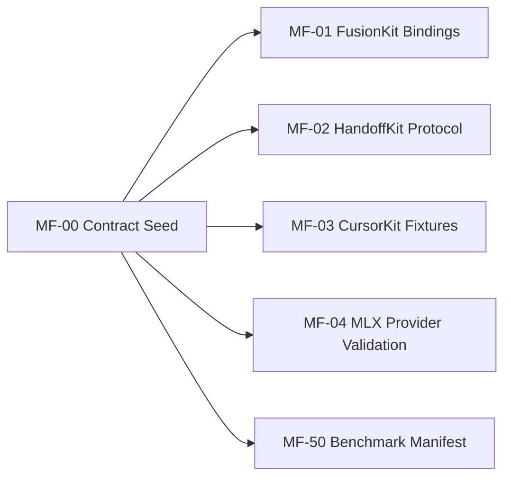

# Model Fusion Contract

This directory is the MF-00 contract seed for model-fusion records. JSON Schema is
the language-neutral source of truth. Python, TypeScript, and provider-specific
bindings are follow-up work in the consuming repos.

## Layout

- `schema/*.schema.json` contains the record schemas.
- `schema/common.schema.json` contains shared metadata, enums, hashes, and reusable
  shapes.
- `fixture/<schema>/minimal.json` contains the smallest valid payload for binding
  and validator smoke tests.
- `fixture/<schema>/realistic.json` contains a synthetic, downstream-oriented payload
  with join keys and nested record shapes.

The canonical record name is the value in the fixture `schema` field. Most filenames
match the record name directly. The exception is `model_endpoint.v1`, which is stored
as `schema/model-endpoint.v1.schema.json` to keep filenames dash-separated while
preserving the record name from the roadmap ticket.

## Required Metadata

Every non-common record must include:

- `schema`: canonical record name, for example `fusion-record.v1`.
- `schema_version`: currently `v1`.
- `schema_bundle_hash`: deterministic SHA-256 over `schema/*.schema.json`.
- `producer`: package or tool that produced the record.
- `producer_version`: producer version string.
- `producer_git_sha`: git SHA for the producer build or fixture seed.
- `created_at`: RFC 3339 timestamp.

The bundle hash lets follow-up repos verify that they are validating fixtures against
the same contract bundle that produced them.

## Compatibility Rules

Additive fields stay in `.v1` when older validators can safely ignore them or when
the field is explicitly additive under an object that allows extension.

Breaking changes require a new `.v2` schema. Breaking changes include renaming fields,
removing fields, changing field meaning, narrowing enum values in a way that rejects
previous valid records, or changing join-key semantics.

Fixtures are compatibility tests, not examples. Changing a fixture should be treated
like changing a public contract test because MF-01, MF-02, MF-03, MF-04, and MF-50
consume these shapes directly.

## Fixture Policy

Fixtures must be synthetic and secret-free:

- Do not include raw secrets, private keys, bearer tokens, customer payloads, or real
  transcripts.
- Use fake commit SHAs, fake hashes, local model names, and synthetic prompts.
- Use redacted or synthetic artifact markers when a future record would reference
  sensitive data.
- Keep stub fixtures shallow. They prove record names, metadata, and validation paths;
  they do not imply product runtime behavior exists.

## Downstream Consumers



- MF-01 should validate FusionKit bindings against `model_endpoint.v1`,
  `model-call-record.v1`, `fusion-run-request.v1`, `fusion-record.v1`,
  `judge-synthesis-record.v1`, and `benchmark-task-record.v1`.
- MF-02 should validate HandoffKit protocol records against model-call, harness,
  judge synthesis, benchmark task, artifact, tool, and receipt schemas.
- MF-03 should validate generic harness fixtures and Cursor-specific fixtures, then
  map `cursor-run-result.v1` into a valid `harness-run-result.v1`.
- MF-04 should validate provider-only `model_endpoint.v1` and
  `model-call-record.v1` fixtures without importing FusionKit, HandoffKit, or
  CursorKit runtime concepts.
- MF-50 should use `benchmark-task-record.v1` for dirty-dozen task manifests,
  including source repo, source SHA, prompt hash, setup hash, expected evidence,
  scorer, holdout flag, contamination notes, and allowed tools.

## Deferred Hardening

MF-00 intentionally does not model the full governance and isolation surface.

Backlog fixtures for redacted transcripts, denied secret or tool use, disclosure,
retention, candidate container isolation, and MicroVM hardening belong in MF-60
through MF-62. Do not expand MF-00 to cover that depth unless those tickets are
explicitly rescheduled.

## Validation

Run:

```bash
uv run python scripts/validate_contract_fixtures.py
uv run pytest
uv run ruff check .
```

The validator checks:

- every schema has a stable unique `$id`;
- every record schema has `minimal.json` and `realistic.json`;
- every fixture validates against the schema named by its `schema` field;
- every fixture carries the current `schema_bundle_hash`;
- fixtures avoid obvious secret-shaped content.
